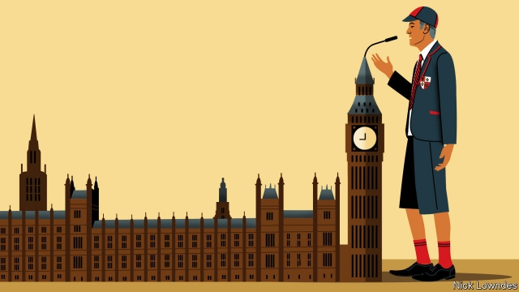

###### Johnson

# In British politics, posh pronunciation reigns 

 

> print-edition iconPrint edition | Books and arts | Jul 6th 2019 

IN “YEARS AND YEARS”, a new television drama co-produced by the BBC and HBO, Emma Thompson plays a politician whose abrasive ideas, such as barring those with low IQs from voting, rocket her to power. To British viewers, her policies might seem more plausible than another of her character’s distinctive qualities: an unapologetically Mancunian accent. 

Although the range of voices at the peak of politics in Britain has broadened, it is still narrow. The United Kingdom has a huge variety of accents. Each of the four constituent nations is diverse, and England (just the size of Alabama) is the most diverse of all. Yet later this month a new prime minister will be installed who—whether it be Jeremy Hunt or Boris Johnson—will sound much the same as every modern holder of that office: like a polished South-Easterner. 

True, there have been nuances. James Callaghan had traces of the West Country in his vowels, and Harold Wilson slightly more Yorkshire. John Major was not the poshest of speakers. Tony Blair, who broke a string of five state-school-educated prime ministers, thought fit to try on a bit of “Estuary”, the demotic South-Eastern accent that contrasts somewhat with the cut-glass tones prevalent higher up the class scale. 

Yet a tourist driving the length of Britain would find these are merely hints of the country’s spectrum. Wilson had nothing like the full Huddersfield (where he was born). Mr Major campaigned as a “working-class boy from Brixton”, but he hardly talked like a pipe-fitter. That is because, from the 19th century onwards, people who aspire to govern Britain have imitated the upper-class pronunciation of the South-East, often known as Received Pronunciation (RP) and associated with pukka schools. Scottish, Welsh and Irish accents remained just about acceptable, but pole-climbers from the English regions have had to “lose their accent” and “learn to speak properly”. 

Both of these goals are, in linguistic terms, meaningless to impossible. Everyone has an accent. Oxford’s vowels are not inherently superior to Sunderland’s; foreign speakers of English rate RP no more positively than other varieties. Rather than losing an accent, strivers from the working classes and regions have mastered a new one that is associated with prestige. Geography and class overlap. The full version of regional English accents is typically heard among the working classes. Those hoping for advancement in London tend to minimise them (or lose them entirely). 

America is different. Though a “General American” accent predominates, the past four presidents have all deviated from it. Donald Trump’s New York origins are obvious in his voice, Barack Obama (a General American speaker) could turn on African-American where appropriate, George Bush’s Texan was key to his identity, as was Bill Clinton’s Arkansan. Southern accents, in particular, are prominent. During the Trump years alone, a secretary of state (Rex Tillerson), attorney-general (Jeff Sessions), White House press secretary (Sarah Sanders), secretary of energy (Rick Perry) and Senate majority leader (Mitch McConnell) have all had strong southern accents. Such a concentration of northern tones in a British cabinet is, for now, improbable. 

Two reasons stand out. American politicians must live in the places they represent, and ideally come from there as well. The local accent proves you are not “carpet-bagging”, or swanning into a winnable seat. In England in 2015, less than half of MPs were born in the regions they represented; still less in the actual constituency. Some who have the same strong regional accents as their voters say they meet constituents who can hardly believe they are talking to an MP. 

The second reason is the dominance of London in Britain’s politics, economy and culture. Paris similarly dominates France, and politicians are mostly expected to minimise regional accents in politics there, too. Germany is like America, a newer and federal state, with local power bases and an economy spread more evenly across the country. For a Bavarian politician to sound anything other than Bavarian would be a betrayal; to adopt the distinctive accent of a native Berliner would be downright bizarre. 

Other parts of British life, notably the BBC, have opened up to different accents. Parliament has more of them than it did in recent decades. But Downing Street lags behind. In an age of disdain for distant elites, opening up room for leaders to sound like their voters might just help a loathed political establishment survive a populist age. 

