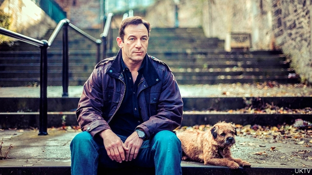

###### Seaside rock

# Jackson Brodie returns in “Big Sky” 

 

> print-edition iconPrint edition | Books and arts | Jul 6th 2019 

Big Sky. By Kate Atkinson. Little, Brown; 400 pages; $28. Doubleday; £20. 

SINCE HER previous book featuring Jackson Brodie was published in 2010, Kate Atkinson’s irascible detective has appeared in his own television series, “Case Histories” (starring Jason Isaacs, pictured above); his creator has published a series of acclaimed but unrelated novels. Now, in “Big Sky”, the fifth Brodie mystery, Ms Atkinson moves the scene of her crimes from Leeds to the picturesque Yorkshire coast. Cold cases are reopened, and characters from Brodie’s past (and the earlier books) reappear, bent either on villainy or on avenging some terrible wrong. 

Ms Atkinson has been on the trail of lost children (particularly girls) since her very first novel, “Behind the Scenes at the Museum”, published in 1995. “Big Sky” duly features a sex-trafficking and paedophile ring set up by a grim trio who refer to themselves as the Three Musketeers. Posing as a recruitment agency for the British hospitality sector, they lure in young women from eastern Europe to the Philippines with the promise of lucrative hotel jobs, only to imprison them in Silver Birches, a hideaway from hell, where they are forcibly injected with drugs before being sold on. 

In the depiction of this despicable business, as in all Ms Atkinson’s fiction, she supplies gruesome discoveries and a strong helping of violence, all nevertheless relayed with a deft and witty touch. Her Brodie novels recall a line from “The Importance of Being Earnest”: “The good end happily, the bad unhappily. That is what Fiction means.” A literary champion of justice, she lines up a colourful cast of unlikely good guys: glamorous Crystal, the kind-hearted, secretly traumatised second wife of a shady millionaire businessman; Vince, the down-on-his-luck golfing partner of the Three Musketeers, whose life declines from bad to worse; Reggie, a returnee from previous yarns who has grown up into a literature-quoting copper; and Bunny Hopps, an elderly drag artist ensconced for the summer season at a local theatre. 

Last, there is Brodie himself, who is now to be found working uninspiring cases as a private detective, while awkwardly spending time with his adolescent son. For their part, the bad guys run a gamut from hapless to pure evil. They include Barclay Jack, an ageing stand-up comedian, and whoever it was who bludgeoned Vince’s highly dislikeable estranged wife. 

“Big Sky” has all the sizzle of a British fry-up; Ms Atkinson’s evocation of the beauty and desolation of faded seaside resorts is unerring. As in the other Brodie novels, several stories are woven into a seamless plot, with the help of credible-seeming twists of fate. And there is just enough unfinished business to leave readers impatient for his next outing. ◼ 

