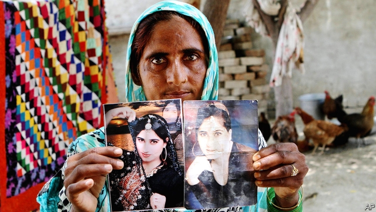

###### Fallen idol

# The life and death of a Pakistani social-media star 

 

> print-edition iconPrint edition | Books and arts | Jul 6th 2019 

A Woman Like Her: The Short Life of Qandeel Baloch. By Sanam Maher. Bloomsbury; 336 pages; £16.99. 

IN EARLY 2017 the Herald, a leading English-language news magazine in Pakistan, conducted its annual “person of the year” poll. The result said a lot about the country. The winner was Raheel Sharif, who had just stood down as chief of Pakistan’s army, the institution that calls the shots, even when, as now, civilians are notionally in charge. In second place was Qandeel Baloch, a woman born into a poor family in a small town in Punjab province, who had been murdered, aged just 26, by her own brother the previous July. 

Sanam Maher, a journalist based in Karachi, has provided the most complete account so far of how Baloch managed to take such a hold on the popular imagination in Pakistan. Ms Maher has done so in an old-fashioned way: with a carefully researched, elegantly written and very readable book. But the territory is already well-trodden in other formats. Previous efforts include a 28-episode Urdu-language soap opera based on Baloch’s life. She also has been the subject of a number of documentary films, including two by the BBC. Film-makers are helped by the wealth of archival material she left them. For she lived, and made her name, on social media. 

Or at least, she did in the later years of her short life, as she became a star. In telling her story, Ms Maher shows what an unlikely outcome that was. Like countless Pakistani women, Baloch was married off by her parents, and suffered horrible abuse. She ran away, leaving her husband and son, and taking refuge in a shelter for victims of domestic violence. Her professional life started with a demeaning job as a “hostess” on long-distance bus rides. It then moved into a rather sleazy world of modelling. She changed her name, shed traditional dress for flimsy Western outfits, and started posting online videos of herself. Her big break was to perform (very badly) on “Pakistan Idol”, a television talent show. Her hysterical reaction to rejection—and the lurid pink leggings she wore—“went viral”. 

She became adept at drawing attention to herself. She was provocatively sexy, and added stunts such as proposing marriage to Imran Khan, then an opposition leader, now prime minister. She offered to strip online if Pakistan beat India at cricket (it lost). By 2015 she was one of the ten Pakistanis most searched for on the web. That she was “Pakistan’s Kim Kardashian” seems to have been both a journalistic cliché and a genuine ambition. 

In one sense, Baloch’s story is an optimistic one—of how the rapid spread of mobile technology and social media offers an escape for people trapped in a life of miserable obscurity. As recently as 2000 only 133,900 Pakistanis were online. Yet to date her painful “Pakistan Idol” audition has been watched 10.9m times on YouTube. 

But her success was also responsible for her death. Two events precipitated it. A newspaper revealed her real name and origins, so her brothers could no longer ignore the stain her online persona was leaving on their “honour”. And she posted flirtatious videos and pictures of herself with a leading Muslim cleric (and head at the time of the religious wing of Mr Khan’s party, from which he was later expelled). 

The fuss and “disgrace” this caused was too much for a brother to bear, and one drugged and strangled her. Unusually, her parents at first condemned the murderer. The furore helped the passage of a law that makes it harder for perpetrators of “honour” killings—of which there are hundreds every year—to escape justice. But three years on, the parents have changed their tune, not wanting to lose a second child. The case drags on. Social media may have the power to transform lives and society, but traditional attitudes endure—and the resulting clashes can be tragic. ◼ 

