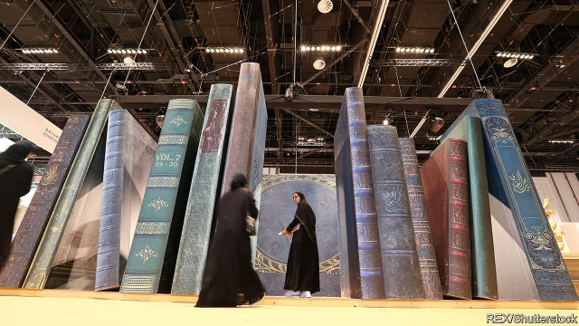

###### The red ink and the black

# The unlikely rise of book fairs in the Gulf 

 

> print-edition iconPrint edition | Books and arts | Jul 6th 2019 

PERHAPS ONLY in the Middle East do the censors get their own stand at book fairs—as they did at last year’s jamboree in Kuwait. Outside, a frustrated local artist installed a mock cemetery of banned works, with hundreds of titles inscribed on headstones. Over the past five years the information ministry has banned more than 4,000 books, from Dostoevsky to “Children of Gebelawi”, published in 1959 by the Egyptian author Naguib Mahfouz, the only Arab to win the Nobel prize for literature. The cemetery protest, too, was quickly censored. The rumpus encapsulated the trick that several Gulf states are trying to pull off. They want to become literary beacons, even as they restrict freedom of speech. 

Arabs have an old saying: “Cairo writes, Beirut publishes, Baghdad reads.” The book fair in Cairo, the Middle East’s oldest, has just celebrated its 50th anniversary. Each year it draws more than 2m people to stalls packed with titles from publishers across the Arab world. But the Gulf states are now establishing themselves as stops on the literary circuit, too. Ten years ago few would have heard of the book fair in Sharjah, one of the lesser-known parts of the United Arab Emirates (UAE). Today it attracts 2.3m visitors a year, double Sharjah’s population. Abu Dhabi, Doha, Manama, Riyadh—all are transforming from sleepy trade fairs to popular events. 

There are strong commercial incentives for publishers to cater to the six members of the Gulf Co-operation Council (GCC). Though they make up just 10% of the Arab world’s population, they have its highest literacy rates. More than 90% of GCC citizens can read, compared with less than 75% in countries such as Egypt and Morocco. Exactly how much they do read is the subject of more speculation than research. A study in 2016, conducted by a government-run foundation in Dubai, suggested that Emiratis read for 51 hours each year and consume 24 books apiece. That would seem to make them either extremely fast readers or dishonest ones. 

Still, the book market in the Gulf is certainly big. Saudi Arabia’s alone is thought to be worth 5bn rials ($1.3bn) a year. Residents of oil- and gas-rich emirates have more to spend on literature than other Arabs. The market in the UAE is estimated at $233m, larger than similar-sized European countries like Hungary or Portugal. Egypt has ten times more people than the UAE, but its publishers take in 23% less. 

The fairs appeal to governments as well. In a region with a dearth of public space, they are a diversion for residents and a potential draw for tourists, an alternative to the sun-and-shopping model that long defined glitzy cities like Dubai. The tourism industry has “been focused on entertainment, people who don’t attend a concert, don’t open a book”, says Mai al-Khalifa, Bahrain’s culture minister. Authorities also hope to nurture a growing coterie of local novelists. This year Sharjah launched a separate fair to showcase more than 1,000 books by Emirati authors. At its main festival it gives an annual award for the best Arabic-language novel. In 2017 this went to Abdullah al-Busais, a Kuwaiti writer, for his book “The Taste of the Wolf”, a rumination on matters of violence and vengeance that loom large in Arab societies. 

And books are only part of the story. Stable and wealthy, the Gulf states are already the centre of political and economic power in the Middle East. They are now spending billions to become cultural powerhouses. Qatar and the UAE host the largest Arabic satellite-news channels. Gulf production houses are making inroads in entertainment programming. The UAE has branches of the Louvre and the Guggenheim; Qatar features a gleaming palace of Islamic art, designed by the late I.M. Pei. 

There is a glitch, however: politics. Visitors to the Louvre in Abu Dhabi are given a tour through 8,000 years of human history, with an upbeat message of progress and optimism—but little that is challenging. The same goes for the Riyadh book fair, which is less a festival of intellectual freedom than a showcase for official policy. Last year’s event, held six months after the kingdom announced that women would be allowed to drive, had a booth where female visitors could try their hand at a simulated steering wheel. In previous years exhibits extolled mega-projects like Neom, a futuristic $500bn planned city, and the bravery of Saudi soldiers in Yemen. 

Censorship is a problem across the Arab world. But curious readers can find plenty of edgy works in Cairo’s Ezbekiya market or the shops on Beirut’s Hamra Street. That is less true in the Gulf. Walk through a bookstore in Dubai’s Marina Mall and you will find shelves filled with business and self-help guides. An entire display is devoted to books by Dubai’s ruler (available in Arabic and five foreign languages). There is almost nothing about current affairs. 

The fairs are a bit more open—yet they too are circumscribed by inconsistent censorship that drives authors and publishers to distraction. In 2014 Saudi authorities confiscated the works of Mahmoud Darwish, the Palestinian national poet, which it labelled “blasphemous” (Darwish was an ardent secularist). He is no longer forbidden; instead the authorities are on the lookout for anything that might expose citizens to subversive politics. In Riyadh last year they closed a stall that sold books “sympathetic” to the Muslim Brotherhood, an Islamist group banned in Saudi Arabia. 

Governments deny any contradiction in all of this. “You have freedom of speech, as long as your speech is moderate,” says an Emirati official. That, of course, is an arbitrary and subjective distinction. Kuwait is the most open of the Gulf states, with a raucous parliament and vibrant print media; all the same, last year Kuwaiti intellectuals started leaking memos from the information ministry, which make for darkly funny reading. Censors do not appear to read all the books they ban—no surprise, since they blacklist about two per day. Instead they just look for keywords. A lone reference to “angels” can merit a crackdown on blasphemy grounds. 

So can the word “pee”, which, ironically, is thought to be the reason Mr Busais’s award-winning novel is banned in his home country. It is another telling example of a paradox taking hold across the Gulf. From Jeddah to Sharjah, governments have never done more to promote culture—and yet, artists and writers agree, the cultural climate has never been worse. ◼ 

