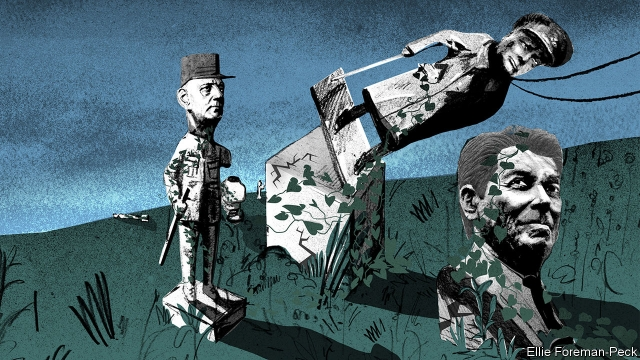
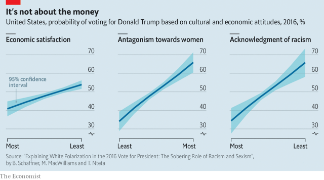

###### The transformation of the right

# Conservatism is fighting for its life against reactionary nationalism 

 

> print-edition iconPrint edition | Briefing | Jul 6th 2019 

TO APPRECIATE HOW politics in America, and elsewhere, has changed, a quick quiz: a) Which American presidential candidate said the following three things; b) How did they do in their campaign? 

What is the matter with our leaders? Every year millions of undocumented aliens break our laws, cross our borders, and demand social benefits paid for with the tax dollars of American citizens. For every tax on manufactured goods that are made in the USA, let us put an equal tax on foreign goods dumped in the USA. For every tariff China puts on us, let us put an equal tariff on them.We’re going to bring the jobs home and we’re going keep America’s jobs here, and when I walk into the Oval Office, we start looking out for America first. 

Answer a) is Pat Buchanan, a speechwriter for Richard Nixon and television pundit. He tried to win the Republican nomination in 1992 and 1996, and won that of the Reform Party in 2000. Answer b) is he fared well enough when within the Republican Party. He won a few primaries, gave some convention speeches. Outside the Republican Party he did ignominiously. In 2000 he took 0.4% of the vote. 

That was in part because of Mr Buchanan. “It’s just incredible that anyone could embrace this guy,” said one of those he beat for the Reform Party nomination, referring to him as “a Hitler lover” who “doesn’t like the blacks”. It was also because Mr Buchanan’s message did not resonate. In 2000 America stood proud as the only superpower; its cold-war rival, the Soviet Union, had disintegrated. Its economic challenger of the 1980s, Japan, was in the doldrums and the GDP of China had only just overtaken that of Italy. September 11th meant no more than the 10th or 12th. Why pay heed to Mr Buchanan’s resentful pessimism? 

When Donald Trump—the one-time Reform Party hopeful who had denigrated Mr Buchanan as a “Hitler lover” in 2000—ran for the Republicans in 2016, his similar message struck a more powerful chord. But this was not just because war, a financial crisis and the rise of China had changed the world. Politics had changed, too. 

The American right of the 1990s was, like most successful and long-lived political parties, a broad church with any number of internal schisms. Though it had its Buchananites, it contained enough conservatives of the old school—small-government, pro-business types, often religious and socially staid, attached to many of the institutions of American life, flag and family above all, and confident of their ability to govern—to keep vulgar, reactionary and isolationist chauvinism from the ascendancy. By 2016, not so much. 

In America and much of the rest of the rich world, conservative parties have been taken over or challenged by reactionary nationalism. This is a threat not just to the parties involved, but to conservatism as a political idea, at least as it has been understood in the English-speaking world for the past 200 years. Those who have defined themselves in opposition to the right will miss that conservatism when it’s gone. 

At the core of endangered conservatism is a belief that things are the way they are for good reason, even if that reason is indiscernible or forgotten. Such conservatives are suspicious of centralised government power—especially in the hands of demagogues—and set store by a range of other institutions, such as monarchies, the armed forces and churches. They value the nested associations, from the local and specialist to the national and general, out of which society is composed. Their respect for tradition “means giving votes to the most obscure of all classes, our ancestors. It is the democracy of the dead,” wrote G.K. Chesterton in “Orthodoxy” (1908). “Tradition refuses to submit to the small and arrogant oligarchy of those who merely happen to be walking about.” 

Conservatives tend to nostalgia and dread disorder. Political psychologists note that liberals are generally more open than conservatives to new experiences, from food to foreign travel. William F. Buckley, an American writer, memorably quipped that the conservative’s role is “to stand athwart history, yelling Stop, at a time when no one else is inclined to do so.” 

But the key conservative insight is that not all history is stoppable, nor is stopping it always the best option. Some changes are to be resisted, some retarded, some governed. As Edmund Burke put it in “Reflections on the Revolution in France” (1790): “A state without the means of some change, is without the means of its conservation.” Sometimes the dead must be overruled. 

Thus, before the era of universal suffrage, British conservatives favoured the preservation of a social order that ran from the monarch at the top to the farm labourer at the bottom. Later they championed self-improvement. Having favoured land over trade and industry, they became pro-business across the board. Having long preferred a woman’s place to be in the home, when offered a woman they thought up to the job they gingerly chose Margaret Thatcher as their leader, embracing her fervently when she proved a successful one. They had principles, but their attitude to them was the one George Orwell encouraged towards rules about writing. They were to be abandoned if sticking to them would mean doing something outright barbarous, such as losing power. 

Losing power is bad because conservatism is a governing creed. Its interest in channelling change cannot be furthered from the sidelines. But the power it craves is that of the brake more than the steering wheel. In his essay “Why I am not a conservative”, Friedrich Hayek, an Austrian economist, argued that, by its nature, conservatism cannot offer an alternative to society’s direction of travel. Though it “may succeed by its resistance to current tendencies in slowing down undesirable developments,” he wrote, it is invariably the fate of conservatism “to be dragged along a path not of its own choosing.” He meant this as a dig. Not every conservative would take it that way. 

This sort of conservatism has a prehistory as ancient as scepticism and privilege. As a collection of arguments it began, in the nicely turned phrase of Roger Scruton, a British conservative writer, “as a hesitation within liberalism” over the French Revolution. Some liberals leapt at the storming of the Bastille. Thomas Jefferson saw it as a second triumph of freedom following the American Revolution; Charles James Fox, leader of Britain’s Whigs, welcomed it as a re-run of Britain’s Glorious Revolution of 1688. But others, most notably Burke, Fox’s fellow Whig, thought it would lead to disaster. 

Much of what is best in later conservatism was built on Burke’s response: his scepticism about radical change and his belief that, human nature being what it is, the passions of the people must be checked by authority and good judgment. Liberals—including Hayek—often felt that new order would spring into being spontaneously from new freedoms. Burkean conservatives saw order as something institutional, anchored in restraint and hierarchy. 

Elsewhere in Europe, the 19th-century right was often much more politically radical. In Britain liberals and conservatives might be seen as sparring partners, the ring in which they fought roped off by respect for property rights and a degree of individual liberty. On the continent they were often bloody-sworded enemies. Europe’s reactionary conservatives sought to beat change back, not merely govern it. They often wanted restorations—of monarchies, of the power of the clergy, of the status of the aristocracy. Compare and contrast Burke’s “Reflections” with “Considerations on France” (1797) by Joseph de Maistre, a Savoyard admirer of the Bourbon monarchy. Faced with the overthrow of the monarchy, Maistre did not merely want to resist; he wanted to return France to the Middle Ages, when the divine right of monarchs to rule over all was unquestioned. Maistre venerated the executioner, whose axe he saw as underpinning all order. You find little restraint here: it reads like the work of an 18th-century Rush Limbaugh. 

Burkean conservatism tends to be as suspicious of reactionary change as of other sorts; tolerable in small measure, dangerous at the radical extreme. But in the second half of the 20th century much of the West’s political right found ways for such impulses to coexist. And they brought in libertarians, religious conservatives and quite a few liberals, too. The glue was opposition to a political left which, even in its milder forms, cared less about the maintenance of property and the safeguarding of wealth than the right did, and which in its more extreme variants sought to impose new forms of order neither sanctioned by the past nor generated spontaneously, but dictated by the Comintern. 

In America and elsewhere this late-20th-century right included people deeply distrustful of big business and people who cared for little else. It included conservationists keen to keep the environment safe and people sceptical of all government regulation to that or any other end. It included elitists distrustful of the people and populists distrustful of the elite. It included libertarians who wanted licence in all things and believers who thought the state existed to do God’s will. It included racists, people willing to pander to the racism of others and people who genuinely opposed racism. What they shared was a desire to keep the economy growing, keep the nation secure from communists and keep the left out of office. It was enough, when combined with good management, to keep such shows on their various roads. 

In the past two decades the wheels have come off. The attacks of September 11th 2001, later echoed in Madrid, London and elsewhere, brought new fears. The financial crisis brought new deprivations, exacerbated in parts of Europe by the rigidities of the euro zone. Some jobs were lost to imports from elsewhere; many more felt precarious. People who were not deeply economically marginalised—unemployment has remained low in most countries—nevertheless became susceptible to feeling excluded and to blaming others. In many countries immigration rose with the approval, or at least the acquiescence, of liberal left and broad right alike. 

To prosper in this world reactionary nationalism no longer needed the bedmates with whom it had been tucked up. It did not need ideological commitments to small government or balanced budgets. It did not need those who valued and sought to serve society as a whole, in the way that Britain’s “one nation” conservatives do, or who thought that businesses benefited from firm but fair regulation. It did not need devotion to institutions. It did not need those who sought to ameliorate societal change that seemed inevitable. It felt empowered, instead, to decry some changes and seek to reverse others. 

The reactionary right embraced resentment against “elites”—notably, in Europe, those in Brussels—and “others”, as judged by race or place of origin. This does not mean all supporters of the reactionary right are racists; it does mean that where there are racists, they will mostly support the reactionary right. In France the anti-immigrant National Front, now rebranded, became increasingly acceptable. In Britain concern about immigration turned out to be one of the best predictors of voting Leave in the Brexit referendum. In America support for President Trump correlated more strongly with a belief that black Americans do not suffer from racism than with economic distress (see chart). According to the Co-operative Congressional Election Study run by Harvard, about 60% of Trump voters in 2016 had family incomes above $50,000. The median Clinton voter was bit poorer. 

 

Most of America’s serious conservative thinkers, as opposed to the people who play conservatives on Fox News, are repelled both by the Republican Party’s leader and by the willingness of its officials and officeholders to stand by him. The premier league of the conservative commentariat—people like Max Boot, David Brooks, Ross Douthat, David French, David Frum, Bill Kristol, Yuval Levin, Jennifer Rubin, Reihan Salam, Peter Wehner and George Will—are all either rooting for the Democrats, thinking about how they might influence the party after Mr Trump has gone, or retreating altogether from politics. “There is a debate going on about how far we want to adapt what we believe to the new circumstances,” says Henry Olsen, a fellow at the Ethics & Public Policy Centre, a conservative think-tank in Washington, DC. “But nobody is excited about the guy who created the ruckus.” 

In short, though the left lost an election to Mr Trump, many on the right have lost their party to him, which feels worse. In Britain a similar end has been arrived at by a different path. The Conservative Party’s membership has become fixated on Brexit at any cost. Their would-be leaders are disgracing themselves trying to keep up. Only one of the six Tories who got to the second round of the race to succeed Theresa May in June refused to countenance a no-deal Brexit. Rory Stewart’s faith in his own judgment would have made Burke proud, and it got him further than many expected. But he was never going to win. 

In first-past-the-post electoral systems like Britain’s and America’s, the reactionary nationalists have taken over parties from within. In the multiparty systems seen in much of western Europe, conservative parties are instead threatened, or have already been overtaken, by startups and reinvigorated far-right rumps. France’s Gaullists, who ran the country for the majority of the Fifth Republic, have been torn apart by a new liberal party, La République en Marche, and the National Rally, the new avatar of the National Front. 

In Spain the equivalent established conservative party, the People’s Party, is in similar decline, undermined by the liberal centrists of Ciudadanos and the new party of the far right, Vox. In Italy the old conservative party was killed off long ago by a mixture of scandal and Silvio Berlusconi, and has since been replaced by the Northern League (now just called the League). Meanwhile, to the east, Hungary has gone straight to the reactionary nationalist right with barely a latitudinarian moment. 

One thing all these movements share is a devotion to pride, particularly manly sorts of pride, and especially pride that involves the loud proclamation of an unwillingness to apologise—for the Southern Strategy, for Franco, for Vichy, for Mussolini, for the Raj, for the Confederacy. At a rally last year Santiago Abascal, the leader of Vox, swore to his followers that “The left will never succeed in making us feel ashamed for that which only merits pride,” such as opposing feminism, Muslims, gay rights and constraints on fighting goaded bits of beef in tight embroidered trousers. 

Particularly worrying, in this respect, is pride centred on ethnicity. Where Burkean conservatives tended to value the institutions they found in the past, reactionaries value the identities they can find there. The 30% of Americans who say that you have to be a native-born Christian to be a real American leans heavily Republican. Conservatives have a respect for a universal human nature; reactionaries tend to value some natures more than others. 

Will this persist? It is tempting to think not. Conservatism has a long tradition of adapting to the world which has served it well. Opportunist, incoherent and unmoored, the reactionary right will fail to deliver and conservatives will rise again from the rich institutional soil they value so much to check and channel change. 

Yet in the first decades of the 21st century the most politically salient ways in which life is changing have to do with things that nobody in the rich democracies voted for. More people in poor countries than ever before can see media images of the West and can afford to try to get there. China has an economic model that produces goods others want to buy. Women have more political power and more freedom to choose how to live their lives. Family structures are changing, as people marry later or not at all. The climate is changing in ways that carry the risk of catastrophe in the absence of radical action. Politicians from conservative traditions might do something about some of this. But these are not changes they can easily control. 

In America, some Roman Catholic conservatives have decided that there is no way back to the way things were—what they call the “dead consensus”. This, they argued in an article for First Things, a journal, is not necessarily a loss. “Yes, the old conservative consensus paid lip service to traditional values. But it failed to retard, much less reverse, the eclipse of permanent truths, family stability, communal solidarity, and much else.” They may have a point. They do not have a plan. It was not the presence of business people and libertarians in the Republican coalition of yore that prevented it from stopping the sort of things these people disapprove of. They are not the sort of thing politics stops. 

Burkean conservatives are not the only enemies of reactionary nationalism; it is opposed by liberals and the left as well. That said, old-fashioned conservatives may still have the best chance of mounting a victory of moderation. If they do not, they may have the most to lose. As Hayek had it, they risk finding themselves dragged along a path not of their choosing.◼ 

