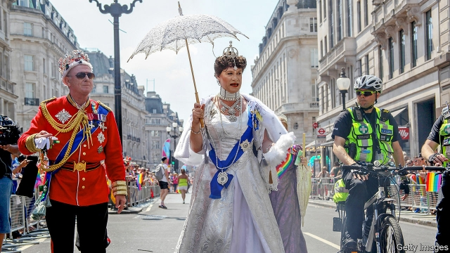

###### Rainbows and clouds

# As London prepares for Pride, a row simmers in the LGBT community 

 

> print-edition iconPrint edition | Britain | Jul 6th 2019 

FIFTY YEARS ago this summer, New York cops raided a gay bar in Greenwich Village, the Stonewall Inn. The riots that followed helped bring together a coalition against the common enemy of the conservative establishment. As the movement prepares for its annual Pride parade in London on July 6th, the establishment is no longer the enemy it once was. Politicians and business leaders nowadays drape themselves in the rainbow flag; Prince William recently said he would “fully support” his children if they were gay. Instead, some of the biggest arguments are taking place within the LGBT coalition itself. 

Much of the tension is between the T (standing for transgender people) and the L (for lesbians) as well as women more generally. Some women fear that efforts to protect the rights of trans women—biological males presenting as women—infringe on their own rights and security. Trans people in turn accuse such women of transphobia, likening their concerns to those raised by homophobes in the 1980s and blaming them for an increase in reported hate crimes against trans people. 

Politicians trying to be both inclusive and progressive have struggled to take a coherent line. The latest example is in Scotland, where the government had hoped to amend the Gender Recognition Act later this year to make it easier to change legal gender. It had planned to reduce the time an applicant had to live in their new gender from two years to six months, and to remove the need for medical certification. But activists protested that the consultation had ignored the impact on women, warning that the government was “sleepwalking” towards an erosion of their rights. Ministers backtracked and on June 20th promised to re-open the consultation. 

In the same month the Scottish government was also forced by Christian campaigners to withdraw guidance to schools on their approach to transgender pupils. The guidelines had suggested that pupils uncomfortable sharing loos or changing rooms with trans children should use accessible toilets or wait, and that parents struggling to accept their child’s gender identity should be reported to the authorities. The government said it would replace the material, to “ensure policies protect the rights of different groups of people”. 

Meanwhile in England, the equalities minister, Penny Mordaunt, has faced calls to get on with a promised review of the work of the Gender Identity Development Service, the country’s only gender clinic for children. The number of girls referred to the clinic has risen fourfold in the past four years; the clinic has received more than 2,500 referrals of children in the past year. The number of young children (some as young as three) being sent to the clinic is also on the rise. 

So not everyone who turns up to Pride will be marching in step. At last year’s event activists held banners reading “Transactivism erases lesbianism”, prompting organisers to apologise for the “bigotry, ignorance and hate”. Such signs are motivated by a fear that young lesbians face pressure to transition into straight men, or that lesbians will be condemned as transphobic if they decline to date male-bodied trans women. At a Pride march in Lancaster last month activists held signs declaring that “lesbians don’t have penises”. 

The strife within the LGBT coalition is not unique to Britain. At the Stonewall Inn’s anniversary party last month, a row erupted between a trans woman and a crowd of gay men. In New Zealand a lesbian group claimed it had been banned from Wellington Pride. A movement founded to promote tolerance seems to be showing ever less of it. ◼ 

