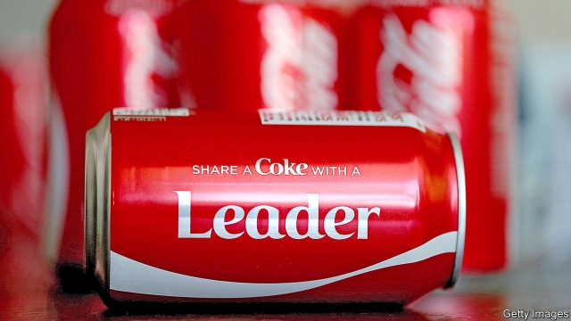

###### Boris eyes the nanny

# Boris Johnson may reverse Britain’s embrace of sin taxes 

 

> print-edition iconPrint edition | Britain | Jul 4th 2019 

CONSIDERING THEY call themselves Conservatives, Britain’s recent leaders have been unusually willing to meddle with individual choices. Plastic straws are to be banned, over concerns about pollution of the oceans. A tax on plastic bags, introduced in 2015, may double under plans currently out for consultation. The Tories have also expanded so-called sin taxes on unhealthy behaviour. Worried about bulging obesity levels, last year the government introduced a tax on sugary drinks, which led manufacturers to change their recipes or raise their prices. 

Some would like the nanny state to be stricter still. Jamie Oliver, a celebrity chef, wants to tax milkshakes. Professor Dame Sally Davies, England’s chief medical officer, is due to deliver in September a report that is likely to recommend more taxes on unhealthy foods. The Institute for Public Policy Research, a leftish think-tank, recently called for more food taxes and for sweets, crisps and soft drinks to be sold in plain packets, as cigarettes already are. Some environmentalists support a meat tax. 

On July 3rd Boris Johnson, the probable next prime minister, announced as part of his campaign for the Tory leadership that he would take a different approach. He promised no new sin taxes until his government had studied whether existing ones—including long-standing taxes on alcohol and tobacco—work, and whether they disproportionately hurt the poor. 

Awkwardly, the answer to both questions is probably that they do. Although the Johnson campaign cites a dissenting study, on the whole there is good evidence that sin taxes change people’s behaviour. In the case of alcohol and tobacco, for example, economists tend to find that a 1% increase in prices is associated with a 0.5% decline in sales. But because poor people tend to spend a higher proportion of their income than others on things deemed sinful, such taxes hit them hardest. 

Mr Johnson’s plans are likely to go down well with the Conservative Party members whose votes he is courting. Health campaigners may be less impressed. On the same day as his announcement, a report by Cancer Research UK found that obesity caused more cases of cancer than tobacco in Britain. As for targeting the poor, advocates for sin taxes sometimes argue this is in fact an advantage of the policies, because the poor will disproportionately reap the promised health benefits of having their behaviour changed. 

This ignores their associated loss of personal choice, however. It also misses a point that Mr Johnson understands very well: the thing about sinful behaviour is that it is often pleasurable. 

