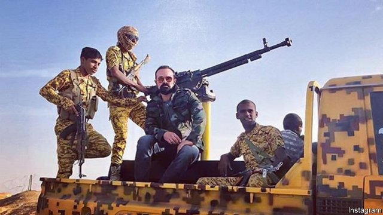

###### Sultan of the Standard

# Britain investigates Saudi influence on two of its newspapers 

 

> print-edition iconPrint edition | Britain | Jul 6th 2019 

OUTSIDE LONDON’S Waterloo station, stacks of the Evening Standard are regularly demolished by frazzled commuters heading home. The paper chiefly covers lifestyle rather than hard news, but a straw poll of readers nevertheless reveals unease that a Saudi sultan has recently taken a 30% stake in its parent firm for around £25m ($31m). For Jess Pemberton, a collage artist from Cornwall, newspapers represent freedom of speech, “so it is hypocrisy that the Standard would be backed by Saudi Arabia.” “What really bothers me is that I didn’t know about the new ownership,” complains another commuter. 

Such views support the decision on June 27th by Jeremy Wright, the culture secretary, to order an inquiry into the purchase by Sultan Muhammad Abuljadayel. He is a little-known banker who is believed to have connections to the Saudi government. Mr Wright’s department described the purchases as a possible acquisition of a stake “by a foreign state”. 

Nor is the Standard Mr Abuljadayel’s only press investment. The first, in 2017, was of a 30% stake in Independent Digital News and Media, owner of the digital-only Independent, a weightier read than the Standard. The following year the Independent agreed to launch four new websites in Arabic, Urdu, Farsi and Turkish, in partnership with the Saudi Research and Marketing Group, a media company with links to the Saudi royal family that is viewed as an organ of soft power for the country. 

Around that time Saudi Arabia’s crown prince, Muhammad bin Salman, was still basking in a reputation as an economic reformer. But the investment in the Standard was completed not long after the murder in October of Jamal Khashoggi, a Saudi journalist and Washington Post columnist. His killing is widely believed to have been ordered by Prince Muhammad. The current owner of both the Standard and the Independent, Evgeny Lebedev (pictured in Yemen, in a snap from his Instagram account), son of a Russian oligarch and former KGB officer, did not reveal the identity of his new investor, which was instead reported by the Financial Times in February. 

The air of secrecy around the two deals made an inquiry by the Department for Digital, Culture, Media & Sport (DCMS) very likely, says Des Freedman, professor of media at Goldsmiths, University of London. Both were completed using firms in the Cayman Islands. DCMS regards the transactions between Mr Abuljadayel’s two Cayman companies and the two British media firms as adding up to a single “relevant merger situation”, which justifies its intervention. It has complained that it took four months of correspondence with Mr Lebedev’s firm to get information. 

It now falls to Ofcom, the media regulator, and the Competition and Markets Authority (CMA) to examine whether the Saudi purchases compromise the papers’ accurate presentation of news and free expression of opinion. Central to this will be shining a light on any relationship between Mr Abuljadayel and the Saudi state. 

Lebedev Holdings and Independent Digital News and Media have lobbied against the inquiry. They say DCMS lacks grounds to intervene on a relevant-merger basis because the two companies operate separately. Several voices in the British media have chimed in with another of the two firms’ arguments, which is that newspapers need any cash they can get. The firms say that the Saudi investments provide a “vital and necessary lifeline” to keep afloat the loss-making Standard, which is edited by George Osborne, a former chancellor of the exchequer. The money will allow the Independent (which is breaking even) to invest in its editorial team. 

It is hardly as if newspaper proprietors have not been controversial in the past, notes someone who should know, David Yelland, a former editor of the Rupert Murdoch-owned Sun. Readers may have to get used to new money from unfamiliar sources going into the press, he says. It takes a brave investor to back papers as ad revenues tumble, agrees a British newspaper chief executive. Yet “chapter one in a dictator’s playbook is controlling the media,” he says, hence concern about Saudi investment in Western newspaper brands. 

Mr Lebedev, who is believed to have sunk over £100m into the two British titles, may not be placed to continue investing as generously in future, media observers reckon. As for the Ofcom and CMA inquiries, which will report in August, ESI Media, the firm that holds the two papers, has said that “the accurate presentation of news and freedom of expression is at the heart of our media outlets and we will continue to vigorously defend our editorial integrity when co-operating in this process.” 

Depending on the Ofcom and CMA reports, DCMS may ask the CMA for a full investigation of Mr Abuljadayel’s deals. One outcome could be to force Mr Lebedev to unwind them, although according to Nicole Kar, head of UK competition for Linklaters, a law firm, that is very unlikely in the context of previous newspaper mergers. Or DCMS could demand remedies to restrict Saudi influence. Either way, most digital Independent consumers and the 1.4m Londoners who pick up the Standard of an evening will remain oblivious. ◼ 

