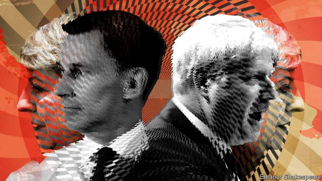

###### The Tory time warp

# Britain’s Brexit debate regresses to 2016 

 

> print-edition iconPrint edition | Britain | Jul 6th 2019 

THE CONSERVATIVE leadership contest was triggered by Theresa May’s repeated failure to pass her Brexit deal. The deadline for Britain to leave the European Union is less than four months away. So the big question for the two men hoping to succeed her is: how credible are their plans for Brexit? And the answer is: not very. Worse, their campaigns are reverting atavistically to claims made after the referendum in 2016 that have since been debunked. 

Both Jeremy Hunt and Boris Johnson make much of their Trump-like dealmaking ability. Neither is prepared to smudge Mrs May’s restrictive red lines of leaving the single market, customs union and European Court of Justice. Both agree that threatening to walk away with no deal is the best way to extract further concessions from Brussels. And they are equally adamant that they can get Brexit done by October 31st. 

As a leading Leaver in the referendum campaign, Mr Johnson espoused having his cake and eating it. That is a fair description of his plan now, to take the bits of Mrs May’s withdrawal agreement he likes and junk the rest, postponing arguments over the Irish border and holding back most of the money Britain owes. If this fails, his plan B is to agree with the EU to work towards a free-trade deal and, during a transition period, exploit World Trade Organisation (WTO) rules to keep trade barrier-free. And if this does not work, plan C is to leave with no deal—though curiously he says the odds against this are a million to one. 

As a former Remainer, Mr Hunt sounds softer, but his Brexit plan is actually quite close to Mr Johnson’s. He too would take out the Irish backstop, shake up the negotiating team to include hard Brexiteers, prepare for no-deal and be ready not to pay the whole Brexit bill. The main difference is over timing. Mr Johnson says Britain must leave at the end of October, “do or die”. Mr Hunt says he will decide by September 30th if a deal looks possible and be ready to extend the deadline if necessary. His thinking is informed not so much by opposition to no-deal, which he would accept “with a heavy heart”, as by fears that Parliament might stop it, risking an early election. 

None of this will be easy to negotiate, let alone by October 31st. Mujtaba Rahman of the Eurasia Group consultancy says the EU sees the withdrawal agreement as a compromise that cannot be unpicked. It may expand the accompanying political declaration about the future, but that would amount to putting lipstick on a pig. Contrary to Mr Johnson’s plan B, there would be no transition period if there were no deal. Even Liam Fox, the pro-Brexit trade secretary, is clear that WTO rules cannot be used unilaterally to avert trade barriers. As for no-deal, most MPs are against it. 

Sir Ivan Rogers, a former ambassador to the EU, likens the Tories to the Bourbons, who learnt nothing and forgot nothing. The list of implausible Tory claims is long, including old assertions that Britain holds all the cards in the negotiation, that what is needed is simply more determination, that the EU is desperate for Britain’s money and that a new prime minister can bypass Brussels and deal directly with Berlin and Paris. Equally unbelievable arguments are made about trade. German carmakers and Italian vintners need the British market, it is claimed. Because Britain runs a trade deficit in goods, no-deal would do more damage to the EU. A fall in the pound would offset any tariffs. Most of the world trades on WTO terms, so Britain would be fine doing the same. As for Ireland, the two governments can agree bilaterally not to impose a hard border with customs controls. 

As Mrs May found over two years of hard bargaining, the truth about power and red lines is less forgiving. German and other EU firms have made clear that they value the integrity of the single market more than access to Britain. The EU acts as a bloc, not through its individual leaders. Exports to the EU make up 14% of Britain’s GDP, whereas exports to Britain account for just 4% of the EU’s. Another drop in sterling would raise prices. Almost no countries trade solely on WTO terms—which is precisely why Brexiteers want free-trade deals round the world. And the Irish border would be an EU border, not a bilateral one, so without a deal controls would be required, especially for agrifoods. 

The sense of déjà vu should worry anyone involved in negotiations in Brussels, not least because of the tight timetable. The new prime minister will take office on July 23rd, barely three months before exit day. And there are two areas in which the Tory leadership election is making matters worse. The first is a willingness to indulge in spending promises. At times Mr Hunt and Mr Johnson seem to be competing to pledge public money to those who could lose out from Brexit, such as farmers. This seems odd when one argument during the referendum was that a “Brexit dividend” would free up money for the NHS and other public services. Moreover, as Philip Hammond, the chancellor, says, any fiscal headroom he has would soon be exhausted by a no-deal Brexit. 

The second is a shift of Brexit talk towards the extreme, epitomised by the two candidates’ embrace of no-deal. The linguistic changes are telling. Mrs May’s deal used to be termed a “hard” Brexit, as it would take Britain out of the single market and customs union. Now it is widely derided as “Brexit in name only”. A “soft” Brexit that would keep Britain in the single market, like Norway, is pilloried as no Brexit at all. And a no-deal Brexit, once considered almost unthinkable even by most Leavers, has become normalised through talk of a “clean” or “WTO” exit that would at least give business certainty. 

The harsh realities for whoever becomes prime minister will change little from those confronting Mrs May. The EU has the negotiating advantage. There is a clear trade-off between prosperity and sovereignty. And although most Tory party members like the sound of a no-deal Brexit, a majority of MPs and voters are firmly against it. Manoeuvring round all these obstacles would test any prime minister, never mind one who still believes old myths from 2016. ◼ 

Vacancy: The Economist is looking to hire a staff writer to cover British economics. Journalistic experience is not necessary; the ability to write clearly and entertainingly is. For details of how to apply, visit economist.com/britainjob2019. The deadline is August 4th. 

