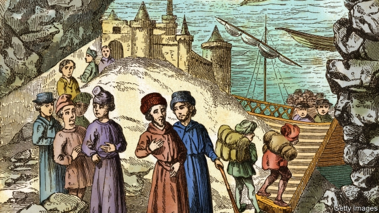

###### Passport to Portugal

# British Jews trace Iberian heritage to retain EU citizenship 

 

> print-edition iconPrint edition | Britain | Jul 4th 2019 

ELLA RACHAMIM can remember the moment she discovered Britain had voted to leave the European Union as if it were yesterday. Rather than turn off the television and go to sleep, the disappointed Remain-voter picked up her laptop and navigated to the website of the Portuguese government. The research begun that night has led Dr Rachamim, a paediatrician from London, to the brink of receiving a Portuguese passport. Her only connection to the country, and her sole qualification for citizenship, is that her ancestors were expelled from it during a bout of anti-Semitism half a millennium ago. 

A year before the Brexit referendum of 2016, Portugal and Spain passed laws which offered Sephardic Jews—those whose families once lived on the Iberian peninsula—a path to citizenship. Each country intended the gesture to act as recompense for the forcible exile of Jews in the 1490s, in one of the first acts of the Spanish Inquisition. But the two countries have unwittingly offered a lifeline for Remainers anxious to retain EU citizenship after Britain leaves the bloc. “I really want to be European, I want my kids to be European,” says Dr Rachamim. To guarantee her three children’s ability to live and work across the continent, she has sought Spanish passports for them, on top of her own application to Portugal. The cost will run to more than £10,000 ($12,650). 

She is not alone. A friend and fellow Sephardic Jew, Fran Leigh, has also embarked on the expensive process. “I wanted to prove to my child that freedom of movement is the most precious thing we can have as human beings,” she says. Campus, an Israeli firm which has been helping to manage applications by Sephardim, says the majority of its British clients are Remainers. “It comes in waves,” says Eylon Kasif, a company spokesman. “Every time Theresa May did a speech about the Brexit.” 

So far at least 420 British Jews have been granted Portuguese passports under the new law; a handful more have obtained passports from Spain (whose rules are stricter, at least for adults). The process requires applicants to demonstrate ancestry dating back to at least the mid-18th century, when Sephardim arrived in England. David Mendoza, a genealogist, says this is fairly straightforward, as the tight-knit community’s synagogue kept excellent records. Nobody knows for sure how many of Britain’s 280,000 or so Jews have Sephardic heritage; Mr Mendoza estimates that the number is in the tens of thousands. He has helped about 200 people research their ancestry in order to claim Spanish or Portuguese citizenship. 

Among their reasons for wanting an EU passport before Brexit, some Sephardim cite concerns about rising anti-Semitism. Dr Rachamim believes the referendum unleashed racism that had been simmering under the surface. “Even though the Holocaust didn’t directly affect my family, I always felt there was this thread of fear that it would happen again,” she says. 

Britain’s equality watchdog is investigating whether the opposition Labour Party illegally discriminated against Jews. Jewish leaders recently condemned the party’s “disgraceful step backwards in its half-baked ‘fight’ against anti-Semitism,” after it readmitted (and later re-suspended) Chris Williamson, an MP accused of showing prejudice towards Jews. 

Portuguese Jewish groups advertise what they say is a friendlier environment in their country. The Jewish Community in Porto claims there is “no anti-Semitism in the city”, making it perhaps the “best safe haven for Jews in Europe.” Mr Mendoza, a ninth-generation Londoner, is wary of such language, noting that it could even inadvertently reinforce anti-Semitic tropes which cast Jews as rootless wanderers. “My family unpacked their bags over 300 years ago. It sounds a little bit hysterical to me, to be honest,” he says. Most Sephardim claiming citizenship in Iberia come from countries such as Turkey or Venezuela, where political conflict is of a different order to that in Britain. “The whole world is very strange at the moment,” he concedes. “But for Jews, England has been, since the times of Cromwell, a good place to live.” ◼ 

