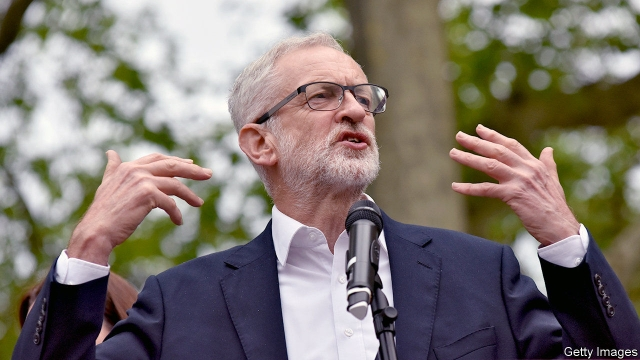

###### Labouring away

# Labour faces another summer of discontent 

 

> print-edition iconPrint edition | Britain | Jul 6th 2019 

WHEN CHATTER from senior civil servants wondering whether Jeremy Corbyn was too frail for Downing Street ended up on the Times’s front page on June 29th, the Labour leader’s supporters sprang into action. The teetotal Mr Corbyn’s fitness “is legendary”, declared Jon Trickett, the shadow cabinet-office minister (“Legendary!” chorused Labour MPs assembled behind him). The 70-year-old allotment-botherer “is much fitter than me, and I’m 31,” insisted Laura Pidcock, another devout shadow minister, who said the leaked comments from Whitehall showed that the establishment was “immensely threatened by our electoral prospects”. 

Any member of the establishment worried about a Corbyn government can relax, at least for a bit. Labour’s polling numbers have slumped. A reckoning on its Brexit position looms. The party’s failure to handle anti-Semitism within its ranks has flared up, again. And while the government is on the ropes, Labour MPs are having to spend their time sweet-talking activists into reselecting them. The party once again faces a summer of discontent. 

Rather than going on the offensive, Labour has turned in on itself. On June 24th it gave its MPs a fortnight to decide whether to stand at the next election, which is scheduled for 2022 but could come as soon as this autumn. If they do, MPs may face deselection attempts from disaffected members, who now benefit from rules aimed at making it easier to get rid of a representative. MPs will have to spend the summer buttering up local activists, rather than winning over floating voters (or heading to the beach). 

The biggest headache, however, is Brexit. Labour has lost four times as many voters to the pro-Remain Liberal Democrats and Greens as it has to the Brexit Party, according to the party’s internal analysis. Since a poor result in the European election in May, some of Mr Corbyn’s closest allies, such as Diane Abbott, the shadow home secretary, and John McDonnell, the shadow chancellor, have called for the party to give its clear support to the idea of a second referendum in which it would campaign for Remain. But the leader’s office has resisted. A Brexit-related culture war slices through Labour’s historical alliance of middle-class public-sector workers, who tended to vote Remain, and the working class, who often backed Leave. The party’s Brexit policy has been built on placating the former, who are more numerous, while not scaring off the latter. 

Its slow shuffle towards a Remain position has already come at a cost. Of all front-rank politicians, Mr Corbyn is least trusted on Brexit, surveys show. Labour should have heeded Macbeth’s advice, says Marcus Roberts, a pollster with YouGov: if it were done when ’tis done, then ’twere well it were done quickly. “The longer this goes, the greater the scale of the damage,” says Mr Roberts. “Whatever you are going to do, do it hard, clean and now.” 

Labour is betting that today’s polls bear little relation to how people might vote were an election called tomorrow. The party rallied by 20 points during the course of the general-election campaign in 2017. Brexit casts a pall over everything, says Mr McDonnell. When it is sorted, voters will return. Not all share his hopefulness. “Down” is how one aide describes the mood in the party. The optimism that gripped Labour in the wake of its 2017 performance is dead. 

Compared with sorting out the Brexit mess, this week’s scrap with anonymous civil servants provided relief. Yet the story niggled for a reason. Thoughts are turning to the future of the party, and Mr Corbyn has no obvious heir on the left. Although younger MPs, such as Rebecca Long-Bailey, the 39-year-old shadow business secretary, are being primed as potential successors, they lack profile and experience. Bigger beasts, such as Emily Thornberry and Sir Keir Starmer, who are loyal to Mr Corbyn but do not share his views, look like stronger contenders. Those on Labour’s left should hope that Mr Corbyn is as fit as his fans say he is. ◼ 

