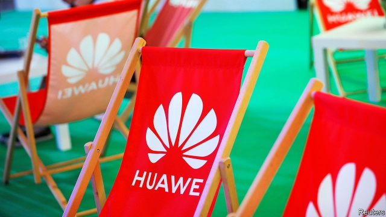

###### Huawei OK to sell?

# Donald Trump eases off Huawei as firms discover holes in his export ban 

 

> print-edition iconPrint edition | Business | Jul 6th 2019 

ON JUNE 29TH, as world leaders were leaving the G20 summit in Japan, President Donald Trump announced that American companies could once again start selling equipment to Huawei, China’s beleaguered tech giant. Fresh from a meeting with China’s leader, Xi Jinping, Mr Trump said that sales could proceed as long as they did not pose a “great, national emergency problem”. 

Mr Trump’s word is not law, but Huawei will welcome the indication of respite. It has had a rough six weeks since the Trump administration placed limits on the export of American technology to the firm, undermining its business and creating turmoil across the tech world. 

At first Huawei put on a tough act, insisting that it could handle curtailed supply of American technology. But after a month its chief executive, Ren Zhengfei, admitted that its 2019 revenues would in fact be about $30bn lower as a result of the export ban—a 30% drop since 2018. Huawei has labelled Mr Trump’s announcement a U-turn. Republicans in America’s Congress, who view Huawei as a national-security threat, called it a catastrophe. 

Things are not so black and white. Before Mr Trump’s announcement and the accompanying flurry of headlines, American chip companies had already restarted at least some of their sales to Huawei. They did so quietly. Two reports, one from Bloomberg and the other in the New York Times, cited anonymous sources saying that Intel and Micron, two large American chipmakers, had begun to supply Huawei again in June. 

It has taken lawyers at such companies a few weeks to get to grips with the details of the American law that now applies to their sales to Huawei, the Export Administration Regulations (EAR), and to realise that they can keep supplying the firm in some circumstances. The days after the ban was announced were chaotic, as tech-company lawyers scrambled to understand an area of law that did not normally apply to their operations. Many firms shut down shipments to Huawei en masse, without waiting for their legal teams to come back with a detailed opinion. 

That complete cessation of supply now appears to have been a precautionary overreaction. Under the EAR, firms may continue to sell products to Huawei as long as they are not made in the United States, and as long as those products do not contain American components whose value makes up more than 25% of their value. 

Notwithstanding this leakiness in the export ban, Mr Trump’s G20 concession is a sign that America’s commitment to containing Huawei is not ironclad. Dan Wang of Gavekal Dragonomics, a Hong Kong-based research firm, says that many Japanese, South Korean and Taiwanese tech firms had been wavering on whether to supply Huawei. “They will take Trump’s statement as a signal that they should support the company,” he says. 

The survival of Huawei, in its current form at least, has looked shaky in recent weeks. America’s president appears to have thrown the company a lifeline. As with all Trumpian pronouncements, it may yet prove illusory. ◼ 

