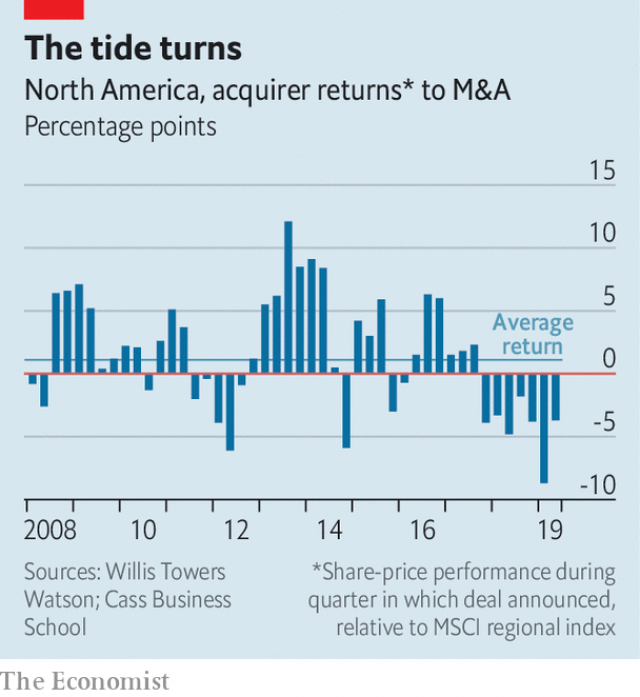

###### Breaking the wave

# Investors and regulators fall out of love with colossal deals 

 

> print-edition iconPrint edition | Business | Jul 6th 2019 

NO ONE ON Wall Street puts it quite like Carl Icahn. “There are far too many boards”, the veteran activist investor opined on June 24th, that “believe...that stockholders are the peasants who represent a necessary evil that must be tolerated, possibly patronised, but certainly ignored.” Mr Icahn’s target was Occidental, an oil firm whose directors are pursuing an unpopular $55bn takeover of Anadarko, a rival. But his outburst reflects a broader change in mood on mergers and acquisitions (M&A). Dealmaking always reflects a power struggle between empire-building executives and bankers, and more cautious investors and regulators. After years of waving through deals, shareholders and trustbusters are now getting testier again. 

Since 2000 a big trend in American business has been domestic consolidation. Firms have sought to grow at home in order to reap economies of scale and to dampen competition. Some industries, for example telecoms and airlines, have become far more concentrated. The result has been higher corporate profits, which is why investors have cheered the dealmaking on. A long-standing rule of thumb is that takeovers usually destroy value for the acquiring company, which overpays. But over the past decade that has not held true in North America. Since 2008 the share prices of acquirers have outperformed the stockmarket by a median of 1.1% in the quarter when the deal was announced, according to Willis Towers Watson, a financial firm. 

At first glance it has been business as usual this year. About $1.8trn of deals have been announced globally and 53% of them by value have been in North America, according to Mergermarket, an analysis firm. Rather than expanding abroad in an unstable geopolitical environment, American firms have focused on growing at home. Consider some of the biggest deals. United Technologies’ (UTC) $90bn merger with Raytheon will create a new defence giant. AbbVie is spending $84bn on Allergan, another big drugs firm. Occidental’s purchase of Anadarko will create an energy behemoth. And by buying Caesars, Eldorado Resorts will become a huge player in Las Vegas. Together these firms generate 71% of their revenues within America’s borders. 

 

Rather than cheering activity on, however, investors are in revolt. As Tara Lachapelle, a commentator at Bloomberg, put it, deals are being “panned instantly”. On the two days after their acquisitions were announced, UTC’s shares fell by 7%, AbbVie’s by 13%, Occidental’s by 9% and Eldorado’s by 14%. This fits a broader pattern of underperformance. Over the past 12 months North American buyers have had a median share-price drop of 4.2 percentage points relative to the stockmarket, Willis Towers Watson reckons. 

What has changed? Part of the explanation is that the fashion among investors has shifted away from giant but stodgy firms intent on raising their margins through cost-cutting, towards smaller, loss-making ones with fast revenue growth—hence the current boom in initial public offerings by tech firms. Some big deals have already soured: AT&T’s share price has dropped by 12% since it announced the takeover of Time Warner in 2016. There is also a sense that after years of consolidation the deals that are left may be scraping the bottom of the barrel. Occidental is paying top dollar for Anadarko after winning a bidding war with Chevron. AbbVie and Allergan are both mature companies with poor drug pipelines. Eldorado is taking on more debt to buy Caesars. 

As the economics of mega-deals have got worse, shareholders have got more unhappy. UTC faces attack from two activist investors: Daniel Loeb, who called the deal “baffling”, and William Ackman, who says it “makes no sense”. Some firms seem to have structured their deals to avoid having to get shareholder approval, which is normally required when new shares issued exceed 20% of the number outstanding. AbbVie is issuing 19.2% of its shares to buy Allergan. Occidental issued $10bn of preference stock to Warren Buffett in order to avoid having to issue so much common stock that it would need to have a shareholder vote. Even so, activist investors can find other ways to cause problems. Mr Icahn has said that he will launch a proxy fight to oust four of Occidental’s directors in order to block the takeover. On July 2nd Occidental urged its shareholders to spurn Mr Icahn’s advances. 

If investors are one impediment to big deals, antitrust regulators are the other. Over the past two decades they have been a walkover, but there are signs this is changing. The merger of Sprint and T-Mobile, two mobile-network operators, still awaits approval after a long delay. Even if the Department of Justice gives it the green light, a coalition of state attorneys-general has pledged to fight the deal, which they say will reduce choice for consumers. 

The mood has also shifted against big tech firms. An emerging consensus among antitrust types is that these should be blocked from scooping up smaller firms because of the worry that it would eliminate potential rivals. Past deals that sailed through, such as Facebook’s $18bn takeover of WhatsApp in 2014, or Microsoft’s $24bn purchase of LinkedIn in 2016, would probably face a rougher ride from the antitrust police now. A de facto ban on tech firms doing big takeovers could depress deal activity for years, given that they are now the biggest firms in America by market value and are blessed with cash-rich balance-sheets. 

Mergers and acquisitions have come in waves ever since the first frenzy of consolidation in the late 19th century. The past two decades have seen one of the greatest waves ever as executives have sought to build corporate giants with market power over consumers, applauded by investors and enabled by trustbusters. The dealmaking in 2019 suggests that this long swell is finally subsiding. ◼ 

