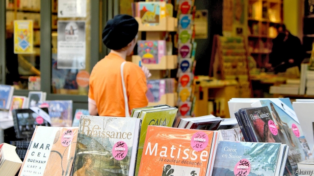

###### Book value

# New ways of selling books clash with France’s old pricing rules 

 

> print-edition iconPrint edition | Business | Jul 6th 2019 

A BOOK IS so much more than mere ink and paper. So insist French booksellers, who for nearly four decades have successfully lobbied to keep the forces of the free market at bay. A law passed in 1981 bans the sale of any book at anything other than the price decreed by its publisher. Authorities are cracking down on those trying to flog the latest Thomas Piketty or J.K. Rowling at a discount. 

The fixed-price rule is meant to keep customers loyal to their local bookshop and out of the clutches of supermarkets and hypercapitaliste American corporations. But the advent of e-commerce and e-readers has prompted questions worthy of their own tomes. Can you fix the price of a book if it is part of an all-you-can-read subscription service? Are audiobooks books at all? And what of authors who self-publish? 

Tweaks have been made to preserve the principle of one book, one price. In 2011 the rule began to apply to digital tomes. Free delivery by online sellers was prohibited on the grounds it implied a subsidy on the delivered books (prompting websites to charge all of €0.01 for postage). But a new challenge to the policy is proving thornier. 

Used books are exempt from the pricing rule. Third-party sellers on Amazon are accused of using this as a way to apply forbidden discounts: selling brand-new books as “second-hand” to make them cheaper. So fans of bleak fiction can purchase a copy of the latest Michel Houellebecq novel, “Sérotonine”, for €11.71 ($13.21) on Amazon, roughly half its mandated price. Its seller claims it is in “perfectly new” condition. 

Amazon claims its practices are legal. But booksellers are fuming, and their political allies with them. “This is a major preoccupation,” complained Franck Riester, the culture minister, at a booksellers’ shindig this week. He says new legislation may be needed. 

Defenders of the fixed-price principle (which has spread to other parts of Europe) say it helps keep independent bookshops viable. Over 100,000 new and reissued titles were released in France last year, in part because bookshops make a decent margin on bestsellers and can take a punt on edgier fare. 

Others are not so sure. Even with a plethora of subsidies, bookshops are among the least profitable retail businesses. Books are expensive in France—an odd way to encourage people to buy more. For now, constraining the market in the name of l’exception culturelle remains an article of faith for French policymakers. “On the internet you find what you look for,” Mr Riester told his literary allies. “But only in a bookshop do you find what you were not looking for.” 

