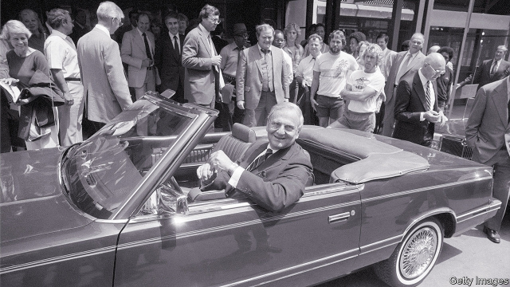

###### King of Detroit

# Obituary: Lee Iacocca 

 

> print-edition iconPrint edition | Business | Jul 4th 2019 

THE WORLD’S carmakers can be roughly divided by specialisation. Europe’s are regarded as the best at sophisticated engineering. Japan’s are the masters of mass-production techniques. What American car firms do best is marketing their products. That reputation was acquired largely thanks to the efforts of an American business legend, Lee Iacocca, who died on July 2nd at the age of 94. 

Brash, tireless and in the seclusion of the boardroom wreathed in a cloud of cigar smoke and profanities, Mr Iacocca presented a public image when boss of Chrysler as the patriotic car guy urging his countrymen to buy American. His rescue of the perennial weakling among Detroit’s “Big Three” from the brink of bankruptcy, and his regular appearance in the firm’s television adverts—once challenging customers that “if you can find a better car, buy it”—made him a celebrity boss long before such an idea became commonplace. 

Public recognition in America and beyond—his autobiography, published in 1984, sold 6.5m copies worldwide—may have come through his turnaround of Chrysler, which he joined as boss in 1980, but it would not have been possible without his remarkable ability throughout his career to sell himself as much as he sold cars. The son of a hot-dog vendor from Italy, he joined Ford in 1946 and grappled his way to the top using a flair for marketing ruses and a recognition that flogging Fords relied on flashy design, as much as the reliability and safety that the firm believed were its main assets. 

He made his name at Ford when he was in charge of the Mustang, unveiled in 1964. Sports-car looks coupled with a relatively modest price tag, backed up by a clever promotional campaign, made the “pony car” an instant bestseller and an enduring classic. It also helped to propel Mr Iacocca to the top job at Ford in 1970. But the salesman’s pushiness and a bluntness that bordered on insubordination were distasteful to the patrician Henry Ford II, chairman and grandson of the firm’s founder. “Sometimes you just don’t like somebody,” he gave as his reason for firing Mr Iacocca, despite a successful eight-year stint at the firm’s helm. 

Mr Iacocca skipped across Detroit to revive a dying Chrysler. Once there he used his powers of persuasion and an ad campaign that asked “Would America be better off without Chrysler?” to wrest a $1.5bn loan guarantee from the government to ensure the firm’s survival. Savage cost-cutting and a nose for the next big thing, in this case smaller cars and minivans, forerunners of the craze for SUVs, returned Chrysler to bumper profits. 

Mr Iacocca’s newfound taste for lobbying the government and the American public’s shifting taste towards smaller, better-equipped and fuel-efficient vehicles together laid the ground for the downsizing of Detroit. The import restrictions on foreign cars that Mr Iacocca argued for ended up encouraging Japanese and later European carmakers to set up shop in America and win a bigger share of its domestic market. By the early 1990s Chrysler was losing money again. No amount of ads featuring Mr Iacocca badmouthing foreign brands could burnish the firm’s ageing line-up. In 1992 he was shown the door. 

His involvement in an attempted hostile takeover of his former firm by Kirk Kerkorian, a corporate raider, thrust him briefly back into the limelight in 1995. But his salesman’s touch was deserting him and the bid failed. Aside from cars and cigars Mr Iacocca flirted with politics. He considered running in the presidential election in 1988, but eventually got cold feet, perhaps concluding that America wasn’t ready for a businessman in the Oval Office, no matter how hard he sold the idea.◼ 

