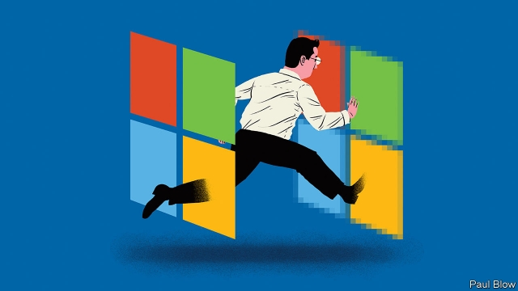

###### Bartleby

# Send in the clouds 

 

> print-edition iconPrint edition | Business | Jul 4th 2019 

LIKE AN NFL changing room, the technology industry is littered with the bodies of fallen champions, from AOL to Yahoo to Blackberry, in urgent need of rehabilitation. Ten years ago many might have expected Microsoft to end up in the same state. But the software giant has made a startling comeback, frequently vying for the title of the most valuable company on global stockmarkets, with a market capitalisation above $1trn. 

The story of this revival is the subject of a new case study by Herminia Ibarra and Adam Jones of London Business School (LBS). In large part the success has resulted from a shift away from a focus on the Windows operating system and towards Azure, Microsoft’s cloud-based services offering. It involved a willingness to let programs run on Apple and Android smartphones, something the company had previously avoided. 

However, the turnaround also required a change to the company’s culture and that is the main subject of the LBS study. The shift to cloud-based services meant that revenues would be generated in a different way. Under the old system, clients bought software under a fixed-term contract; once the sale was made, the revenue was guaranteed. Cloud services are paid for on a metered basis; revenue comes in only when customers use them. That required a new approach by the company’s sales team, led by Jean-Philippe Courtois. 

The shift was enormous. Around 40,000 people had to change how they did their jobs. Three elements were important. First, staff had to understand how customers were using cloud-based services, so that they could be encouraged to use them more. This required 5,000 specialist hires. 

Second, to permit existing sales staff to concentrate on attracting and retaining customers, they had to be relieved of some duties, such as preparing sales forecasts. Internal review meetings were reduced, including an intimidating ordeal known as the mid-year review in which senior executives grilled employees—and for which workers spent lots of time cramming like students for a test. 

Lastly, salespeople needed an incentive to put in the work to flog the new products, which were potentially less lucrative for them than the old fixed-term contracts. This involved a greater use of performance bonuses. 

Technology chivvied the process along. A new tool helped workers analyse how much time they spent in meetings or writing emails and whether they were interacting with fellow employees or with clients. It also allowed the usefulness of meetings to be gauged. If staff were fiddling with their smartphones, they were not listening to their colleagues. (The test could be usefully applied at a lot more places than Microsoft.) 

Managers have had to change, too. Microsoft is introducing a programme called “Reimagine Managers” which aims to foster an approach of coaching and caring for the staff. Technology has made some routine management tasks (like organising rotas) easier, leaving more time for talking to employees. 

Changing a corporate culture is an enormous task, and Mr Courtois admits that it is a work in progress. Microsoft, he says, has shifted from a “fixed mindset” to a “growth mindset”. 

But what is interesting about the Microsoft case study (which is mostly free of such management jargon) is that it highlights the practical changes needed to transform a company. Microsoft could have been a classic victim of “creative disruption”, so dependent on an existing technology (personal computers) that it failed to manage the shift to a world dominated by mobile devices. But the shift has only been successful (so far) because it has involved not just strategic insight, but a change in approach across the workforce. 

Microsoft can still trip up. Tech companies are like the Red Queen in Lewis Carroll’s “Through the Looking Glass”—constantly running to stay in the same place. IBM successfully shifted from hardware to services in the 1990s, but has struggled to get its revenues to grow or to lift its share price in recent years. 

In the long run Microsoft’s fortunes may depend on whether acquisitions like LinkedIn, a career site, or GitHub, a software-development startup, prove to be wiser than its failed bet on Nokia’s mobile-phone business earlier in the decade. But Microsoft has already shown that, even in a big organisation, culture change is possible. 

