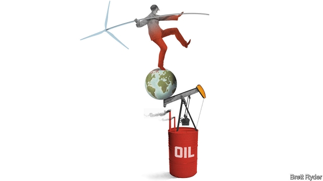

###### Schumpeter

# Shell’s boss delivers some hard truths on oil and climate change 

 

> print-edition iconPrint edition | Business | Jul 6th 2019 

WHEN BEN VAN BEURDEN was a boy in the Netherlands, one of his chores was to fill the coal scuttle. It was a hateful task—especially in the cold weather when he had to traipse out to a shed in the back garden. “I can still feel the wet, freezing cold creeping up my legs,” he told a Dutch audience last year. He hated the coal furnace because he had to wash himself next to it. He hated the washcloth because it did not stay hot for long enough. But it gave him a cold, hard lesson in the importance of energy. 

Mr van Beurden, boss of Royal Dutch Shell, the world’s second-biggest publicly traded oil company, is not the first well-paid executive to dwell on the hardships of his youth. But his story is poignant because of what came next. In the 1960s the vast Groningen field in the Netherlands brought natural gas to the country for the first time. The coal scuttle and cold washcloth gave way to a hot shower—and progress for his whole family. 

In these days of worry about global warming, another energy transition is under way: from fossil fuels to clean energy. Of all the oil majors, Shell’s attempts to navigate it under Mr van Beurden are the most intriguing. In 2016 it splurged $52bn on BG Group, becoming the biggest listed gas producer. The importance of oil in its business has diminished; measured in years of production, its reserves are lower than those of its Western peers—ExxonMobil, BP, Total, and Chevron. Shell is bolder than its rivals in forecasting huge global demand for clean power over the next 30 years. And it is the only firm to link its executive’s pay to progress in reducing emissions across its operations, including sales of products such as petrol—the source of most of the industry’s emissions. 

In other words, for all the cynicism that oil firms are “greenwashing” their way through the energy transition, Shell’s efforts should be taken seriously. But how seriously? Despite the urgency to tackle climate change, Mr van Beurden has no intention of going all in on a post-carbon future, and warns against Shell sticking its neck out too far. To explain why, he sets out a few hard truths. 

The first is about business itself. Shell may justifiably fear being on the wrong side of history when it comes to climate change. But it needs shareholders’ support to move in the right direction. Though some investors put global warming as their highest priority, most still relish the juicy 10%-plus returns that Shell generates on capital employed in big, risky projects such as oil wells and refineries. They are wary of cleaner-energy ventures such as electricity, where Shell has taken its first steps; returns are steadier, but puny (say 4%). New-energy businesses such as hydrogen and biofuels are seen as financial black holes. So Shell has to coax investors along with a mix of hard cash and prudent investments. 

The cash comes from Shell’s legacy businesses, upstream oil and gas, and downstream chemicals and oil products. Last month it laid out a plan to return $125bn—a whopping half of its current market value—to investors, through dividends and share buy-backs from 2021 to 2025. Some analysts worry that it might be planning to drain its hydrocarbon reserves to keep the cash machine running. Shell insists that is not the case; it has sought to reassure critics by earmarking most of its $30bn annual capital-expenditure budget over the five-year period for fossil-fuel related projects. As for the prudence, it will only ramp up spending on its nascent power business if it can show that returns come close to those of oil and gas. Investors wanting more ambitious climate strategies can put their cash into clean-tech companies instead. 

The next tough subject is the market for energy. Demand for coal and oil may have peaked in the West. But, like the young Mr van Beurden, many poor countries still lack readily available fuel supplies, and hanker for the modernisation energy brings. Shell sees plenty of scope to substitute biomass and coal with gas and cleaner energy sources in the developing world. Thanks to rising populations and incomes there, global energy demand is likely to stay high for decades to come. Less reassuringly, this also explains why Shell sets itself unit, rather than aggregate, targets for reducing its carbon footprint: it aims to halve the emissions per unit of energy it produces by 2050, rather than slashing emissions outright. So if energy demand continues to soar, the commitment will constrain Shell’s business much less than it appears—with less benefit to the planet. 

Mr van Beurden justifies this with a third hard lesson: the world has a shared responsibility to tackle climate change. Even if all the Western oil majors decided to stop pumping oil and gas to reduce carbon emissions, global production would shrink by only 10%; state-owned oil companies from China, Russia, the Gulf and elsewhere could pick up the slack. There are overlapping sources of carbon emissions, too. Shell, for instance, sells far more oil products through its 44,000 petrol stations than it refines. Who bears responsibility for reducing the carbon footprint of those products? Shell, the companies that pumped the oil, the carmakers whose engines burn the fuel, or the people who drive the vehicles? The answer is probably a combination of all of them. 

To heap the blame for global warming on the oil industry alone would be to oversimplify the emissions problem. True, companies like Shell could have been more open about evidence of the risks from climate change, and they sometimes lobby against steps to reduce emissions. But everyone bears responsibility. That includes other fuel-guzzling industries; governments for failing to explain the need for carbon taxes, and find ways to capture and store carbon; and society at large for its utter dependence on fossil fuels. Mr van Beurden’s plain speaking will earn him little credit from those determined to paint the firm as a pantomime villain. But everyone should take a long, hard look in the mirror to appreciate how much they too need to change their habits to reduce demand for fossil fuels. A cold, wet washcloth may come in handy.◼ 

