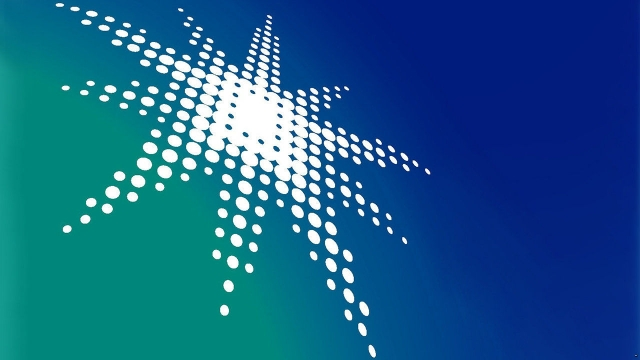
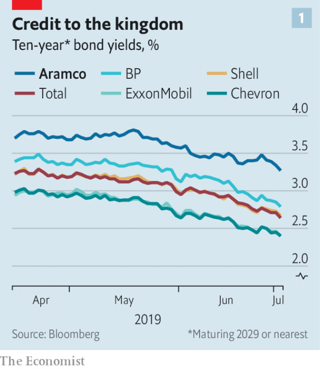
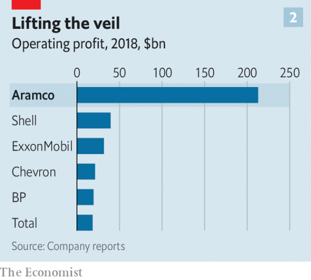

###### Saudi Aramco

# The world’s biggest potential IPO may be on again 

 

> print-edition iconPrint edition | Business | Jul 6th 2019 

BETWEEN THE end of Ramadan in early June and the start of the scorching summer holidays, a window for dealmaking has opened in Saudi Arabia. Swarming through it are some big-hitting investment bankers. They are hoping for a second chance to play a role in a potentially historic initial public offering (IPO): that of Saudi Aramco, the world’s biggest oil company. 

So far, the Aramco IPO has been more mirage than money-spinner. Muhammad bin Salman, the crown prince, announced it with fanfare (and scant forethought) in 2016, hoping for a $2trn valuation that would dwarf any other public company on the planet. Last year the process ran into the ground, amid differences between Prince Muhammad, Aramco and its legal advisers about whether the main listing should be in New York, London or elsewhere, and whether the $2trn was remotely achievable. The killing of Jamal Khashoggi, a Saudi journalist, in the kingdom’s consulate in Istanbul in October cast an even darker cloud over its prospects. 

Yet recently three things have changed the mood, and momentum to list Aramco as early as next year is picking up, say advisers. The first is Aramco’s so far successful $70bn acquisition of 70% of Sabic, the kingdom’s biggest petrochemical company. This needs to be approved by global antitrust regulators before a listing can take place, but that is considered a fairly safe bet. The acquisition is set to make Aramco the world’s biggest downstream producer of refined products and chemicals, as well as the biggest upstream firm. 

 

Second, Aramco’s first international bond offering in April attracted orders of $100bn for a $12bn issue, a staggering vote of confidence despite Khashoggi’s murder. Yields trade roughly in tandem with international oil majors (see chart 1), auguring well for further exposure to the capital markets. The offering was accompanied by Aramco’s first disclosures of drilling costs and profits that put the company in a league of its own (see chart 2). The experience is said to have reassured sceptics in the kingdom that it is safe to open the crown jewel to outsiders. 

 

Third, Aramco is building on that openness by promising to hold its first earnings call in August. This could be good preparation for the interaction with investors that would be required of a listed company. 

High hurdles remain. Aramco’s lawyers are against listing it in New York for fear district attorneys will hound it over allegations that the kingdom provided support to the perpetrators of the September 11th 2001 terrorist attacks. Though the London Stock Exchange has courted Aramco assiduously, the City is becoming more ambivalent about oil and gas investments for environmental reasons. Saudi Arabia’s Tadawul exchange is too small to handle potential stock trades of trillions of dollars. Ultimately the whereabouts of the listing may be a geopolitical call. If President Donald Trump cajoles Prince Muhammad into listing in New York, he may oblige. But the valuation remains in the lap of the gods. ◼ 

