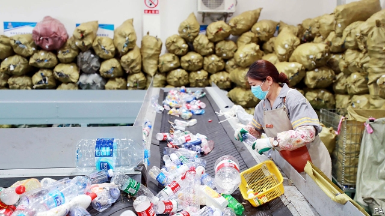

###### Recycle, or else

# Cheerleaders and police usher in a new era of trash-sorting 

 

> print-edition iconPrint edition | China | Jul 6th 2019 

“WHAT KIND of rubbish are you?” This question might normally provoke anger, but in Shanghai it has elicited weary groans over the past week. On July 1st the city introduced stringent trash-sorting regulations that are expected to be used as a model for the country. Residents must divide their waste into four separate categories and toss it into specific public bins. They must do so at scheduled times, when monitors are present to ensure compliance (and to inquire into the nature of one’s rubbish.) Violators face the prospect of fines and worse. 

Shanghai authorities are responding to an obvious environmental problem. It generates 9m tonnes of garbage a year, more than London’s annual output and rising quickly. But like other cities in China, it lacks a recycling system. Instead, it has relied on trash pickers to sift through the waste, plucking out whatever can be reused. This has limits. As people get wealthier, fewer of them want to do such dirty work. The waste, meanwhile, just keeps piling up. China churns out 80bn pairs of disposable chopsticks a year. 

Officials have tried before to get people to limit their rubbish. But bins marked for recycling have in practice served as yet more garbage cans. This time the government sent a signal that it was more serious: Xi Jinping, the president, visited Shanghai last year and called on the city to make a success of its trash-sorting. Propaganda authorities have spared little effort. It has been a top item on news broadcasts for days on end. Just about every building has been plastered with recycling instructions. A popular reality-television show featured celebrities walking along river banks to pick up garbage. There have also been public performances, including cheerleaders dancing to a peppy song about recycling and traditional drumming troupes battering away at rubbish bins. 

The threat of punishment is integral to Shanghai’s drive. On the first day of enforcement the government sent 3,600 city-management officers, a quasi-police force, to 4,216 rubbish-collection points. They began by making an example of wealthy foreigners: the first warning was issued to Swissôtel Grand, a five-star hotel, for improper sorting. 

Individuals who fail to recycle could be hit with fines of up to 200 yuan ($29). For repeat violators, the city can add black marks to their credit records, making it harder for them to obtain bank loans or even buy train tickets. Some object to this. Peng Feng of the Shanghai Academy of Social Sciences warns that the use of the credit system is overkill, raising a risk that officials will abuse their power. But others say a tough campaign is necessary. “Slowly people will get used to it,” says Li Changjun of Fudan University. 

Many residents appear to support the idea of recycling in general but are frustrated by the details. Rubbish must be divided according to whether it is food, recyclable, dry or hazardous, the distinctions among which can be perplexing, though there are apps to help work it out. Some have complained about the rules surrounding food waste. They must put it straight in the requisite public bin, forcing them to tear open plastic bags and toss it by hand. 

Most vexing are the short windows for dumping trash, typically a couple of hours, morning and evening. Along with the monitors at the bins, this means that people go at around the same time and can keep an eye on what is being thrown out; no one wants to look bad. But it is inconvenient. “People have to get to work. We don’t have the time for this,” said Mr Wu as he threw out rubbish outside his apartment building. To your correspondent’s untrained eye, his sorting looked impeccable. ◼ 

