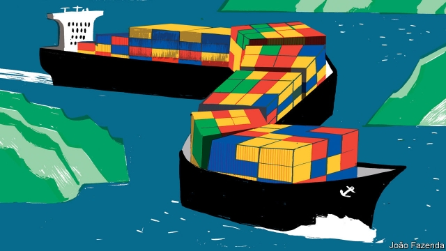

###### A chained dragon

# China’s maritime expansion reflects a curious mix of ambition and paranoia 

 

> print-edition iconPrint edition | China | Jul 6th 2019 

GEOGRAPHICAL GOOD luck gave Wu Zhaozong a front-row seat as China opened to the world. As a boy he watched his grandfather steer a horse-drawn cart through the docks of Tianjin, on China’s northern coast. Poor neighbours, living in courtyard homes shared with four families, would follow carts to pick up horse dung and fallen coal-lumps for fuel. Coal was a Tianjin export, as was garlic for Japan. “I very rarely saw cars,” Mr Wu recalls. 

Today Tianjin is one of the world’s ten busiest ports, and Mr Wu is operations director of a ship-supply company. The firm’s work includes securing giant wind turbines on ships bound for Chinese partners in Africa. Earlier this week Mr Wu gave Chaguan a lift in his BMW to Tianjin’s passenger terminal. There he oversaw crisply uniformed Filipino sailors loading fresh produce onto a cruise ship, before it carried newly affluent Chinese tourists to Japan. The changes witnessed by Mr Wu—driven by Tianjin’s location as a gateway to Beijing and other northern cities—have been both dramatic and astonishingly rapid. For Mr Wu, an amiable father of two little girls, is just 38 years old. 

China was an inward-looking, continental power when Mr Wu was born. It rose in part by turning to the sea. Seven of the world’s ten largest container ports are in China. Overseas, Chinese companies had by 2018 helped build or expand 42 ports in 34 countries, often as part of the Belt and Road Initiative, a global infrastructure scheme. Chinese operators own majority stakes in foreign ports from Abu Dhabi to Zeebrugge. 

Unusually in its long history, China faces no serious threat of invasion by land. Against that, its national wealth is concentrated in regions near the sea, as never before. Coastal provinces and cities account for a small fraction of its landmass, but more than half of its GDP. Unsurprisingly, China is striving to become a maritime great power. Its navy, now the largest in Asia, is tasked with defending all that coastal wealth, but also with protecting shipping lanes that carry 85% of the country’s trade in goods by volume, as well as vital energy imports. Naval might backs up territorial claims that include the island of Taiwan and almost the whole of the South China Sea. A final naval mission involves denying American warships risk-free access to seas within the “first island chain”, the archipelago that encircles China’s coastline, comprising Japan and its southern islands, Taiwan and the Philippines. 

Not so long ago China called America imperialist for operating foreign military bases. In 2017 China opened an overseas naval base of its own, in the African country of Djibouti. Ostensibly commercial Chinese investments in ports around the Indian Ocean or the South Pacific now routinely trigger sharp questions from America, Australia and other Western powers with Pacific security interests, asking whether another Chinese base is about to open. In late June a senior Pentagon official wrote to Cambodia’s government to express concern that Chinese military assets might soon be welcomed at the Ream naval base, the country’s largest. Cambodia denies such plans, though it is awash with Chinese money. 

Many ordinary Chinese insist that China’s only fault is to grow large enough to frighten the West. “We’re not and, in our history, have never been an aggressive country,” says Mr Wu in Tianjin, loyally, though he is sure that China will defend itself if attacked. 

Hawkish Americans scoff at such assurances, which they often hear from Chinese leaders. They point to such acts as China’s construction of airbases and missile batteries on disputed reefs in the South China Sea and see aggression and swaggering confidence. 

Chinese strategists urge Westerners to understand that their country’s maritime rise is also guided by deep insecurity. They call China not so much blessed by geography, as cursed. They have a point. In “Red Star over the Pacific”, an influential book on China’s maritime ambitions, Toshi Yoshihara and James Holmes, two naval scholars, note that President Dwight Eisenhower saw the first island chain as a means for America and allies to hem China in, a view shared by Chinese admirals. The book quotes a Chinese military strategist who calls Taiwan, at the chain’s centre, “a lock around the neck of a great dragon”. It describes the claustrophobia of Chinese planners when they contemplate paths to the ocean that run through narrow choke-points between South Korea, Japan, Taiwan and the Philippines, or through the Strait of Malacca near Singapore. China has 14 land neighbours. America is envied for having two, friendly ones, and vast oceans to each side. 

America’s geography is even luckier below the waves, argues Owen Cote of the Massachusetts Institute of Technology, in a new study in the Bulletin of the Atomic Scientists. Since the cold war, he writes, America has successfully tracked foreign submarines with acoustic arrays placed where continental shelves end and deep oceans begin. Asian allies host American arrays to detect Chinese submarines heading for the ocean past Japan, Taiwan or the Philippines. Geographical constraints—such as the shallowness of Chinese inner seas—make it hard for China to build similar arrays. 

Hu Bo, a prominent naval strategist at Peking University, suggests that China may need perhaps two more overseas military bases between Djibouti and the South China Sea, because Djibouti would be too far from home “once we are in an emergency, say on the brink of war”. Whereas America gained many bases by fighting world wars, China must seek bases through discreet negotiations. Some might be primarily commercial in peacetime, he suggests. Increasingly, China has “huge interests overseas”. That offers avenues for co-operation with other countries, but also vulnerabilities. Mr Hu says it would be a “suicide mission” for China to take any actions that might provoke a blockade in its near seas—whether by America or other sea-powers. That is an oddly reassuring argument, at least for the rest of the world. In geopolitics, if not geography, a sense of vulnerability can be a stroke of luck.◼ 

