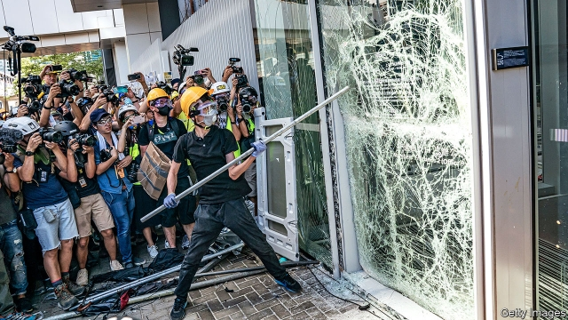

###### Anti-establishment day

# Protesters expose a fractured Hong Kong, but China’s grip only tightens 

 

> print-edition iconPrint edition | China | Jul 6th 2019 

IT WAS A dramatic rebuke of Chinese rule of Hong Kong, on the day it was meant to be celebrated. On July 1st, a public holiday known as Establishment Day in honour of the handover of the territory in 1997 from Britain to China, anti-government protesters stormed into and ransacked the city’s Legislative Council, displaying a British-era colonial flag for cameras and live social-media feeds. Hours after Carrie Lam, the territory’s chief executive, had toasted the putative success of 22 years of mainland rule, protesters laid bare for the world the reality of a deeply fractured, fractious Hong Kong. 

The violence provided Mrs Lam and Chinese leaders in Beijing, on the defensive after weeks of massive but mostly peaceful protests, an opening to harden their line against protesters. They moved quickly to take it. Mrs Lam held a press conference at police headquarters at 4am on July 2nd, condemning the break-in and defacement of the Legislative Council, known as Legco, and vowing that perpetrators would be caught and punished (there have already been some arrests). The Chinese central government’s Liaison Office in Hong Kong declared that the “savage acts were an outright provocation and trampling of the city’s rule of law.” On July 3rd Liu Xiaoming, the Chinese ambassador to Britain, denounced Hong Kong’s “ultra-radicals”, saying they had “challenged the bottom line of one country, two systems”, the framework, negotiated in a treaty with Britain, under which Hong Kong’s freedoms are meant to be protected until 2047. 

Mr Liu had taken the unusual step of holding a press conference in London to admonish the British government, which had warned China to abide by its commitments under the bilateral treaty. “The UK government chose to stand on the wrong side,” Mr Liu said, warning of “consequences” to the relationship with China if Britain continued to “interfere”. “Hands off Hong Kong,” he said. “It is not what it used to be under British colonial rule.” 

There will be no confusion about that. The tough, co-ordinated response to the Legco break-in, and to critics abroad, will reinforce concerns that Chinese custodianship of the territory will grow only more stern with time. The protest movement this year is the latest of several since the handover that have been sparked by fears that freedoms in Hong Kong are eroding under Chinese rule. This time the tinder was an extradition bill that would allow people accused of crimes in mainland China to be sent there for trial, a power which many worry would be wielded to stifle dissent. On June 15th, after massive protests and clashes with the police, Mrs Lam suspended consideration of the bill. A day later a crowd estimated by organisers at 2m people marched, in a territory of 7.5m; many demanded that the bill be withdrawn entirely, and that Mrs Lam resign. She did not, but as the demonstrations kept going in the weeks following, Mrs Lam decided to lie low and adopt a more contrite tone. 

As long as the marches remained peaceful, the authorities waited them out, as they did in 2014 when large democracy protests went on for months in what became known as the Umbrella Movement. It dissipated, its ringleaders later arrested and jailed, without any democratic concessions from the government. The successes in Hong Kong protests have been almost exclusively defensive: stopping the government from passing a security law, or from mandating patriotic education. 

A sense of powerlessness may have informed protesters this time. On the morning of July 1st Mrs Lam promised that the government would be more open and would listen to the people of Hong Kong. Outside, protesters were facing police on the streets. Across town, crowds were gathering for another march through the city to demand political reform, an annual rite on Establishment Day; organisers say this one drew 550,000 people (the police say 190,000). Many walked peacefully past the government’s offices in Admiralty. But hundreds heeded calls to turn towards Legco, where some protesters had been gathering since the early morning. 

One group used a makeshift battering-ram, fashioned from a trolley, to break a large glass door on the outside of the building. Later, at about 9pm, they breached a metal gate and got inside. Some sprayed graffiti and ransacked offices. From the main council chamber they read out a list of demands, which included the removal of unelected politicians from Legco. One protester unfurled a colonial-era flag; another painted over the part of Hong Kong’s official title which describes it as being part of the People’s Republic of China. Again they repeated calls for Mrs Lam to resign. 

Many in the protest movement are sympathetic to those who ransacked Legco, while disavowing the violence. On July 2nd Joshua Wong, one of the leaders of the Umbrella Movement, who on June 17th emerged from a third stint in jail, posted to Twitter that Mrs Lam suspended the extradition bill only after police clashed violently with protesters around Legco, on June 12th. “Months of Hong Kongers and the world expressing concern did not matter to her at all until she saw blood,” he tweeted. He also has called for Mrs Lam to resign. 

Demonstrators should be careful what they wish for. Some veterans of the democracy movement have privately told foreign contacts that Mrs Lam’s resignation as chief executive is something to fear, because only the fiercest of hardliners would be willing to take her job in the present climate. Others worry, too, that the Liaison Office would exert more influence, pushing Hong Kong towards more political integration with the mainland. 

Yet China has its own reasons to fear an early change of chief executive before the end of Mrs Lam’s first term in 2022. To remove Hong Kong’s leader now would be to re-open the painful question of how chief executives are chosen—a process which involves a pro-establishment selection panel and endorsement by Communist Party bosses in Beijing, rather than anything approaching a free, democratic election. That would provide more tinder for protests. ◼ 

