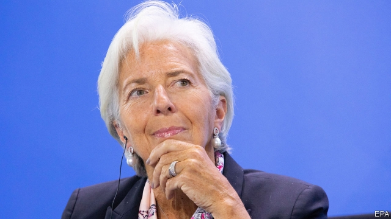

###### Sticking to the plan

# A change of direction under Christine Lagarde is unlikely 

 

> print-edition iconPrint edition | Europe | Jul 4th 2019 

WHEN CHRISTINE LAGARDE was asked last year whether she was interested in a job in Europe, the head of the IMF made an emphatic denial. “No, no, no, no, no, no,” she told the Financial Times. “I have a very important job here that I want to do and I’m not going to leave that beautiful vessel when there might be rough waters out there.” But the vagaries of European politicking are such that on July 2nd she was anointed successor to Mario Draghi at the European Central Bank (ECB), as part of the package for top EU jobs (see article). 

The decision comes as a surprise to bank-watchers. Ms Lagarde’s name had been floated as a possible candidate but, her denial aside, she had been thought an unlikely choice because of her lack of an economics pedigree. Like Jerome Powell, the head of America’s Federal Reserve, Ms Lagarde is a lawyer by training. Unlike Mr Powell when he was appointed chairman, she has no central-banking experience, though she held various ministerial positions in France—including the finance portfolio—before she moved to the fund. 

Her experience means that the well-respected Ms Lagarde brings solid political and communication skills to the bank. But when combined with other recent changes at the top, her nomination means that the bank loses technical expertise even as threats to the economy loom. 

Unusually, the selection of the new boss—Mr Draghi’s eight-year term ends in October—coincided with five-yearly parliamentary elections, when the EU’s other top jobs fall vacant. Leaders had initially paid lip service to a “3+1” approach, feeling that the more technocratic ECB position needed to be treated separately from the more political roles. In the end, though, the job was part of the horse-trading. 

Ms Lagarde is right to worry about choppy waters. The euro area’s economy has been hammered by a slowdown in global trade and the lingering threat of a trade war. Mr Draghi has more or less committed himself to providing more stimulus should the economic situation fail to improve. But interest rates are already negative, and quantitative easing is near the bank’s self-imposed limits. So boosting demand significantly means either expanding the monetary toolkit or persuading governments—particularly frugal northerners—to enact fiscal stimulus. Some central bankers, such as Olli Rehn, the head of the Finnish central bank and a member of the ECB’s decision-making body, think the circumstances call for a wholesale review of the ECB’s monetary-policy framework. 

Fortunately, Ms Lagarde is admired for her willingness to listen to a variety of opinions, and her ability to build consensus among the fund’s shareholders. Perhaps her two biggest challenges in her eight years at the IMF were the sovereign-debt crisis in Greece and, more recently, a big loan to Argentina. It is too soon to tell how well the Argentine bail-out has gone. The fund’s initial approach to Greece, formed before Ms Lagarde took over in 2011, came under fire for being swayed by European creditors. But by 2015 it had changed course, resisting pressure from Germany to participate in yet another bail-out, and calling for less stringent budget-surplus targets. That might suggest a degree of the political independence that a central banker will need. 

Ms Lagarde’s comments over the years suggest that she will steer broadly the same course as Mr Draghi. She supported his pledge to do “whatever it takes” to preserve the euro and was an early advocate of quantitative easing, says Andrew Benito of Goldman Sachs, an investment bank. 

But can she make the weather, rather than be shaped by it? Whereas Ms Lagarde’s role at the fund is broad—she would opine on matters ranging from global inequality to sexual harassment—her new job is narrower, and more technical. Mr Draghi may have been able to make bold policy calls because he understood markets and economics so well. 

All this makes the team at the bank more important. But Ms Lagarde joins its six-strong executive board just as it sheds expertise. When she starts in November, the board will have as many lawyers as economists. Like her, Luis de Guindos, the vice-president who joined last year, is a former minister with no prior monetary experience. Benoît Cœuré, the Frenchman in charge of market operations, leaves in December. Philip Lane, the chief economist and a former academic, may find himself deploying a powerful hand on the tiller. ◼ 

