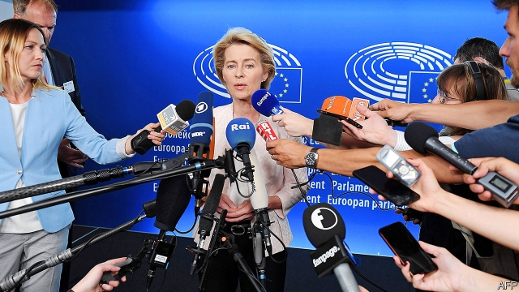

###### The Leyen’s share

# EU leaders’ arduous deal on top jobs may yet fall apart 

 

> print-edition iconPrint edition | Europe | Jul 4th 2019 

EMMANUEL MACRON is a lucky man. His rivals and opponents have a habit of doing themselves harm. In the French presidential election in 2017 his main centre-right rival was consumed by a corruption scandal. Earlier this year anti-government gilets jaunes protesters surged then faded in part because disorganisation and public-relations mistakes took their toll. And this week Mr Macron obtained something close to a dream outcome in the allocation of big European jobs. Once again this was largely thanks to others’ mistakes. 

After three days of talks the EU’s leaders (minus Theresa May of Brexiting Britain) agreed to nominate Ursula von der Leyen, Germany’s defence minister, to the presidency of the European Commission, the EU’s executive. A moderate Christian Democrat close to Angela Merkel, Mrs von der Leyen shares some of Mr Macron’s federalist inclinations. Also, she did not run in the recent European election campaign as a Spitzenkandidat or “lead candidate” for the commission job—a convention that the French president wants to kill off. The presidency of the European Central Bank (ECB) goes to Christine Lagarde, the French head of the IMF who, like Mr Macron, is on the doveish side of Europe’s economic debates. The presidency of the European Council, the group of EU heads of government, goes to Charles Michel, Belgium’s liberal prime minister and a Macron ally. The final appointment sees Josep Borrell, a veteran Spanish social democrat, as the EU’s high representative for foreign affairs and security policy. 

“Macron is delighted with the outcome,” observes Mujtaba Rahman of the Eurasia Group, a consultancy. He points out that the result was less Mr Macron’s design than the product of others’ errors. 

The first was made last November, when the European People’s Party (EPP), the group of centre-right parties, picked Manfred Weber, a Bavarian member of the European Parliament, as its lead candidate. The EPP came first in the European Parliament elections that took place from May 23rd to 26th, which under the Spitzenkandidat convention would have made Mr Weber the prime candidate for the commission. But he has no executive experience, little profile outside Brussels and his native Germany and a reputation for making excuses for Hungary’s authoritarian government. Moreover, the EPP lost seats, along with its traditional partners in the centre-left Socialists and Democrats (S&D) group. Mr Weber was too contentious a figure for the newly fragmented parliament to settle on his candidacy, or on a single alternative. Although Mrs Merkel, the EPP’s most powerful leader, backed her compatriot, other leaders objected to him at a summit on June 20th. Unable to reach a deal, the leaders postponed their talks to June 30th. 

It was Mrs Merkel who made the second mistake. In discussions with Mr Macron and the prime ministers of Spain and the Netherlands, the German chancellor agreed to a compromise whereby Frans Timmermans, the S&D’s lead candidate and a Dutch vice-president of the commission, would take the commission presidency, with Mr Weber becoming president of the parliament and a liberal running the council. Mrs Merkel’s colleagues in the EPP, such as Leo Varadkar of Ireland, objected that the parliament job was too puny a prize for coming first. The leaders of eastern states and Italy, too, dislike Mr Timmermans for his record of tough action against illiberal abuses. 

The summit on June 30th dragged on into July 1st. By breakfast it was clear that neither Mr Timmermans nor Mr Weber could command the necessary support. Leaders suspended the talks until the following morning, when Mr Macron floated the idea of Mrs von der Leyen. Acceptable to Mrs Merkel, the rest of the EPP, the easterners and to left-of-centre governments, she was the tolerable candidate exhausted leaders could accept. With a German heading for the commission, Mr Macron could press for a Frenchwoman at the ECB. 

Yet the package did not inspire universal approval. Some, especially in the EPP and S&D, complain that Mrs von der Leyen lacks a democratic mandate, having not campaigned as a Spitzenkandidat. Her struggles to modernise the armed forces cause some to question her competence: “Germany’s weakest minister”, sneered Martin Schulz, a German former president of the European Parliament. Other objections have also bubbled up. All four of the big jobs settled at the summit go to western Europeans at a time of heightened tensions between easterners and westerners. 

All of which makes support for the package in the parliament uncertain. In votes on the parliament’s own presidency on July 3rd MEPs from the “grand coalition” of moderate pro-EU parties—the EPP, S&D and liberals—splintered as some social democrats backed the Green candidate and easterners in the EPP backed a Czech from a more right-wing group. David Sassoli, an Italian social democrat supposedly supported by the grand coalition, won with only 345 of its 442 votes, and no others, meaning that he does not enjoy a majority among the parliament’s 751 members. 

That may suggest that Mrs von der Leyen is also not guaranteed the majority she needs to secure the commission presidency. That vote is due to take place between July 15th and 18th. If she fails, leaders will have to return to the drawing board. They might then turn to Margrethe Vestager, the liberal competition commissioner who was a Spitzenkandidat in all but name and fairly widely acceptable. Otherwise the options are few. 

But if she does succeed, what sort of a commission president will Mrs von der Leyen make? It is true that after five years of her as defence minister, the German armed forces are still plagued by equipment shortages and technical faults. German opposition parties are holding an investigation into her extensive and expensive use of consultancies. Yet her job is known as a graveyard of careers for good reason—the problems long predate her tenure—and Mrs von der Leyen has done well to survive in it. Multilingual and instinctively Atlanticist, she is respected by NATO colleagues for having fought for budget increases for Germany’s armed forces and presiding over expanding German military missions in places like Mali and Lithuania. She has recently warned against European complacency about China’s rise and intentions. Addressing MEPs in Strasbourg on July 3rd she struck a conciliatory tone in comments in German, French and English. 

There may have been better candidates for the commission job—for example, Ms Vestager—but there were certainly far inferior ones. Likewise, Ms Lagarde, Mr Michel and Mr Borrell are all competent figures. The Spaniard will be the most heavyweight person to hold the foreign-policy role since its creation in 2009. Europe runs on compromises like this one. It could do worse. ◼ 

