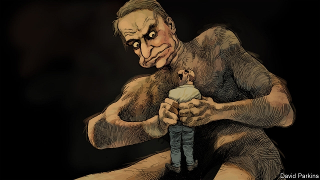

###### Charlemagne

# Family trouble 

 

> print-edition iconPrint edition | Europe | Jul 6th 2019 

TUCKED INTO a fold in the hills an hour north of Thessaloniki, Serres is old Greece: settled, traditionalist, patriotic. The town is a stronghold of the conservative New Democracy (ND) party, whose founder, Konstantinos Karamanlis, was born nearby. So it was a natural place for Kyriakos Mitsotakis, the party’s leader and Greece’s probable next prime minister, to gin up his base in the final weekend of campaigning ahead of an election on July 7th. In sweltering heat he stood straight-backed and sombre-featured at a ceremony in the old Byzantine cathedral, at a wreath-laying at a statue of Emmanouel Pappas, a leader of the Greek war of independence, and at a parade of soldiers and schoolchildren on the town’s main drag. The other dignitaries were a roll-call of conservative Greece: army generals, police officers, priests, municipal administrators and traditional military brigades. 

Mr Mitsotakis is loved here. Applause followed him around Serres and he was mobbed with requests for selfies. One man ran out of a café to grasp his hand: “My prime minister!” Here, close to Greece’s northern borders, he is particularly popular for attempting to block a deal, agreed to by Alexis Tsipras, Greece’s leftist prime minister, whereby the Former Yugoslav Republic of Macedonia was renamed “Northern Macedonia” to settle a long-running dispute. The change, argued Mr Mitsotakis and his supporters, undermines the identity and integrity of the Greek region of Macedonia; the deal, however, has now gone through. At the wreath-laying the crowd burst into a spontaneous rendition of “Famous Macedonia”, a military song associated with Greek claims to the name. 

This was Charlemagne’s second outing with the ND leader. The first, a rally at the Zappeion palace in Athens in May, was a who’s who of the Greek establishment, from industrialists to media stars and leading figures from previous Greek governments of the right. Both events epitomised Mr Mitsotakis’s deep roots in that world. He comes from a doughty political dynasty. His father was prime minister in the 1990s. He is one of them. He is family. 

Unfortunately, the old Greek establishment has not led the country well. ND governed from 2004 to 2009, ahead of Greece’s crisis and again, around its peak, from 2012 to 2015. The party was long tangled in the web of cronyism, corruption and vested interests (ranging from oligarchs to the coddled armed forces) that left Greece uncompetitive, administratively dysfunctional and, ultimately, bankrupt. Since his earthquake re-election win in 2015, Mr Tsipras has proved a far more flexible figure than expected, reforming Greece’s labour market and its pensions system and helping the country return to normal after the crisis. But much remains to be done. Debt is 181% of GDP. Red tape still stifles the private sector. The banking system needs an overhaul. Greek-Turkish tensions are rising again and nationalists on both sides are spoiling for confrontation. 

Is Mr Mitsotakis up to the task? Greece’s recovery belies its vulnerability to an economic downturn and a new European debt crisis; perhaps one caused by Italy’s fiscal theatrics. Set against that backdrop, a return to the indulgence and patronage of the pre-Tsipras era would be calamitous. 

His background is the case for the prosecution. The case for the defence comes in his personal style and agenda. Despite his pedigree, Mr Mitsotakis was an outsider when he ran for his party’s leadership in 2015. He won it not with the backing of its grandees but by touring small-town Greece and encouraging non-members to pay €2 ($2.25) to vote in the open primary. He eschews the pompous style of past leaders: in place of mega-rallies and podium speeches he prefers walkabouts and gatherings in cafés. In Kilkis, near Serres, he wanders around talking to voters (“They are ruining me with taxes!” one farmer complains) before explaining his programme to a crowd of shoppers in the town square. He styles his promises as modest and achievable. 

In the car ride back to Thessaloniki, Mr Mitsotakis acknowledges in almost accentless English that he is the embodiement of the Greek establishment. But he insists that the image is inaccurate. “I worked for years abroad,” he says of his consultancy career in London, and argues that as a minister in the last ND government he cut spending in sensitive areas and was an internal critic of the slow pace of reform. “Under me, ND has attracted different sorts of voters, including younger ones,” he adds. He plans to move fast as prime minister to harness the momentum of an election win: with tax cuts by the start of 2020 and a drive to digitise Greece’s public sector on Estonian lines. Streamlining judicial procedures, cutting bureaucracy and performance appraisals for civil servants are also on the cards, all in the hope of attracting new investment and pushing the slowing growth rate from under 2% to above 3%. 

His success or otherwise will depend on his willingness to take on parts of the old Greece and its vested interests; to take on, in other words, elements of his own political family. He declined to do so in the battle over the Macedonian name change. Likewise, he has opposed extending adoption rights to gay couples or recognising gay marriage. His backers claim this was necessary to prevent support from drifting to the far-right. Such excuses are self-serving and in any case no grounds for coddling ND’s base as prime minister. Mr Mitsotakis may well win a majority this weekend. His party already controls 12 of Greece’s 13 regional governments. He will have lots of political capital, and he should use it. 

Family fights can be an ugly business. The Greek god Cronus castrated his own father and, fearing a similar fate would befall him, gobbled up five of his own children before vomiting them back out. But at times they are also necessary. Mr Mitsotakis will need to pick some if he is to move Greece forward. Whether he has the courage to persist still remains to be seen. ◼ 

