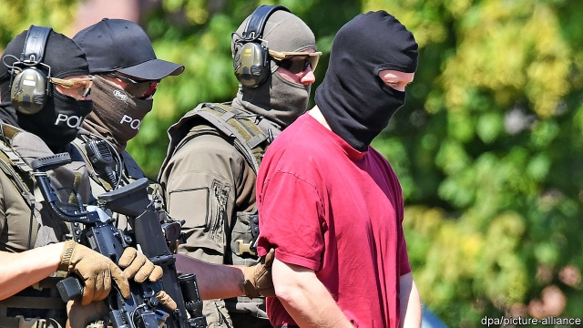

###### Xenophobic extremism

# German soul-searching after the murder of a champion of refugees 

 

> print-edition iconPrint edition | Europe | Jul 6th 2019 

FOR THE first time since the days of the Weimar Republic a German politician has been murdered by a xenophobic extremist. In June 1922 a group of anti-Semitic right-wingers appalled the German establishment by assassinating Walther Rathenau, the foreign minister, in his car on the streets of Berlin. This year, on June 2nd, Stephan Ernst, a neo-Nazi from Kassel with a history of violence against immigrants, allegedly shot Walter Lübcke, the Kassel district president, in the head outside his house in Wolfhagen, in central Germany. Mr Ernst confessed in detail at the end of June. On July 2nd he is said to have retracted his confession. 

The crime has shocked Germany more than any of the 195 murders by right-wing extremists since reunification because the victim was a representative of the state. “Never in our republic’s 70 years has democracy been challenged from the right as it is nowadays,” said Armin Laschet, the state premier of North Rhine-Westphalia, who, like Mr Lübcke, is a member of Chancellor Angela Merkel’s Christian Democratic Union (CDU) and supports her refugee policies. On Thursday June 27th more than 10,000 people took to the streets of Kassel to march against right-wing violence. 

Seventy-four years after Hitler’s death, many Germans are haunted by the spectre of resurgent neo-Nazi violence and wonder whether enough is being done to fight it. Thomas Haldenwang, head of the federal office for the protection of the constitution, responsible for Germany’s domestic security, admitted that his agency has yet to expunge the threat of right-wing extremism. Frank-Walter Steinmeier, the president, said it was shameful that Germany could not protect Mr Lübcke. 

Not enough is done to try to deradicalise neo-Nazis, says Dierk Bostel of Dortmund University, an expert on the extreme right. The police, the federal prosecutor’s office and Mr Haldenwang’s agency are being urged to work more closely together. More, it is said, must be done to monitor neo-Nazi networks and hate speech on the web. Mr Ernst, an aficionado of online Nazi propaganda, should have been closely watched ever since he nearly killed an immigrant in a train-station toilet in 1992. 

Far-right extremism surged during the refugee crisis in 2015 and has not come down. One manifestation is the rising popularity of the Alternative for Germany (AfD), which started as a Eurosceptic protest party in 2013 but has turned into a hard-right outfit akin to Austria’s Freedom Party. “The AfD are enablers of right-wing terror,” says Hajo Funke, a specialist in xenophobic extremism at the Free University of Berlin. The party’s radical wing has got the upper hand. Even though the AfD talks about expelling extremists such as Björn Höcke or Andreas Kalbitz, its ultranationalist leaders in Thuringia and Brandenburg, it has never actually kicked anyone out. 

The AfD’s reaction to the Lübcke tragedy seemed to confirm the party’s reputation. In Bavaria’s parliament, an AfD politician refused to stand for a minute’s silence in Mr Lübcke’s honour. Wolfgang Gedeon, an AfD deputy in Baden-Württemberg’s state parliament, belittled far-right terrorism as “birdshit” compared with the threat posed by the far left and radical Islamists. 

This was too much for Annegret Kramp-Karrenbauer, the CDU party leader, who said any politician hoping that her party might join a coalition government with the AfD in the future “should close their eyes and think of Walter Lübcke”. Her resolve will be tested in the autumn, when Saxony, Brandenburg and Thuringia vote in state elections. Polls show the AfD tied for first place in the first two and being supported by around 20% in Thuringia. ◼ 

