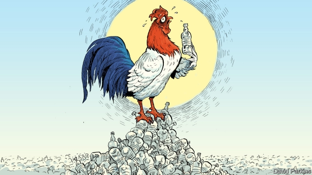

###### Green on blue

# Heat, water and plastic in France 

 

> print-edition iconPrint edition | Europe | Jul 6th 2019 

IT WAS THE day the temperature reached a French all-time record of 45.9°C (114.6°F). At the station in the sleepy Provençal town of Orange, a high-speed TGV train was being held indefinitely due to forest fires farther down the track, and passengers were wilting in the stifling heat. So the station master mobilised a human chain to shift box after box of bottled water from his store room to the train. The scene captured many of the contradictions France faces, as the land of plastic bottled water tries both to go green and stay cool. 

Ever since Emmanuel Macron vowed in 2017 to “make our planet great again”, France has sought to take the lead in greenery. The president uses respect for the Paris climate deal of 2015 as a tool of foreign policy. In Brune Poirson he has an energetic junior environment minister who seems to be off every week fishing plastic bags out of the sea or sifting through recycled waste. The government has just banned all disposable plastic in government offices from next January. A French commitment to be carbon-neutral by 2050 is going through parliament. 

Yet the country is not quite as green as it would like to think. France’s environmental council, set up by Mr Macron, recently declared that the reduction of carbon-dioxide emissions between 2015 and 2018 failed to meet government targets. Mr Macron himself cancelled a rise in the carbon tax on motor fuel after mass gilets jaunes protests. Ms Poirson, who implores her fellow citizens to embrace le recyclage, concedes that “France is behind in terms of recycling waste.” The country recycles plenty of glass bottles and paper, but only 26% of plastic packaging, below the EU average. 

Part of the problem is the sheer volume of water consumed. No French supermarket trolley reaches the till without a six-pack of litre bottles, wrapped in yet more plastic film. After the Italians and Germans, the French are Europe’s biggest consumers of bottled water. Danone, a French firm, is the world’s second-biggest supplier of bottled water, selling a dozen brands. 

Under pressure, Danone now promises to make 100% of its packaging reusable, recyclable or compostable by 2025. This would help, as long as consumers carry out le recyclage. By the end of the hottest day in French history, rubbish bins on streets and station platforms overflowed with empty plastic bottles—awaiting their probable fate as landfill. 

