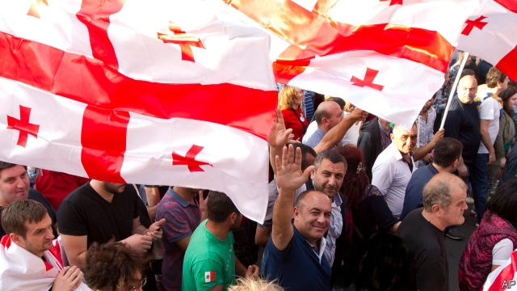
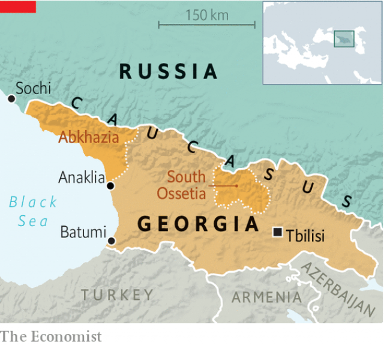

###### Back in the bear pit

# Russia plays games with Georgia 

 

> print-edition iconPrint edition | Europe | Jul 6th 2019 

SEVEN YEARS ago an oligarch’s dream came true. Bidzina Ivanishvili, a shadowy Georgian tycoon who made his money in Russia, staged a takeover of his native country. Mikheil Saakashvili, a pro-Western moderniser who had once enjoyed Mr Ivanishvili’s support, was forced out of power and from the country. Mr Ivanishvili’s winning coalition, known as Georgian Dream, claimed that democracy had prevailed over Mr Saakashvili, who was denounced as authoritarian at home and reckless abroad. Many Georgians breathed a sigh of relief as Mr Ivanishvili demonised his predecessor, whose methods often struck fear into the populace, and promised to normalise relations with Russia, which Mr Saakashvili had infuriated. 

Vladimir Putin, Russia’s president, seemed pleased. In 2008 he had attacked Georgia to stop it integrating with the West and promised to hang Mr Saakashvili “by the balls” for responding militarily to Russia’s provocations. Though Mr Ivanishvili publicly reaffirmed Georgia’s Euro-Atlantic aspirations, his actions signalled a tilt back towards Russia. Recently he has tried to undermine a plan to build a deepwater port at Anaklia, on Georgia’s Black Sea coast, a strategic project backed by America and the EU. The Kremlin has rewarded him by toning down its propaganda and reopening its market to Georgian produce. 

But in the past fortnight the Georgian Dream has turned into a nightmare. Russia’s smile has been replaced by its more familiar scowl. This happened after Sergei Gavrilov, a Communist member of Russia’s parliament close to the Kremlin and to the Orthodox Church, paid a visit to Georgia’s parliament on June 20th. The sight of Mr Gavrilov pontificating in Russian from the parliamentary speaker’s chair was more than many Georgians could bear, seeing that Russia occupies a fifth of the country’s land and props up the breakaway regions of Abkhazia and South Ossetia, which it recognises as sovereign states. 

 

Thousands of young Georgians took to the streets. Though their protest was provoked by Mr Gavrilov’s visit, it was aimed at their own government, now run from behind the scenes by Mr Ivanishvili, who stepped down as prime minister in 2013 but continues to call the shots and has become chairman of Georgian Dream. Their anger was fed by the rise of anti-liberalism, the lack of an independent judiciary, a surge in crime and a return of corruption and nepotism. Violence broke out, the riot police overreacted, and the government lost its fading legitimacy. Mr Ivanishvili, who portrays himself as a saviour from Mr Saakashvili’s tyranny, is now widely despised. The government has had to apologise and offer concessions, such as changing the electoral rules in ways that will make it harder for Georgian Dream to stay in power after next year’s election. 

Whereas Mr Ivanishvili backed off, Mr Putin, allergic to civil activism in any former Soviet land, hit back. Citing a need to protect Russian tourists in Georgia (though none had been hurt), he has banned direct flights to the country and put an informal embargo on Georgian wine. His propaganda machine spouts nationalist insults and gloats over Georgia’s impending loss of business from Russian tourists. 

Mr Putin has two other constituencies in mind. One is Russia’s own liberals, who see Georgia as a country that has successfully reformed. The other is America, which Russia’s foreign minister, Sergei Lavrov, accuses of “geopolitical engineering” in the region. The Kremlin does not deem Georgia truly independent, regarding it as a card in a game for dominance in the Caucasus and around the Black Sea. 

Russia’s rulers dislike the Anaklia port project, which is close to Abkhazia and only 320km (200 miles) down the Black Sea coast from Mr Putin’s residence in Sochi. The port is vital for Georgia’s independence as well as for European security. It could open the bottleneck in the land corridor through the Caucasus from China to Europe. It could also harbour American submarines. Earlier this year Mr Lavrov’s deputy, Grigory Karasin, issued a menacing ultimatum. “Tbilisi has to decide either to choose an atmosphere of regional welfare or the Euro-Atlantic agenda.” If Georgia chose the latter, it could, he warned, be faced with “unpleasant surprises” similar to those faced by Ukraine in 2014, when Russia annexed Crimea and invaded Eastern Ukraine. 

Mr Ivanishvili has tried to reassure Russia over the Anaklia plan by arguing for Chinese involvement in the project and attacking its American-backed Georgian financiers. But this in turn has agitated the Americans. Last month Mike Pompeo, the American secretary of state, told Georgia’s prime minister that the port at Anaklia “will enhance Georgia’s relationship with free economies and prevent Georgia from falling prey to Russian or Chinese economic influence. These pretended friends do not have Georgia’s best interests at heart.” Mr Putin may prove him right. ◼ 

