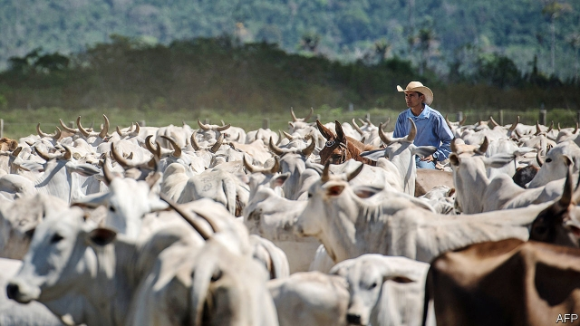
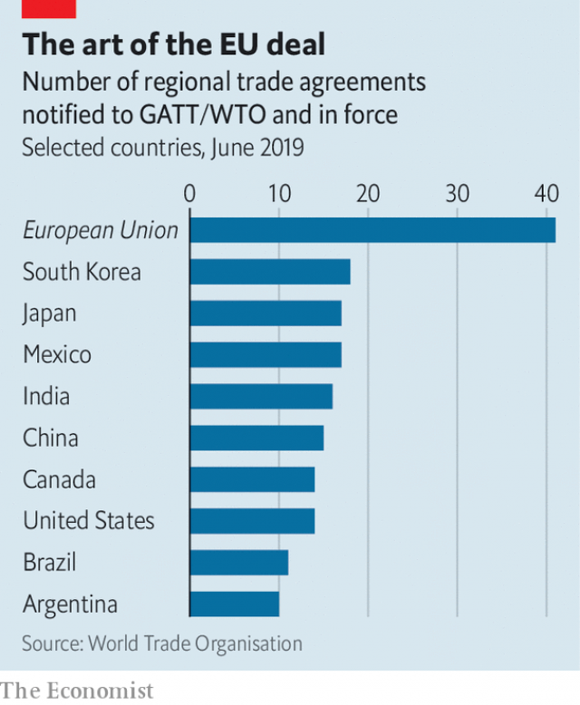

###### Missed you

# A new trade deal has FOMO as its secret sauce 

 

> print-edition iconPrint edition | Finance and economics | Jul 6th 2019 

THE MOTIVE force behind trade deals is supposed to be “FOMO”—the fear of missing out. If negotiators fail to grab new markets for their exporters, the theory goes, rivals may snap those markets up first. On June 28th two trading partners seized better access to each other’s markets as Mercosur, a customs union comprising Argentina, Brazil, Paraguay and Uruguay, agreed to a new trade deal with the European Union. An EU press release gloated that European companies would gain an “important head start into a market with an enormous economic potential”. 

The details have yet to be published. But the pact should improve market access for French cheese, Brazilian orange juice and Argentine fish, as well as car parts made in Europe, which now attract Mercosur tariffs of 14-18%. European companies will be eligible to compete for government contracts within Mercosur. Customs procedures will be simplified. Based on current trade patterns, the annual bill for tariffs on Mercosur’s imports from the EU should fall by over €4bn ($4.5bn), more than four times the equivalent sum for the deal the EU recently signed with Japan. 

Though 9% of Mercosur’s tariff lines, and 5% of the EU’s, will remain above zero, a “standstill” clause commits the members not to raise any of the tariffs above an agreed rate. In effect the EU has insured itself against the South American countries swinging back towards their habitual protectionism. But there was no talk of backsliding as the deal was announced. Brazil’s government called it a “bridging agreement”, intended to facilitate further agreements with other countries. Shunko Rojas, until recently one of Argentina’s negotiators, recalled scepticism about Mercosur’s ability to close trade deals. But this one, he said, should send the message that Mercosur is open for business. 

Indeed, Mercosur may be thinking of the EU deal as a model for others. Emily Rees of Trade Strategies, a consultancy in Brussels, notes the overlap between Mercosur’s other negotiating partners and countries with which the EU already has trade agreements. Potential Mercosur deals with Canada, South Korea, Singapore and EFTA (Iceland, Liechtenstein, Norway and Switzerland) could be designed to complement the agreement with the EU, making it easier for components to slip into global supply chains. She interprets the move as Mercosur turning away from “import substitution”, the failed development model under which it kept out foreign products in the hope that local production would thus flourish. 

In the two decades that the EU and Mercosur have been talking, the world has changed. When they started the EU was indeed fuelled by FOMO—specifically, the fear of being beaten to the South American bloc by a free-trading United States. But America’s attitude to trade is not what it was back then, and the EU’s motivation has consequently changed too. 

 

FOMO is still involved—but it is no longer the EU that feels it. Instead the trade bloc may be hoping to inspire it in the Trump administration, which has been threatening—or applying tariffs to—almost all its trading counterparts, including the EU. As well as the looming threat of tariffs on cars and car parts unless the EU reaches a deal, on July 1st America said it might impose new tariffs on $4bn-worth of imports from the EU as part of an ongoing dispute over aircraft subsidies. And even if America does not feel a trickle of fear at the prospect of falling further behind the EU, which leads the world as signatory to the largest number of trade deals (see chart), perhaps other governments might get the message. On June 30th the EU signed a trade deal with Vietnam, days after Mr Trump threatened the country with tariffs. 

It would be premature to predict a further flurry of trade agreements. The one between the EU and Mercosur may have been agreed during a rare window of opportunity when the governments of Argentina and Brazil were both in favour of economic liberalisation. That window will close in October if Mauricio Macri is not re-elected as president. Further deals involving Mercosur would become less likely, and the one with the EU might not be ratified. Even now, the Argentine fact sheet accompanying the EU-Mercosur deal boasts about how much more slowly tariffs would be lifted relative to the EU’s other trade deals. Nor is ratification certain at the EU end, since national parliaments may each have a veto. 

Hunger for a slice of Europe’s agricultural market drove Mercosur’s negotiators towards agreement. (The beef quota they secured was modest because the EU pleaded the necessity of saving some goodies for counterparts in future deals.) Extra quotas of beef, dairy or pork are also alluring for America, which is negotiating with the EU too. But the EU is insisting that they are off the table. However good it feels to stand up to Mr Trump, free trade is still a hard sell. ◼ 

