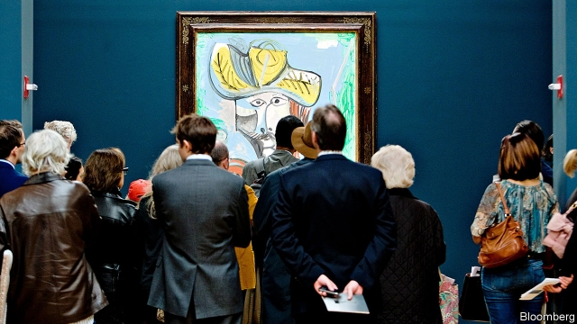

###### Cash in on your Picasso

# Borrowing against art is growing at a stunning rate 

 

> print-edition iconPrint edition | Finance and economics | Jul 6th 2019 

FEW ART collectors are as liquid as Patrick Drahi, a French telecoms magnate, who purchased Sotheby’s, an auction house, for $3.7bn in cash last month. Selling art can take months, even years. The only way to unlock its value quickly is to borrow against it. And indeed the number of owners doing so is rising. Deloitte, an accounting firm, estimates that the outstanding value of loans against art in America reached $17bn-20bn in 2017, up 13% from the previous year. Industry insiders say such lending has continued to grow at double-digit rates since then. 

“Ten or 20 years ago it never crossed your mind to leverage your art collection. But the word is out now,” says Evan Beard of Bank of America Private Bank, the institution with the highest outstanding value of art-secured loans. As interest rates have fallen, borrowing has become more attractive. Open public registers make it easy to check if art is encumbered. Price estimates and auction results available online since the early 2000s have made underwriting easier. In America collectors can even keep encumbered art on their wall. 

Large banks’ private-banking arms have been lending against art since the 1970s. Now the strong market is attracting specialist lenders. For a private bank, though a loan may be secured against a piece of art, it will almost always be backed in the last resort by a client’s entire balance-sheet. Boutique lenders, by contrast, will accept a piece of art as sole collateral. 

Athena, America’s largest boutique lender, requires art worth about $2m to secure its minimum loan of $1m. At Bank of America and other private banks, the minimum loan is closer to $5m. Both accept only works by well-known artists as collateral, since they are the only ones with reliable longevity. Thus art-secured loans are less risky than many believe, says Arturo Cifuentes of Columbia Business School. 

“We can lend millions of dollars in three or four weeks,” says Cynthia Sachs, chief investment officer at Athena. But boutiques’ greater speed and flexibility come at a price: interest rates that outstrip those at private banks by several percentage points. That may hobble their growth. Rachel Pownall, a professor of art finance at Maastricht University, thinks the market for specialist lenders may be limited, since most art by famous names belongs to super-rich clients of private banks. Among dealers and gallerists, only the smaller ones have to turn to boutique lenders. 

The best prospect for growth in the sector may be Europe. None of the continent’s banks has an art-lending programme on the scale of those in America, where 90% of art-secured lending takes place. Art financiers such as the Fine Art Group in London and WestendArtBank in Berlin have moved in. Lenders say inquiries from wealthy clients about leveraging their art collection are rising. Though Europeans are in general reluctant to borrow against their possessions, those who buy art for reasons beyond the aesthetic may prove willing to make an exception. ◼ 

