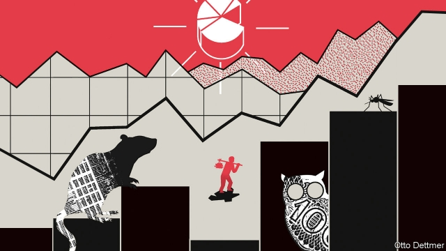
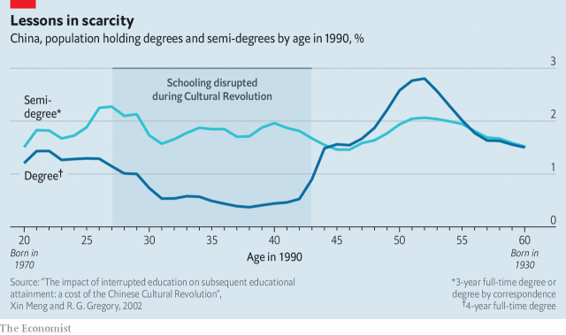

###### Free exchange

# How a victim of the Cultural Revolution mastered economics 

 

> print-edition iconPrint edition | Finance and economics | Jul 4th 2019 

THE STUDENTS embarking on an economics doctorate at the University of California, Berkeley, this autumn face a daunting obstacle: Econ 201A, a course in microeconomic theory inflicted on all new recruits. Over 16 weeks they must acquaint themselves with some of the most formalised parts of economics, including Houthakker’s Axiom, the Slutsky matrix and Afriat’s Theorem. According to one instructor, between five and seven class members (out of 20 to 25) usually receive a grade of B- or worse. 

But anyone losing heart should take inspiration from a past student, Weijian Shan. He tried the course in 1982 after becoming one of America’s first PhD students from communist China. As he recounts in “Out of the Gobi”, his memoir published earlier this year, he had not taken a mathematics class beyond the age of 12. His faculty adviser, Janet Yellen, who would later chair the Federal Reserve, and George Akerlof, who would later win a Nobel prize, worried that the difficulties of Econ 201A would be “insurmountable”. 

Mr Shan, however, had already surmounted more than most. After his schooling was cut short in 1966 by the Cultural Revolution, he was “sent down” to the countryside, like millions of other city kids. He joined a Construction Army corps in the Gobi desert, trying to create farms out of salty clay in a “place that birds don’t care to shit”. They dug ditches, made bricks and harvested wheat, three of the four most tiring things in the world, according to one squad member. (The fourth was sex, which they were spared.) 

His march to Berkeley was long. He arrived in the Gobi knowing only a few sayings and slogans in English (“Long live Chairman Mao”). But in 1975 he was chosen by his peers and bosses to study the language in Beijing. He won nomination only after first ingratiating himself with his company by memorising the official rules and referee signals of volleyball, which made him a respected referee of platoon matches. The English he learnt in Beijing helped him win an Asia Foundation scholarship to study in America after it restored formal diplomatic ties with China in 1979. Having earned an MBA in a year at the University of San Francisco, he embarked on his PhD at Berkeley’s business school. 

In his study of economics Mr Shan had one or two things going for him. Economics is the science of scarcity, a subject with which he had intimate acquaintance. Deep in the Gobi, a day’s walk from their settlement, half a box of matches could cost 50kg of potatoes. When Americans dismiss something as “bullshit”, Mr Shan recalls the patties of cow dung they used to treasure as fuel. 

The construction corps taught him other economic concepts, such as “value-added” and its opposite: their company turned 750,000kg of seeds into just 70,000kg of grain. He experienced the power of the division of labour. Even with the utmost industry his team could make only 200 bricks per person in a day if they each mixed, moulded and moved the materials. But by dividing those tasks between them they could make two-thirds more. He also learnt the value of capital. His platoon could have made 20,000 bricks per day with a simple mixing machine, but no one would provide the 3,000 yuan (about $1,300 at the official exchange rate) to buy it. Mr Shan wonders if he was the first hard labourer with “such a burning desire to be exploited by capital”. 

Mr Shan’s educational resurgence was nonetheless remarkable. Even by 1990 just 0.4% of Chinese born in 1951-55 held a university degree (see chart). The Cultural Revolution was like a mad natural experiment, depriving some people of a university education for reasons unrelated to their ability. Their loss has thus helped economists calculate the worth of a college education, which is otherwise difficult to estimate because college-goers are often more able than other people, even before they get there. According to a study in 2015 by John Giles of the World Bank, Albert Park of the Hong Kong University of Science and Technology, and Meiyan Wang of the Chinese Academy of Social Sciences, about three-quarters of the returns to college in China reflect the skills and credentials that universities confer. But a quarter reflects the intrinsic abilities of the people they admit. Mr Shan’s education yielded a rich harvest. But he was also an unusually good seed. 

 

One benefit of university is guidance. Mr Shan’s efforts to educate himself in the desert lacked system or direction. He retreated to a pigs’ kitchen, where vegetable roots, skins and leaves were boiled, to read whatever he could find: an aviation magazine, Mao’s speeches, a pesticide manual. For this reason, he feels his “little house of knowledge is built on sand”. (The vastly more privileged students of today can also struggle to study systematically, because of the surfeit of claims on their attention. Their houses can be dangerously top-heavy.) 

Mr Shan enjoyed Econ 201A, eventually. But he had to abandon his first attempt, returning only after taking the mathematics class that Ms Yellen and Mr Akerlof had recommended. The maths textbook was over 400 pages long. He read it seven times. “I would have enjoyed studying in a more leisurely manner,” he writes, but “I had so much ground to make up.” 

He followed his PhD with a brief stint at the World Bank and a longer one as a professor at Wharton Business School. He founded the China Economic Review (which in 1990 published an article by a 32-year-old Yi Gang, now head of China’s central bank), then entered finance, becoming a big shot in private equity at Newbridge Capital. During long negotiations in hotel conference rooms he would marvel at the luxury of round-the-clock room service. His colleagues would tell him to shut up and gain some weight. 

After the Cultural Revolution ended in 1976 and reforms began, Mr Shan, like his country, had a lot of potential—and a lot of ground to make up. Since then they have both been compelling examples of convergence. When capital, of the human or physical variety, is scarce, the returns to investment can be high. And after the rigours of the past both were accustomed to the deferred gratification that heavy investment requires. The man who eventually mastered Econ 201A is an economics lesson in himself.◼ 

