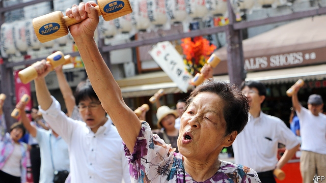
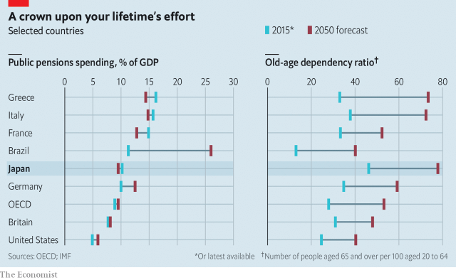

###### Sumo-sized challenge

# Japanese people need to put more aside for retirement 

 

> print-edition iconPrint edition | Finance and economics | Jul 6th 2019 

LAST MONTH Japan’s Financial Services Agency (FSA), the financial-industry regulator, lobbed a grenade into a fractious debate on how to support the world’s oldest population in retirement. The typical elderly couple, it warned, will need to top up their public pensions by a whopping ¥20m ($185,000). The furore that followed put Taro Aso, the finance minister, on the back foot. Japan’s pension system “will never collapse”, he insisted. 

His attempt at reassurance was widely mocked. A cartoon in a weekly magazine depicted him helping a Buddhist deity dispatch souls to financial heaven or hell. The implication was that, aged 78 and one of Japan’s richest politicians, he personally did not risk ending up in penury. 

And yet the gloomy forecast should have come as no surprise. Government mandarins have fretted over Japan’s pension system for years. The Nikkei Shimbun, a staid business newspaper, warned last year of “disaster” unless it was reformed. The system was built on the expectation that people would live until their 70s or 80s, says Naoyuki Yoshino of the Asian Development Bank Institute, a think-tank. But more than half of Japanese babies today can expect to live to over 100. A quarter of all 60-year-olds will still be alive in 35 years, estimates the government. 

All 20- to 59-year-olds in work must pay a flat premium of ¥16,410 into the national pension fund every month. Those who do so for 40 years get a full pension, currently ¥780,100 a year. Corporate and government workers also make payments into supplementary schemes. But the system is imbalanced, with shrinking numbers paying in and growing numbers drawing out. Japan already has more than 35m people aged over 65—28% of the population. The share is projected to reach a third by 2050. 

 

Japan’s pensions are comparatively stingy, with several countries spending more despite their younger populations (see chart). A couple in their 60s on the basic state pension would be ¥50,000 short each month compared with average household expenditure, says the FSA. A survey by the welfare ministry published on July 2nd found that half of all retired people had no income beyond their pension. 

The system is due to get even stingier, with spending as a share of GDP planned to stay almost static as the population ages. The FSA’s calculation was supposed to prod people into better retirement planning. But that would mean taking greater risks, says Noriyuki Takayama of the Research Institute for Policies on Pension and Ageing, a think-tank—and Japanese people are highly risk-averse. The bulk of Japan’s ¥1.83 quadrillion in household financial assets is held in post offices or bank accounts that pay zero interest. Most of it is owned by people who remember the puncturing of Japan’s asset bubble a generation ago. 

Getting them to diversify is both a challenge and a “business opportunity,” says Toshihide Endo, the FSA’s director, given that the net assets of elderly households have been almost flat for 20 years. “This implies that wealth formation is failing to keep pace with increased longevity.” 

Mr Yoshino draws an unflattering comparison with America, where major asset classes have increased in value far faster than in Japan. But the fear of losses deters many Japanese investors. Nerves have been jangled by a record loss in the most recent quarter at the Government Pension Investment Fund, the world’s largest. Five years ago Shinzo Abe, the prime minister, pressed its managers into shifting about half its assets into equities and slashing its holdings of domestic bonds. 

Japan is a harbinger of changes to come elsewhere. The World Bank forecasts a shortfall in retirement savings in big countries of about $400trn dollars by 2050. More adventurous investment may be part of the solution. Japan’s government also wants to raise the retirement age from 65 to 70. “The very easy answer is that everyone should keep working as long as possible,” says Mr Yoshino. But with a general election just weeks away, Mr Abe may not have felt able to point that out. ◼ 

