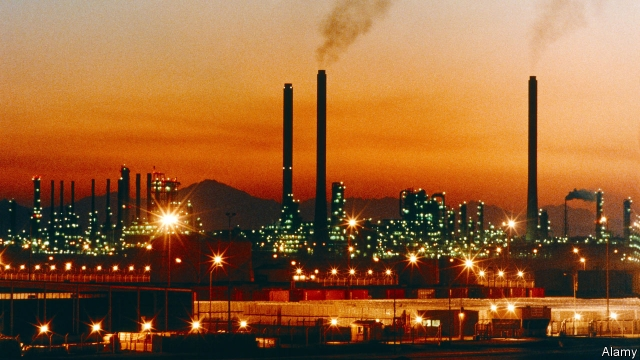
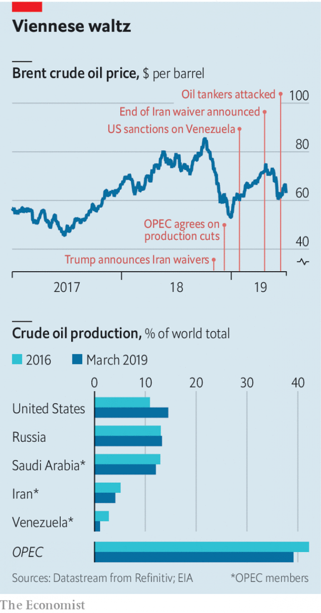

###### Making the cut

# OPEC’s predictable deal cannot hide its giant problems 

 

> print-edition iconPrint edition | Finance and economics | Jul 4th 2019 

THE MEETING of the Organisation of Petroleum Exporting Countries (OPEC) in Vienna on July 1st and 2nd was, in some respects, a snooze. The deal announced by OPEC and its allies was the continuation of one struck late last year. For at least another nine months, daily production will remain 1.2m barrels below last October’s level. But behind the predictability giant problems loom, for the oil market and for OPEC itself. 

America and Iran, an OPEC member, are flirting with war. The decline in Venezuela’s production has steepened since January, when America announced sanctions against PDVSA, its national oil company. Escalating conflict in Libya could cause production there to plummet as well. 

Nevertheless, oil producers are more concerned about weakening demand than tight supply. The price of Brent crude climbed to $74 a barrel in late April, after President Donald Trump said he would not extend waivers to sanctions on Iranian exports. It then plunged in May as inventories built up, investors fretted about the trade war and government-bond yields tumbled in America and Europe. The announcement on June 29th that America and China would resume trade talks has helped, but a deal is far from certain. Faced with shaky economic indicators, OPEC is keen to avoid a market awash with oil. 

 

But OPEC’s decision to trim output points to further uncertainties within the alliance. The first is how long it will be willing to continue losing market share to America. In 2014, as American oil flowed freely, OPEC declined to curb output, hoping that slumping prices would teach gung-ho American oilmen a lesson. The ensuing crash pained petrostates and wildcatters alike. But shale production has roared back—last year America produced more crude than any other country—and OPEC has become reluctant to let prices dive again. The result is that OPEC’s share of global production has dipped, from 42.2% in 2016 to 39.2% in March, and America’s has risen, from 10.9% to 14.5% (see chart). 

The second question is whether Saudi Arabia and Russia will start to feel the pain of production cuts more acutely. Sinking output in Venezuela and Iran has helped OPEC to keep a lid on supply even as American output has risen. Wood Mackenzie, an energy-research group, estimates that America (excluding Alaska and Hawaii) will pump 1.2m more barrels of crude a day this year than it did in 2018. Iran will pump 1m fewer. 

That helps explain why, despite cutting production somewhat, Saudi Arabia accounts for almost as much of the global market as it did in 2016. Russia has been even more protected. That year it agreed to work with OPEC to stabilise the oil price. Its influence in the Middle East has grown and it has helped shape OPEC’s decisions, big and small. On June 29th Vladimir Putin, Russia’s president, said that he had agreed with Saudi Arabia to extend OPEC’s production cuts, making the imminent meeting in Vienna seem all but redundant.  

Russia has given up relatively little in return. In most months its output has exceeded the level it had agreed with OPEC. (May was a rare—and possibly unintended—exception: an important crude pipeline suffered contamination.) In March its share of the global market was higher than in 2016. “By doing only a little, they got quite a lot,” says Martijn Rats of Morgan Stanley, a bank. 

OPEC and Russia look set to continue co-operating. The meeting in Vienna included a charter to formalise OPEC’s partnerships with non-members. But there is a limit to how much further output in Venezuela and Iran can fall. If oil prices remain low, Saudi Arabia and Russia may face an uncomfortable choice: let prices dip or cut production more steeply, thereby losing market share and propping up American shale. This month’s meeting was straightforward. Future ones may be less so. ◼ 

