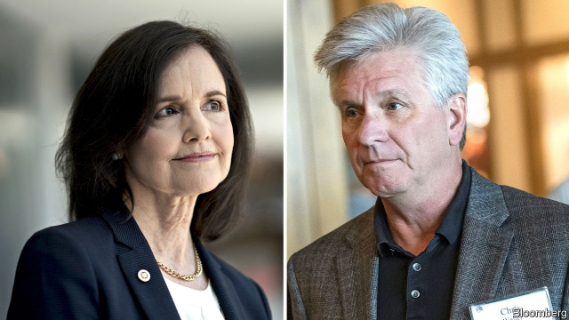

###### Help wanted

# President Donald Trump is trying to fill two jobs at the Fed 

 

> print-edition iconPrint edition | Finance and economics | Jul 6th 2019 

HIRING FOR the Federal Reserve has been difficult for President Donald Trump. He clearly regrets his pick for chairman, frequently railing against Jerome Powell for keeping interest rates too high. His last two nominees could have fought his corner, but both withdrew after it became clear that neither would be confirmed by the Senate. On July 2nd he had another shot, announcing candidates to fill two vacant spots: Judy Shelton of the European Bank for Reconstruction and Development, and Chris Waller of the Federal Reserve Bank of St Louis. 

Mr Trump’s reasoning seems obvious: both look doveish. In a recent interview Mr Waller expressed scepticism about the Phillips curve—the idea that low unemployment necessarily leads to inflation. His boss at the St Louis Fed, James Bullard, voted to lower interest rates at the most recent Fed meeting. Ms Shelton has called for interest-rate cuts, saying that companies benefiting from Mr Trump’s pro-growth agenda need better access to capital. 

But there the similarities end. Mr Waller is a conventional choice. Though he has questioned the Fed’s decisions on interest rates, he has also defended its balance of independence and accountability before Congress. Ms Shelton, meanwhile, who acted as an adviser to Mr Trump’s election campaign, has shown distinctly more eccentric—and fluid—views. 

For years she was one of the most hawkish voices around. As America’s economy was crashing in 2009 she warned of “runaway government spending” and predicted that inflation was about to make the dollar useless as a unit of account. She advocated a return to the gold standard, which would place monetary policy, inflation and the labour market at the mercy of the supply of and demand for the metal. She claimed the move would claw back power from unaccountable monetary policymakers, whom she accused of undermining property rights, and of favouring wealthy investors and corporate borrowers over savers and pensioners by allowing inflation of 2% rather than none at all. 

All this is a million miles from the modern mainstream. It is also at odds with what Mr Trump wants. Whereas Ms Shelton has called for a strong dollar, Mr Trump gets irate when other countries seek to depreciate against it. Fears of inflation and a debased dollar imply a leaning towards tighter monetary policy—and Mr Trump has made his distaste for that very clear. 

But Ms Shelton’s more recent statements in favour of looser policy seem to suggest a thoroughgoing conversion. That would be reassuring—if only it was not so conveniently timed to fit with a possible Fed nomination. If she is willing to flip her views to fit better with Mr Trump’s agenda, might she be pliant while he is in power, only for her own eccentric views to re-emerge under a future president? She could stick around for a while. Of the two posts Mr Trump is trying to fill, one expires in 2024 and the other in 2030. 

Regardless of their unequal merits, neither candidate is a shoo-in. Sarah Binder of George Washington University notes the long line of political appointees waiting for Senate confirmation. Candidates for the Fed are jostling with candidates for open-ended judicial appointments, which the Republicans who control the Senate will want to confirm quickly. Ms Shelton will be waiting a while to hear, “you’re hired”. ◼ 

