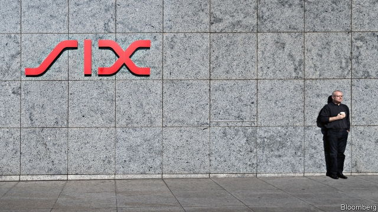

###### Raising the stakes

# Swiss stocks are collateral damage in a worsening trade row 

 

> print-edition iconPrint edition | Finance and economics | Jul 6th 2019 

IT IS A country famed for avoiding conflict. Yet on July 1st, in a serious escalation of a trade spat with the European Union, Switzerland barred the trading of Swiss-listed companies’ shares on EU platforms. Last December the trade bloc had given Switzerland an ultimatum: sign up to a revamped deal replacing the patchwork of 120 bilateral agreements that governs trade relations between the two by June 30th, or lose stockmarket “equivalence”—a status bestowed by the EU that allows seamless trading of shares across borders. Rather than fold, Switzerland retaliated. 

Before the ban traders based in the EU accounted for 60-80% of trading in Swiss shares by volume, some of that on Swiss exchanges and some on multilateral trading platforms in EU countries. Now those platforms have suspended trading in Swiss shares, as have the London Stock Exchange and Deutsche Börse. Swiss shares are available only on Swiss exchanges—and on far-distant ones, such as American and Asian trading hubs. 

This does not mean that Swiss giants such as Nestlé, Novartis and Roche have suddenly become untradeable from within the EU. Though the bloc usually requires its traders to trade on its own venues, or those it recognises as equivalent, it makes an exception when too few of a company’s shares would be available. So EU traders keen to buy Swiss shares can use Swiss exchanges. But the Swiss retaliation has nonetheless caused uncertainty: there is no formal definition of how few is too few. “It is up to individual trading venues to assess how to adjust their operations,” said a spokesman for the European Commission. 

Straight after the ban it was business as usual for SIX, Switzerland’s biggest stock exchange, and big Swiss firms saw no unusual trading activity. But unless the row is quickly resolved, Swiss shares will become less liquid. The harm to the Swiss stockmarket could be significant, says Charlotte de Montpellier, an economist with ING, a big Dutch bank. Trading costs are likely to rise and, in the long term, some Swiss companies may choose to go public outside Switzerland on exchanges with greater competition and more liquidity. 

The row could ripple out into the wider economy. Switzerland is integrated with the EU not only in its trade and capital markets, but also in other areas such as research funding and electricity markets. 

The Swiss federal government wants to close the deal, says André Simonazzi of the Swiss Federal Council. But it has asked the EU for clarification on provisions that have aroused domestic opposition, including on state subsidies and protections for wages and working conditions. Without tweaks the deal would probably be rejected by Swiss citizens in a referendum. Federal elections due in October make a speedy resolution less likely: no party wants to be seen as giving in to the EU. 

A no-deal Brexit might break the logjam. Many EU traders and trading platforms are based in London, which could arrange equivalence with Switzerland itself after leaving. But Brexit is also a cause of the impasse. The EU is using Switzerland to signal to Britain’s next prime minister that it is no longer willing to tolerate a pick-and-mix relationship like that it has long had with the Swiss—and that it is prepared to follow through on threats. The result, says Ms de Montpellier, is that both Switzerland and the EU are losers. “The EU can survive without Switzerland economically, but it is damaging a relationship with a reliable and stable trading partner.” ◼ 

