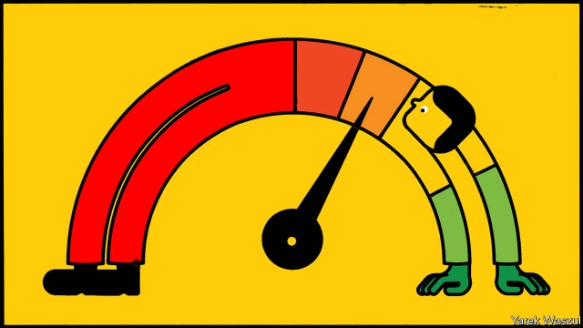
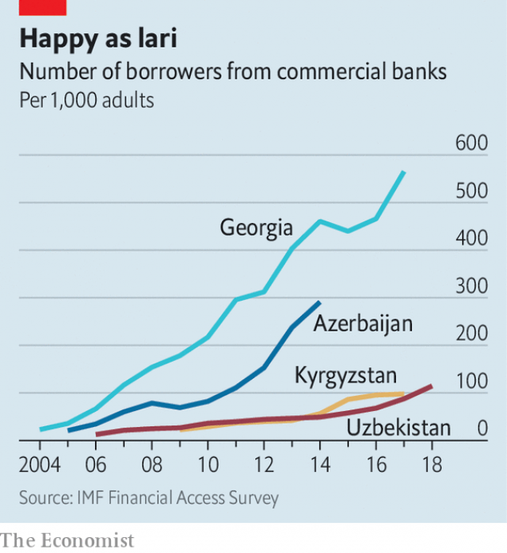

###### Numbers game

# A brief history—and future—of credit scores 

 

> print-edition iconPrint edition | International | Jul 6th 2019 

EVERY WEEKDAY Lika Koplatadze, who sells consumer loans for TBC Bank, one of Georgia’s largest, calls between 170 and 250 of her compatriots. She does not choose her targets. An algorithm crunches the credit scores (a number between 0 and 400 indicating the likelihood of repaying a loan) of millions of Georgians, selects the best prospects and auto-dials them. 

Something like this has been happening in rich countries for decades, but in Georgia it is a recent development. In 2005 a handful of Georgian banks joined with Creditinfo, an Icelandic group, to set up the country’s first credit bureau. Within two years the bureau had records on 232,000 people. Now it covers 2.6m Georgians, in a country with about 3m adults. 

The impact has been profound. Loan officers used to make around ten decisions a day, says Vasil Verulashvili, who runs credit-risk management for Bank of Georgia, the country’s largest bank by assets. In the past if someone applied for a mortgage, “you have to check, is it the real purpose of the loan? You have to go to the flat: is it real or not?” he says. “Today we need less than one second to make ten decisions.” The value of loans has jumped from under 10% of GDP in 2004 to 56% in 2016. Average interest rates declined from 20.2% to 12.6%. “Everything starts from this,” says Mr Verulashvili, referring to the growth of Georgia’s credit records. 

Georgia is following a well-trodden path, albeit at an accelerated pace. About half the world’s economies have private-credit bureaus, of varying degrees of sophistication. Their rise not only greased the wheels of economic development but also presaged the arrival of the data-driven, algorithm-mediated economy of the 21st century. Now entrepreneurial companies are taking that blend of finance and technology to the developing world, drawing on new types of digital data to make credit decisions. As with many data-driven businesses, the companies are also inserting themselves into the most intimate spaces inhabited by their customers. 

Well into the 20th century, systematic data on potential borrowers barely existed. The early American credit bureaus were local operations that scoured newspapers for information: notices of arrests, marriages, promotions and more. They included all sorts of dubious stuff, including information about people’s marital troubles, sex lives and political activities. Little science was involved. 

That began to change in 1956, when William Fair and Earl Isaac hit upon the idea of using data to predict the probability that a borrower would default. “Good” loans, it turned out, were correlated with telephone-ownership, longer time at the same address, longer employment in the same job and the applicant’s age. They set up a consultancy, Fair, Isaac and Company, whose product was a literal scorecard, made of cardboard, provided to banking and retail customers. Loan officers filled them in with applicants’ information and totted up the results to see if they exceeded an acceptable level of risk. 

The spread of the company’s scorecards attracted regulators’ attention. So did the growth of credit bureaus such as Retail Credit Company (now Equifax), which held records on millions of Americans and cheerfully shared them with any buyer. Amid a debate that presaged today’s fights over data privacy, Congress held hearings into the matter. 

 

This culminated, in 1970, in the passage of the Fair Credit Reporting Act (FCRA), which required credit bureaus to report information only to those with a legitimate purpose, obliged them to ensure accuracy, and gave consumers the right to see and correct their files. The Equal Credit Opportunity Act (ECOA) of 1974 made it unlawful for lenders to discriminate on the basis of sex or marital status. In 1976 it was amended to outlaw the consideration of race, religion and several other characteristics. 

Although the FCRA restricted the activities of the credit bureaus, regulation turbocharged Fair Isaac’s business. Credit-scoring provided an apparently scientific as well as non-discriminatory system for determining who should borrow, and the need to comply with the ECOA transformed it from a luxury for lenders to another line-item in the cost of doing business. 

The biggest revolution in credit-scoring came 15 years later. Working with Equifax, Experian and TransUnion, three credit bureaus that had come to dominate the market, in 1989 Fair Isaac unveiled the first consumer-credit score: a number between 300 and 850, where higher scores indicate a better credit rating. Known as the FICO (for Fair Isaac Corporation) score, it rapidly became the standard for American lenders. 

Whereas FICO had previously created custom algorithms for lenders by mapping their past customers’ attributes onto future ones, its new score used the troves of data held by the three bureaus to assign a three-digit number to every individual in the system. A FICO score considers five core bits of financial information, assigning each a different weight. The exact formula is a secret, but broadly it is made up of payment history (35%), the total already owed (30%), length of credit history (15%) and two scores for the mix of credit: cards, shop accounts and mortgages (10%), and applications for new credit (10%). The resulting number plays a big role in whether someone is offered credit, and at what rate. FICO scores are now used in 90% of consumer-lending decisions in America. 

Credit scoring is spreading fast through developing countries. In just a few years China’s Ant Financial, an affiliate of Alibaba Group, has built up an extensive scoring system, called Zhima Credit (or Sesame Credit), covering 325m people. The benefits of a good score go beyond borrowing, in part because it is embedded within Alipay, Alibaba’s payment app: they include easier visa applications, lower rental deposits and even better placement on dating sites. Yet it is best thought of as a rewards scheme for Alipay users, in that the best way to get a good rating appears to be to use Alipay a lot. The Chinese government is now in the process of building, through its national bank, a system to extend financial credit scores to all its citizens—one aspect of a broader “social credit” system. 

But in smaller, poorer countries with little financial infrastructure, credit-scorers have limited data to work with. They can look at payment records for services that are provided first and paid for later, such as utilities, cable-television or internet. Such proven payment data, says Michael Turner of PERC, an American think-tank focused on financial inclusion, are a good guide to risk in the absence of a credit history. FICO uses some of these data in a specialised score aimed at American “consumers that were previously unscorable based on their traditional credit data alone”. Creditinfo is working on including these sources in west Africa. 

But poor people are more likely to use pay-as-you-go phone services, especially outside the West. And utilities are registered to households, not individuals (when they are registered at all). So a new breed of company has spied an opportunity. Tala, a California-based startup that operates in India, Mexico, the Philippines and east Africa, says it uses over 10,000 data points gleaned from a customer’s smartphone to determine whether to grant a loan. It has lent more than $500m since 2014. 

Though it operates only outside America, Tala does not take into account many of the attributes—such as race, gender, religion—prohibited there and publishes a “data ethics” statement. Yet the data it does consider would set a Western data-protection regulator’s blood pressure soaring. Good borrowers include those who put both first and last names in their contacts, those whose travel and location follow predictable patterns, and those who communicate regularly with a few contacts. 

Someone who uses taxi apps is a lower risk, says Paul Randall of Creditinfo, which also operates in several poor markets, because it suggests they have a smartphone with a payment method that they use regularly, rather than one set up for the purposes of applying for a loan. People with betting apps are higher-risk. People with friends who have bad debts may be bad borrowers themselves. 

Psychometrics, or psychological quizzes that measure character, consistency and commitment, are commonly used, too. Such methods have benefits, but also come with risks. Though a useful supplement, psychometrics are no substitute for traditional scoring methods and financial data, says Mr Turner. And too much data can be as bad as too few. He cites the cases of antipodean partners who used 26 variables for their generic scorecard. “In the United States if you have over ten you’re either laughed out of the risk group or fired... With 26 you can’t distinguish the signal from the noise,” he says. 

Miguel Llenas, who helped set up a credit bureau in the Dominican Republic starting in 1999, says his country has long used “all kinds of information”: electricity bills, water, mobile, judicial information, criminal records. But he draws the line at mining social-media accounts for signals, which some startups promote as a new source of data. A picture of you playing poker years ago reveals little, he argues, adding, “I am worried about these things because I value privacy.” 

In some ways the rush of startups claiming to be able to determine an individual’s creditworthiness from non-financial data resembles the situation in 1950s America, when divorces and promotions were routinely considered. Yet the difference between robust credit-scoring in the rich world and the novel methods now used in emerging markets is likely to be temporary. Exotic correlations are a passable proxy for creditworthiness, but they are no match for the predictive power of actual financial records. Today a farmer in the Philippines may have to share his internet browsing history for a tiny loan. In just a few years he, like his Georgian counterparts, could have the good fortune to be harassed by cold calls from a bank that knows little more about his habits than that he regularly pays off his debts. ◼ 

