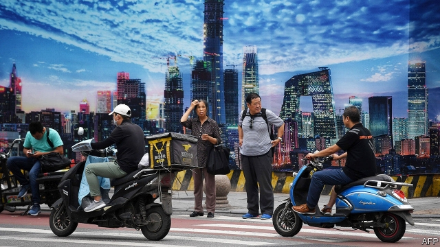
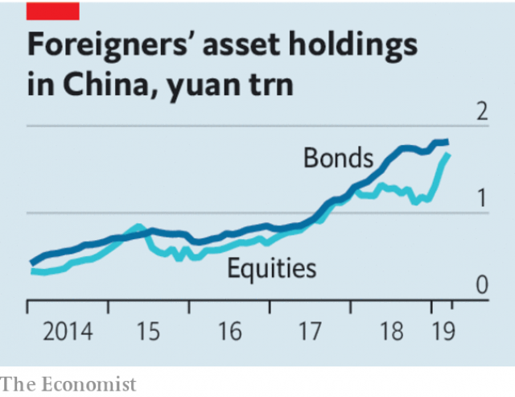

###### Counter-flow

# Financial links between China and America deepen, despite the trade war 

 

> print-edition iconPrint edition | Leaders | Jul 6th 2019 

TRADE WAR, tech war, new cold war or just plain decoupling: call it what you will, the confrontation between America and China has been bruising. Tariffs are up, exports down. Even as they resume trade negotiations, they talk of blacklisting each other’s firms. In the words of Henry Paulson, a former American treasury secretary, the danger is that an “economic iron curtain” will soon divide the world. All the more remarkable, then, that one crucial sector—finance—is bucking the trend. Financial links between China and the West have grown tighter since the trade war broke out. They are set to grow tighter still. 

For years Western insurance firms, asset managers and brokerages have been allowed to own only minority stakes in local firms. Now China is giving foreign financial firms more leeway on the mainland. Since mid-2018 they have been able to apply for 51% control. On July 2nd Li Keqiang, China’s prime minister, said that financial firms would be allowed full control by 2020. 

That is not the only sense in which financiers and trade negotiators exist in parallel universes. China is also making it easier for foreigners to buy into its markets. Since the start of 2018 they have ploughed $75bn into Chinese shares. In the same period they have pulled $8bn out of all other big emerging markets. In the next decade, Goldman Sachs estimates, $1trn will enter China’s bond market from abroad, putting it among the world’s top investment destinations (see article). All this is possible because China has not stopped foreigners from cashing out, despite the strict capital controls it imposes on its own citizens. As the rules have eased, stock and bond indices that investors mirror in their portfolios, such as MSCI’s equities benchmark, have added Chinese securities. 

Helping Wall Street and the City of London do more business in China is not a popular cause there or in the West, but the implications for finance are profound. Firms like Morgan Stanley, BlackRock and Schroders which have long dabbled on the mainland must now decide whether to go for it. Some worry that they lack clout and connections. Few insurers, for example, relish a brawl with China Life, a state-run behemoth with 1.7m sales agents. Foreign banks’ assets in China have soared to $650bn, but still amount to less than 2% of the country’s total. 

Nonetheless a few global firms have a good chance of building large Chinese businesses. HSBC, a London-based firm with roots in Asia, already makes three-quarters of its profits from Hong Kong and China. AIA, which was spun out of AIG, an American firm, is the leader among foreign life-insurers. Western asset managers have long records and global expertise that local firms do not. Over time, as Chinese savers seek to diversify, this could help them win market share. 

China needs to make this opening count. Many Wall Street bosses have gone from Sinophiles to hawks in the past few years. So, tactically, China has a chance to win brownie points with America’s business lobby. That gain could be dwarfed by the benefits within the country itself. Western firms will push up standards in its immature but giant capital markets, a priority if it is to allocate capital more efficiently and get more out of its savings. And China needs foreign funding more than in the past—its current-account surplus has dropped from 10% of GDP in 2007 to less than 1% last year. Without a steady flow of capital into the country, there could be a destabilising fall in the yuan. 

 

Some political figures in the West argue that financial links with China count as a betrayal. Steve Bannon, who was once President Donald Trump’s adviser, talks of removing Chinese companies from American stock exchanges. Marco Rubio, a hawkish Republican senator, has accused MSCI of channelling American cash to the Chinese Communist Party by including state-owned companies in its benchmarks. 

In fact closer financial links could have a beneficial effect, which is why longtime China-watchers like Mr Paulson back them so strongly. When Chinese firms have foreign shareholders or underwriters, their calculations change. They face tougher questions, as Alibaba, a Chinese e-commerce giant, is reminded on every earnings call. None of this will suddenly transform China into a free market but it will encourage its firms to be more open, to respond to market signals and to respect intellectual property. Chinese firms that use Western banks when they go abroad, as Huawei used HSBC, are less able to circumvent global rules on corruption and sanctions. 

If America excludes China from the global financial system, China will eventually build an alternative to the dollar-based order that has dominated markets since 1945—which would then feed into a wider strategic rivalry. For the time being, despite the hostilities over trade and tech, China welcomes foreign investors and firms. That is to be celebrated. There is more to be gained from building connections than cutting them off.◼ 

