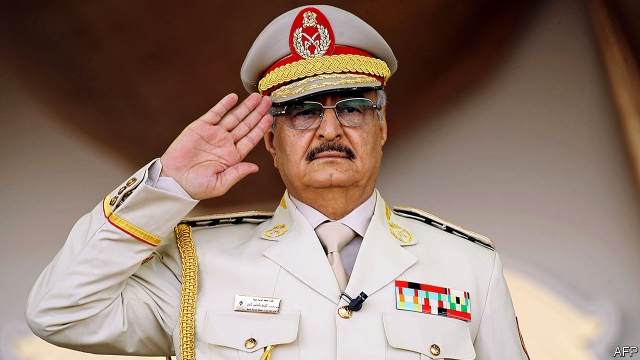

###### A country apart

# How to put Libya back together 

 

> print-edition iconPrint edition | Leaders | Jul 6th 2019 

“IF THE SUN lost its gravity, its gases would explode and its unity would no longer exist. Accordingly, unity is the basis for survival.” Muammar Qaddafi’s “Green Book”, his rambling political manifesto, is full of pabulum. But the former Libyan dictator was right about the importance of unity, something his country has sorely lacked since he was killed in a revolution in 2011. 

Libya has been mired in conflict ever since, creating a jihadist playground and a jumping-off point for migrants desperate to reach Europe. The latest fighting pits the “government of national accord” (GNA) in Tripoli against the self-styled Libyan National Army (LNA), under Khalifa Haftar, which rules by fear in the east and south. The UN was trying to bring them together when he attacked Tripoli in April—while the secretary-general was in town. 

Peace is a distant prospect (see article). But the West has an interest and a responsibility to help repair Libya. NATO members led by Britain and France supported the revolution with air strikes—then watched as the country sank into chaos. Barack Obama says that failing to plan for the day after Qaddafi was the “biggest mistake” of his presidency. America and Europe can start to fix that omission by putting their weight behind a UN-led peace process. 

Mr Haftar believes that Libya can be stabilised only by a strongman (himself, naturally). Some foreign powers seem to agree. Egypt, France, Russia and the United Arab Emirates (UAE) have supported him. America has flirted with him. But their calculus is flawed. Mr Haftar needed three years just to take Benghazi, the country’s second city, which he flattened in the attempt. In April the LNA said that it would take days to capture Tripoli, but today it is still fighting—and losing ground. The militias of Misrata, who are stronger foes, lie in wait for him. Far from stabilising Libya, Mr Haftar is sowing more chaos. 

The LNA’s backers risk turning the civil war into a regional conflict. Egypt and the UAE are the source of most of the weapons flowing into Libya (some of which were made in America), but Turkey, which opposes their anti-Islamist agenda, has lately tried to even things out by supplying the militias that prop up the GNA. Even with help, neither side in Libya looks able to achieve absolute victory. The LNA is overstretched and short of cash; the GNA is weak and unpopular. War will only prolong the country’s misery. A single attack on July 3rd killed more than 44 people at a detention centre near Tripoli; each side blamed the other. 

The good news is that a once-divided Europe has begun to narrow its differences over Libya, and that, now Mr Haftar no longer looks a winner, America seems to have cooled on him. Together they should lean on other countries to stop fuelling the war—and threaten to punish those who violate the UN arms embargo, which has been in place, but rarely enforced, since 2011. No progress can be made until a ceasefire is reached, but that should not stop new thinking about the peace. Too much focus has been placed on getting a deal between Fayez al-Serraj, the head of the GNA, and Mr Haftar. A broader dialogue is needed, involving representatives from the east, west and south. Countries, such as Egypt, France and Italy, with interests in Libya should also have a voice. 

That is not so different from what the UN was planning when the LNA launched its attack. Ghassan Salamé, its envoy to Libya, proposed holding a national conference that would bring together rival factions to agree on a new constitution and electoral law, leading to elections. It is still a sensible plan. America and Europe should make it credible by supporting it. ◼ 

