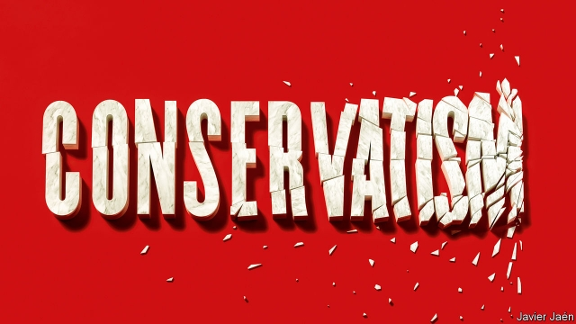

###### Politics

# The global crisis in conservatism 

 

> print-edition iconPrint edition | Leaders | Jul 4th 2019 

VLADIMIR PUTIN, Russia’s president, has declared the liberal idea “obsolete”. It will not surprise you to learn that we disagree. Not just because he told the Financial Times that liberalism was all about immigration, multiculturalism and gender politics—a travesty—but also because he picked the wrong target. The idea most under threat in the West is conservatism. And you do not have to be a conservative to find that deeply troubling. 

In two-party systems, like the United States and (broadly) Britain, the right is in power, but only by jettisoning the values that used to define it. In countries with many parties the centre-right is being eroded, as in Germany and Spain, or eviscerated, as in France and Italy. And in other places, like Hungary, with a shorter democratic tradition, the right has gone straight to populism without even trying conservatism. 

Conservatism is not so much a philosophy as a disposition. The philosopher Michael Oakeshott put it best: “To be conservative…is to prefer the familiar to the unknown, to prefer the tried to the untried, fact to mystery, the actual to the possible, the limited to the unbounded, the near to the distant.” Like classical liberalism, conservatism is a child of the Enlightenment. Liberals say that social order emerges spontaneously from individuals acting freely, but conservatives believe social order comes first, creating the conditions for freedom. It looks to the authority of family, church, tradition and local associations to control change, and slow it down. You sweep away institutions at your peril. Yet just such a demolition is happening to conservatism itself—and it is coming from the right. 

The new right is not an evolution of conservatism, but a repudiation of it. The usurpers are aggrieved and discontent. They are pessimists and reactionaries. They look at the world and see what President Donald Trump once called “carnage”. 

Consider how they are smashing one conservative tradition after another. Conservatism is pragmatic, but the new right is zealous, ideological and cavalier with the truth. Australia suffers droughts and reef-bleaching seas, but the right has just won an election there under a party whose leader addressed parliament holding a lump of coal like a holy relic. In Italy Matteo Salvini, leader of the Northern League, has boosted the anti-vaxxer movement. For Mr Trump “facts” are just devices to puff up his image or slogans designed to stir up outrage and tribal loyalties. 

Conservatives are cautious about change, but the right now airily contemplates revolution. Alternative for Germany has flirted with a referendum on membership of the euro. Were Mr Trump to carry out his threats to leave NATO (see “The World If” in this issue), it would up-end the balance of power. A no-deal Brexit would be a leap into the unknown, but Tories yearn for it, even if it destroys the union with Scotland and Northern Ireland. 

Conservatives believe in character, because politics is about judgment as well as reason. They are suspicious of charisma and personality cults. In America plenty of Republicans who know better have fallen in with Mr Trump even though he has been credibly accused by 16 different women of sexual misconduct. Brazilians have elected Jair Bolsonaro, who fondly recalls the days of military rule. The charismatic Boris Johnson is favourite to be Britain’s next prime minister, despite being mistrusted by MPs, because he is deemed to be the “Heineken Tory” who will, like the beer, refresh the parts other conservatives cannot reach. 

Conservatives respect business and are prudent stewards of the economy, because prosperity underpins everything. Hungary’s prime minister, Viktor Orban, paints himself as a low-tax economic conservative, but undermines the rule of law on which businesses depend. Mr Trump is a wager of trade wars. Over 60% of Tory members are willing to inflict “serious damage” on the economy to secure Brexit. In Italy the League is spooking markets by toying with issuing government paper that would act as a parallel currency to the euro. In Poland Law and Justice has splashed out on a welfare bonanza. In France, in the campaign for the European Parliament elections, the rump Republican Party made more of a splash about Europe’s “Judeo-Christian roots” than prudent economic management. 

Last, the right is changing what it means to belong. In Hungary and Poland the right exults in blood-and-soil nationalism, which excludes and discriminates. Vox, a new force in Spain, harks back to the Reconquista, when Christians kicked out the Muslims. An angry, reactionary nationalism kindles suspicion, hatred and division. It is the antithesis of the conservative insight that belonging to the nation, a church and the local community can unite people and motivate them to act in the common good. 

Conservatism has been radicalised for several reasons. One is the decline of what Edmund Burke called the “little platoons” that it relied on, such as religion, unions and the family. Another is that the old parties on both right and left were discredited by the financial crisis, austerity and the long wars in Iraq and Afghanistan. Outside the cities, people feel as if they are sneered at by greedy, self-serving urban sophisticates. A few have been wound up by the xenophobia of political entrepreneurs. The collapse of the Soviet Union, some believe, loosened the glue uniting a coalition of foreign-policy hawks, libertarians and cultural and pro-business conservatives. None of these trends will be easy to reverse. 

That does not mean everything is going the way of parties of the new right. In Britain and America, at least, demography is against them. Their voters are white and relatively old. Universities are a right-wing-free zone. A survey by Pew last year found that 59% of American millennial voters were Democratic or leaned Democratic; the corresponding share of Republicans was only 32%. Among the “silent generation”, born in 1928-45, Democrats scored 43% and Republicans 52%. It is not clear enough young people will drift to the right as they age to fill the gap. 

But the new right is clearly winning its fight against Enlightenment conservatism. For classical liberals, like this newspaper, that is a source of regret. Conservatives and liberals disagree about many things, such as drugs and sexual freedom. But they are more often allies. Both reject the Utopian impulse to find a government solution for every wrong. Both resist state planning and high taxes. The conservative inclination to police morals is offset by an impulse to guard free speech and to promote freedom and democracy around the world. Indeed conservatives and liberals often bring out the best in each other. Conservatism tempers liberal zeal; liberals puncture conservative complacency. 

The new right is, by contrast, implacably hostile towards classical liberals. The risk is that moderates will be squeezed out as right and left inflame politics and provoke each other to move to the extremes. Voters may be left without a choice. Recoiling against Mr Trump, Democrats have moved further to the left on immigration than the country at large. The British, with two big parties, may have to pick between Jeremy Corbyn, Labour’s hard-left leader, and a radicalised Tory party under Mr Johnson. Even if you can vote for the centre, as with Emmanuel Macron in France, one party will win repeatedly by default—which, in the long run, is unhealthy for democracy. 

At its best conservatism can be a steadying influence. It is reasonable and wise; it values competence; it is not in a hurry. Those days are over. Today’s right is on fire and it is dangerous. ◼ 

