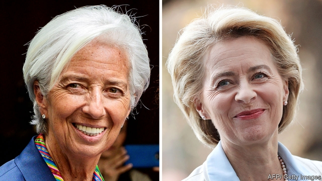

###### The EU’s new appointees

# The tasks facing Europe’s top team 

 

> print-edition iconPrint edition | Leaders | Jul 6th 2019 

IT WASN’T PRETTY, but they got there in the end. After an epic three-day haggle, the leaders of the European Union came up with a slate of names for its top jobs: the presidents of the European Commission (the executive arm), the European Council (the forum where the leaders meet) and the European Central Bank (ECB), as well as its grandly titled High Representative for Foreign Affairs and Security Policy. None of the jobs went to the front-runners, nor indeed to anyone who had featured on most observers’ lists until a few hours before the dénouement. 

Critics will object to the murky process, though it was always going to take horse-trading to satisfy 27 states (Britain politely sat the business out), while striking a balance between right and left, north and south, east and west, big states and small ones, and between the sexes. Along the way, the notion that a decision on the more technocratic ECB boss would be kept apart from the political jobs was abandoned. So, too, was the hard-fought principle that the commission job should go to the Spitzenkandidat or “lead candidate” of one of the European Parliament’s political groups. That could well bring the whole deal crashing down if, as many MEPs threaten, the parliament uses its veto against the proposed candidate, Ursula von der Leyen, Germany’s defence minister (see article). 

She does not deserve that fate. Inevitably, the team that has emerged is a compromise that has its weaknesses. The star of Mrs von der Leyen (pictured right) was generally reckoned in Berlin to have faded before her abrupt elevation; she was not, for instance, a contender to succeed Angela Merkel as party leader and chancellor. The Economist would have preferred Margrethe Vestager, a steely liberal Dane. At the ECB, Christine Lagarde (pictured left), a former French finance minister, was another surprise. Her time as head of the IMF has been broadly successful, but leading the ECB is very different: she has experience neither as a central banker nor as an economist, which many would regard as part of the job description. 

However, much worse alternatives were being bandied about. Like the choices of Spain’s Josep Borrell for the foreign-affairs job and Belgium’s Charles Michel to preside over the council, Mrs von der Leyen and Ms Lagarde are solid, experienced administrators and established public figures. They can be expected to act calmly, pragmatically, but purposefully. 

They will need to. The task ahead of Mrs von der Leyen is monumental. In the next few years the EU needs to make hard choices on euro-zone integration, climate change and migration. It must decide how to respond on trade and security to President Donald Trump, as well as to an assertive Russia and an ever more powerful China. This requires not just strength of purpose but also the building of alliances. Mrs von der Leyen has not shown much of a knack for that in her attempts to overhaul Germany’s dismally run and curmudgeonly armed forces. The new European Parliament, like the EU itself, is fractious and requires skilful handling. Encouragingly, Mrs von der Leyen will want to see a stronger European dimension in tackling these problems. As the EU urges reluctant northern states (including Germany) towards risk-sharing within the single-currency area, it could help to have a German at the helm. 

For her part, Ms Lagarde joins the ECB just as there is churn at the top. Like her, the newish vice-president, Luis de Guindos, is a former minister without monetary-policy experience. She brings fine political and communication skills, and at the IMF advocated sensible reforms to the euro zone. But her new role is more technical than the old one. If another downturn hits, the bank will hastily need to draw up creative policy options. That will require appointing the right staff and knowing whose advice to follow in times of crisis—precisely when the bank’s governing council may be deeply divided. If she can do this then she, like Mrs von der Leyen, may yet prevail. ◼ 

