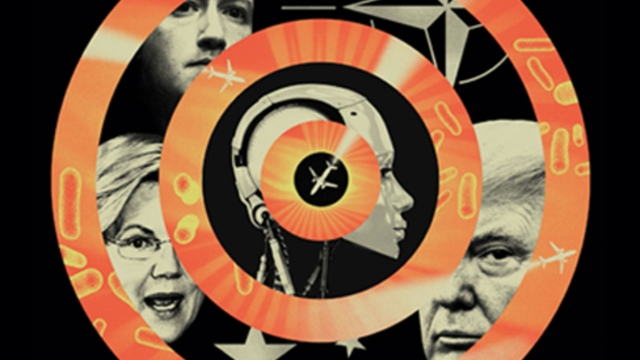

###### Futurology

# Why it's worth reading crazy-sounding scenarios about the future 

 

> print-edition iconPrint edition | Leaders | Jul 6th 2019 

PREDICTING THE future is hard. But preparing for its uncertainties, while you lie on the beach, can at least be entertaining. It can also broaden the mind and subtly change your understanding of the present. Rather than the Great American Novel or a tall stack of chick-lit bonkbusters (see our Obituary on Judith Krantz), we propose a different sort of summer reading. Speculating about the future, even if it is far-fetched, can help people and institutions cope with what comes next. For the best material, here are three places to look. 

The first is scenario planning. This originated in the armed forces during the second world war and was pioneered in industry by Royal Dutch Shell, enabling it to react more quickly and effectively than rival oil firms to the oil shock of 1973. The central idea was to avoid betting everything on a single forecast and instead to test future projects and plans against a set of plausible scenarios. Mapping out several futures, deciding how to respond to them and identifying the early signs that they might be coming about has been widely adopted by multinational firms, particularly after the terrorist attacks of September 11th 2001. In that spirit, we publish our own annual set of speculative scenarios, “The World If”, in this week’s edition. What if America leaves NATO, or antibiotics stop working, or Facebook switches itself off in Europe? These things may never happen, but it is mind-stretching to think about what you should do if they did. 

Science fiction, a second realm of speculation, is perhaps a more familiar beach read. It is wrong to see sci-fi as chiefly predictive, however. Its contemplation of the future is often a commentary on the present: many sci-fi authors take current concerns, from robots to climate chaos to gender politics, to the logical extremes and consider their implications. As a result, sci-fi can play a useful role as a forward-scanning radar for technological, social and political trends. But sci-fi does directly shape the future in one concrete way: the tech industry is full of people trying to make it come true. Amazon’s Alexa voice-assistant is the talking computer from “Star Trek”; SpaceX lands its rockets on drone ships whose names are borrowed from Iain M. Banks’s “Culture” novels; an entire industry is trying to bring to life the virtual world of Neal Stephenson’s “Snow Crash”. Beyond these familiar tropes, Chinese sci-fi and Afrofuturism offer refreshingly different perspectives and possibilities. 

The last speculative category is corporate anthropology and trendspotting. Many large companies employ roving anthropologists to seek out “edge cases”: examples of emerging technologies and behaviour that have yet to become widely adopted, but have the potential to go global. As the sci-fi novelist William Gibson once put it, “the future is already here—it’s just unevenly distributed.” Two decades ago, Japanese schoolgirls led the way with modern smartphones, capable of taking pictures and downloading apps; we are all Japanese schoolgirls now. What’s next: the death of cash? Clothes made of mushrooms? Artificial meat? Trendspotters often get it wrong. But it is worth paying attention to what they think might be coming, just in case they are right. 

Pierre Wack, one of the gurus of scenario planning at Shell, once likened dealing with the future to shooting the rapids in a boat. You know the general direction of travel, but not the exact path, and the trick is to be able to respond quickly. Reading about possible futures can shift your perception of the present and help you understand what might be around the corner. It can also be fun. So why not give it a try, starting with the speculative scenarios in this issue: who knows what might happen? ◼ 

