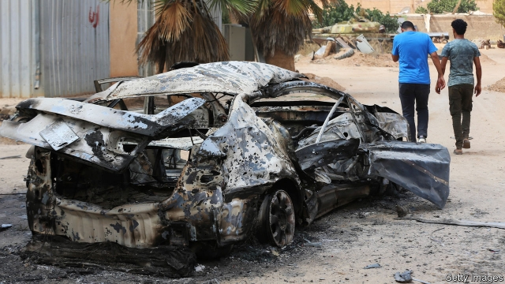
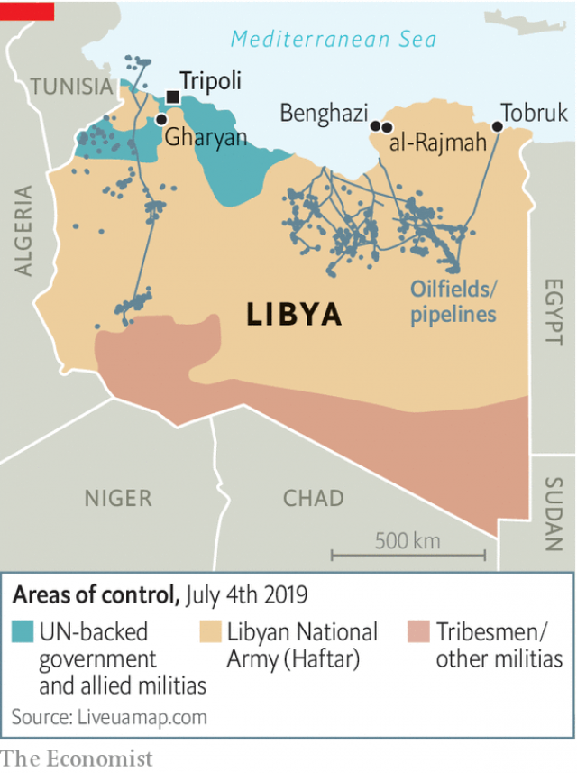

###### Siege on the Mediterranean

# A warlord’s offensive against Tripoli is flagging 

 

> print-edition iconPrint edition | Middle East and Africa | Jul 4th 2019 

IN TRIPOLI, the capital of Libya, children play on the beach, cafés buzz late into the night and the manager of a beauty parlour reports that laser treatments, hair-removals and nose-jobs are on the rise. “War hasn’t put off custom,” says Kherea Dughman. About 15km (9 miles) away a rebel army is fighting to take the capital. But after eight years of civil war, Libyans have become inured to the rumble of artillery. 

There have been several attempts to stabilise Libya since the overthrow in 2011 of Muammar Qaddafi, its former dictator. In 2016 the UN installed a “government of national accord” (GNA) in Tripoli. But it is beholden to the militias in the west that back it. Khalifa Haftar, the head of the self-styled Libyan National Army (LNA), controls the east and much of the south, including Libya’s largest oilfields. 

Talks arranged by the UN to broker a peace between them in April were upended by Mr Haftar, who launched a surprise attack on the capital just after the UN secretary-general had arrived. Mr Haftar has little interest in negotiating a settlement. The 75-year-old former general thinks Libya is not yet ready for democracy and that it needs a strongman—himself. 

Mr Haftar returned from exile in America after Qaddafi’s fall and raised a force of perhaps 20,000 fighters. They would, his supporters repeatedly promised, clear the capital of the chaos of “terrorist militia” rule. His sneak-attack was intended to snatch Tripoli swiftly. But three months on his forces are being pushed back. 

 

Militias that had previously fought each other have rallied against Mr Haftar. On June 26th they captured Gharyan, cutting his supply line to the south (see map). That leaves his troops over 1,000km from their main base at al-Rajmah. Whereas the defenders of Tripoli can go home and shower at the end of a day of fighting, Mr Haftar’s troops are in the desert. The tribes backing him are reluctant to send more men. 

Mr Haftar, though, has powerful friends. Saudi Arabia, Egypt and the United Arab Emirates (UAE) provide arms, fighter jets and money to pay recruits. They see Mr Haftar as an ally in their counter-revolution against the popular, and often Islamist, uprisings the Arab spring unleashed in 2011. And they view Libya’s oil, territory and ports as strategic assets that they want to keep out of the hands of their regional foes, Turkey and Qatar. With their support, Mr Haftar hopes to battle on just as he did in Benghazi, Libya’s second city. He took it in 2017 after three years of fighting, but only by destroying and depopulating it. 

Turkey and Qatar, meanwhile, have sent weapons and armoured trucks to reinforce Tripoli. Both say they are buttressing the forces of democratic and popular change. They have also supported armed groups who share their Islamist ideology. 

Foreign intervention risks turning a civil war into a regional one. In June Mr Haftar’s men threatened to strike all Turkish vessels in Libyan waters. It detained six Turkish sailors and released them only after Turkey threatened military action. 

The UN Security Council is too divided to restrain the parties. Libya’s former colonial rulers, France and Italy, have backed opposing sides, fuelled by their oil interests. (Total, a French company, has most of its fields in the east; Italy’s oil giant, Eni, is concentrated in the west.) Russia, which favours autocrats across the region, has thrown its support behind Mr Haftar. 

America, which could be an umpire, acts like a bystander. Since Barack Obama’s presidency, it has opted to “lead from behind”. Donald Trump phoned to congratulate Mr Haftar—a naturalised American citizen—when it seemed his offensive would be successful. America, which had supported calls for a ceasefire in the UN, abruptly threatened to veto them. Since Mr Haftar’s offensive has failed Mr Trump’s interest seems to have waned in another of what he once called the Middle East’s “stupid wars”.  

Despite the conflict, the dinar has stabilised. Oil production is near its post-2011 peak of 1.1m barrels a day and at current prices could earn Libya $27bn this year. In the current fighting both camps are avoiding anything that might damage the oilfields because revenue from them pays the salaries of armed groups on each side. 

As Mr Haftar tries to regain the initiative, however, that could change. Although he controls most of the fields, a UN embargo on non-government sales prevents him from boosting his own coffers while shrinking those of the government. Previous efforts to sell oil independently were thwarted by America, but Mr Haftar is thought to be mulling trying again. 

He may also become more destructive. Since losing Gharyan he has stepped up his bombardment of Tripoli. Fighting has already destroyed one airport and threatens a second. On July 3rd an attack killed 44 African migrants in a detention centre on the edge of Tripoli. Power lines and the pipes bringing water are also vulnerable to attack. Electricity is down to nine hours a day. Schoolchildren complain it is too hot to prepare for exams. More than 100,000 people have left the capital’s outlying suburbs for the city centre. 

Most people in Tripoli want a government able to collect the rubbish and put an end to the militias’ extortion and turf wars. (“It’s like taming wildcats in a circus,” is how a government official describes governing Tripoli.) Some may have once welcomed the order that Mr Haftar promised to restore. But his bombardment has punctured such hopes. His flamboyant uniforms, his nepotistic promotion of his sons and backing from the former regime’s henchmen stir fears of a second Qaddafi. 

Meanwhile, the horror goes on. Field hospitals and ambulances ferrying the wounded have come under attack. A nurse camped in a school with her children, after the shelling destroyed her home, begs for relief. “Why don’t they both just go away,” she sobs. ◼ 

