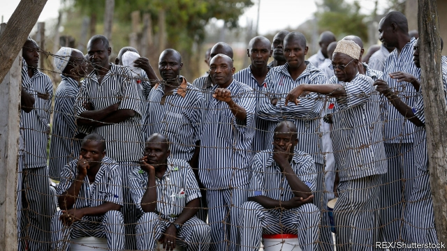
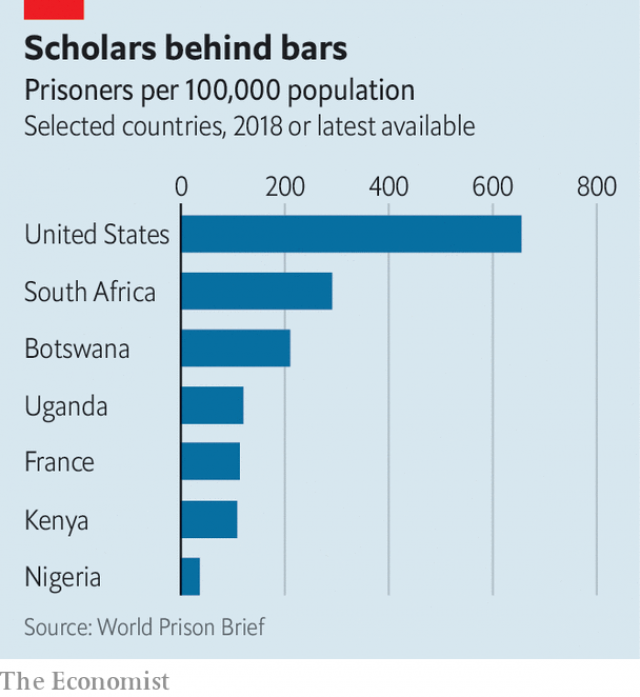

###### Kenyan prisons

# Learn the law, hope for freedom 

 

> print-edition iconPrint edition | Middle East and Africa | Jul 4th 2019 

A SENIOR POLICEMAN in Kenya was recently sentenced to death for torturing and killing a prisoner who had been brought into a police station near Nairobi, Kenya’s capital, after drunkenly brawling with his wife. The policeman had thrashed him with a metal pipe, dunked his head in a drum of water and then, after the man had died, claimed he had been beaten by another prisoner, who was initially charged with the murder. Bribes were offered to prisoners to incriminate their fellow inmate. But the judge rejected the story and sentenced the cop to death. 

The police usually enjoy impunity, especially when they kill suspected criminals, which they often do after nabbing them. More striking in this case was that, a mere four days after he was sentenced, the errant policeman was sitting in the front row of a class of 15 prisoners in Kamiti maximum-security jail outside Nairobi. Clad in the blue and white pyjamas worn by convicts, he had started a course in law under the auspices of London University. 

Through the African Prisons Project (APP), a British-backed NGO, about 65 Kenyan prisoners, almost all of them lifers or on death row, are taking classes in law, their papers sent back and forth between London and Nairobi. The scheme was started by a British lawyer, Alexander McLean, in neighbouring Uganda 12 years ago. In Kamiti prisoners and warders often attend class together, sometimes helping each other with homework or jointly solving legal conundrums. “We’ve had so many success stories,” says George Dianga, the officer in charge of Kamiti. “APP has greatly improved the inmates’ capacity to make appeals. Now judges really do listen.” 

 

The APP has helped change the law itself. One of its star students, Wilson Kinyua, who was set free in February after 19 years behind bars, had argued before the Supreme Court that the death penalty violated the constitution, which forbids cruel or inhuman punishment. In fact, no death sentence has been carried out in Kenya since 1987. Thousands have had their sentences commuted to life imprisonment under presidential decrees. But the death penalty is still on the statute book. Thanks, however, to the constitutional challenge lodged by Mr Kinyua and his friends, the Supreme Court now accepts that death sentences should no longer be mandatory for murder (the recent case of the policeman was considered exceptionally heinous). 

The law in Kenya is still heavily tilted against the poor, who are afforded no legal aid in their defence, except for capital crimes, unless a lawyer can be found who acts pro bono. Travesties of justice are frequent. Until the recent Supreme Court ruling, judges had little leeway for leniency, since various crimes carried mandatory sentences. Robbery with violence, for instance, used to carry a mandatory death sentence, albeit often commuted to life. But life usually meant life. 

Most of the women prisoners serving life or facing a death sentence in the maximum-security jail in Langata, on the other side of Nairobi, murdered their husbands or partners. Claims that they suffered violent domestic abuse carried little extenuating weight when judges sentenced them. 

So a vital facet of the APP has been to teach prisoners how to launch appeals and to argue for them in court. The prisoners pursuing London University courses stress that their aim is to help fellow inmates who were unable, for lack of education or money, to defend themselves effectively. 

While the APP is sensitive to the charge of paternalistic interference in Kenya’s judicial system, the Kenyan government and especially its prison service have been happy to co-operate with it. The organisation has sought to improve both prison conditions and the justice system. One effect has been to enhance relations between prisoners and guards. Another has been to reduce reoffending: according to the APP, none of its graduates, once freed, has slipped up. 

Above all, it has given prisoners hope. “APP has inspired us,” says William, a death-row prisoner who, after ten years inside, has both a poetic and lawyerly turn of phrase. “It has turned people from being unreasonable into being reasonable. Inasmuch as our bodies are in prison, our minds are free.” ◼ 

