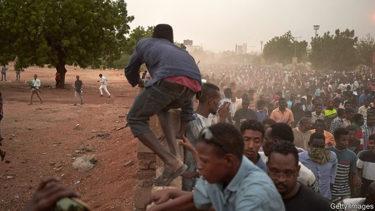

###### Stalemate in Sudan

# Protesters are back on the streets in Sudan 

 

> print-edition iconPrint edition | Middle East and Africa | Jul 6th 2019 

THEY MARCHED, like a train rolling into a station, across a bridge over the Nile and into Khartoum. Tens of thousands of protesters arrived in the Sudanese capital on June 30th, singing and chanting, to mark 30 years since the coup that brought to power the military dictatorship they are now struggling to overthrow. 

This was the first mass demonstration since a massacre on June 3rd, when security forces killed more than 100 people, including at least 19 children. And it was a reminder that the peaceful protest movement—which in April prompted the army to oust Sudan’s former dictator, Omar al-Bashir—remains a force to be reckoned with. “It was rejuvenating,” says Lena Esheikh, an activist. “We walked for hours.” 

The protest organisers had hoped to bring a million people onto the streets across the country. Despite fears of another massacre, the crowds were still large. Muhammad Hamdan Dagalo (widely known as Hemedti), whose men have been blamed for the massacre in June, said that he would not tolerate “vandals”. Although only the deputy head of the Transitional Military Council that took over after Mr Bashir’s fall, Mr Dagalo controls the Rapid Support Forces (RSF), a paramilitary group of perhaps 30,000 men that is now terrorising the capital. This makes him the most powerful man in Sudan. 

When demonstrations resumed, Mr Dagalo’s men tried to disperse them with tear-gas and live bullets. At least 11 people died, according to protest leaders, and hundreds more were injured. At the El Gederaf Teaching Hospital in eastern Sudan, security forces chased and beat marchers. “Some of the demonstrators were hit inside the hospital,” says Sami Salah, a surgeon. 

But it was not a repeat of June 3rd, which suggests that outside pressure may be restraining the junta. International mediators including Abiy Ahmed, Ethiopia’s prime minister, have been trying to end the stand-off between the generals and leaders of the protest movement. The junta’s main backers—Egypt, Saudi Arabia and the United Arab Emirates—have also begun voicing their support for a transition to civilian rule. “They are at least saying the right things now,” says Alan Boswell of the International Crisis Group, an NGO. One foreign diplomat says the junta’s backers were embarrassed by reports that they had encouraged it to send in troops to clear the streets in early June. 

The protesters, meanwhile, have shown they are not cowed and that they can organise without the internet, which the junta shut off a month ago. Some bought international SIM cards to send live broadcasts on social media of atrocities committed by government forces. The march was “an overwhelming success”, says Amjed Farid, one of the organisers. On July 1st they announced plans for further action, including two days of civil disobedience later this month. 

The generals appear to be on the defensive. They recently acknowledged that there have been several coup attempts. There is also a deepening of divisions within the transitional council, particularly between the army and the RSF, which was formed out of the janjaweed, a militia that terrorised Darfur. Mr Dagalo, who wants to be president and recently signed a $6m contract with a Canadian lobbying firm to clean up his image, also faces opposition from within Sudan’s intelligence service. One spy whispers that Mr Dagalo should not be president because he is uneducated. 

The junta still seems a long way from handing power to civilians. On June 29th the generals appeared to accept a power-sharing agreement proposed by the African Union (AU) and Ethiopia in time for an AU deadline of June 30th, only to announce two days later that they would not allow civilians to head the transition. 

The generals are also trying to re-open talks on issues around the transition that mediators thought had already been settled, such as an agreement to hold democratic elections in three years. “There are growing doubts among many that the military council actually wants an agreement,” sighs a Western diplomat. 

So the protesters see no option but to take to the streets again. “It’s just up to us to keep pushing,” says Ms Esheikh. “Until something gives.” ◼ 

Journalist wanted: We are looking for a new writer, based in Africa, to strengthen our coverage of the continent. For further details please go to: www.economist.com/africawriter 

