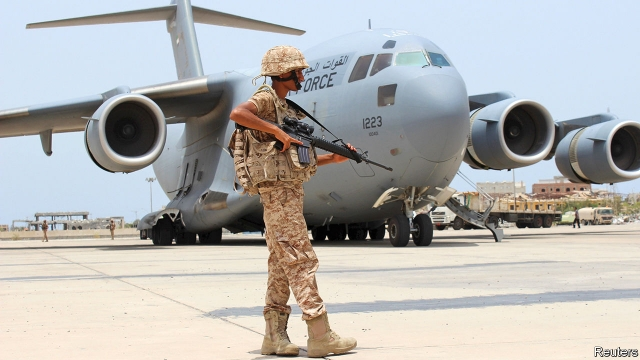

###### Bringing them home

# The UAE begins pulling out of Yemen 

 

> print-edition iconPrint edition | Middle East and Africa | Jul 6th 2019 

AFTER FOUR years of fierce fighting and international outrage, the United Arab Emirates (UAE) is quietly slipping out the back door. Over the past few weeks it has begun to withdraw men and materiel from Yemen, where it is part of a Saudi-led coalition fighting against the Houthis, an Iranian-backed Shia militia that controls large parts of the country. The UAE has not commented on the drawdown. But foreign diplomats and eyewitnesses confirm it is happening. 

The proximate cause is growing fear of conflict with Iran. Tensions have climbed steadily since America withdrew last year from the agreement struck in 2015 that imposed limits on Iran’s nuclear programme. In May four oil tankers were sabotaged near the UAE port of Fujairah. America blamed Iran. The Emirati foreign minister, in a sign of his country’s nervousness, says it is too early to assign blame. “The UAE are playing it very cool because they understand how vulnerable they are,” says a Western defence official. 

But the Emiratis wanted out even before this crisis. They worry about the reputational costs of a war that has killed tens of thousands of civilians and caused famine and cholera outbreaks. Last month America’s Senate voted to block an $8bn arms deal with Saudi Arabia and the UAE. The war has also caused fissures within the UAE, a confederation of seven emirates. Dubai, the glitzy business hub, is unhappy with the steep financial cost. 

Many Emiratis feel the fighting has run its course. They are the most important partner in the coalition. Though the UAE’s army is much smaller than Saudi Arabia’s, it is a more capable fighting force. Emirati troops did most of the heavy fighting on the ground in South Yemen, while Saudi jets provided often ineffectual air support. 

The Houthis are not popular in the south, where locals grate at northern control (South Yemen was a separate state until 1990). It would be much harder to oust the Houthis from the capital, Sana’a, and the northern highlands where their movement originated. The coalition’s offensive has also stalled around the western port of Hodeida, where the UN brokered a tense ceasefire. Unable to advance, the Saudis have of late been looking for a negotiated peace deal, though with little success. Without the support of the UAE, the prospects of a Saudi victory look remote. 

