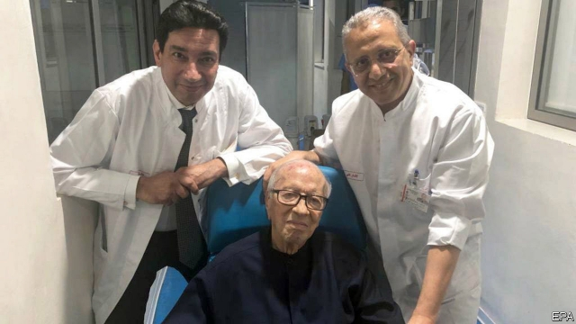

###### Crisis delayed

# Tunisia’s fragile democracy faces a stiff test 

 

> print-edition iconPrint edition | Middle East and Africa | Jul 6th 2019 

FOR A MOMENT, a looming political crunch in Tunisia looked like it would arrive earlier than expected. On June 27th the president, Beji Caid Essebsi, was rushed to hospital after an unspecified “health crisis”. The news capped a chaotic week in the only country to emerge from the Arab spring with a democracy. There was already talk of delaying presidential elections scheduled for November because of a row over the electoral law. Then, before Mr Essebsi fell ill, a pair of suicide bombings in central Tunis killed a police officer and wounded several other people. 

The president’s office gave no details about his condition, which led to false rumours that Mr Essebsi, aged 92, had died. That would have made the 85-year-old speaker of parliament the interim leader. But he was also ill, having been admitted to hospital days before Mr Essebsi. In the end it was a moot point. The president was discharged on July 1st and plans to return to work only for a few months, since he is not running for a second term. 

Tunisia’s fragile democracy still faces a test. Mr Essebsi took power in 2014 as the leader of Nidaa Tounes, a secular coalition formed to unseat Ennahda, the Islamists who had won Tunisia’s first free election. He succeeded, only to watch his coalition fall apart. About half of its MPs sit with other factions. Over the past year he has also fallen out with the prime minister, Youssef Chahed, who will lead his own secular faction in parliamentary elections in October. 

For a time Mr Chahed looked like a rising star in Tunisian politics. His popularity has ebbed, too, largely owing to a struggling economy. Since 2013 annual GDP growth has been less than 3%. Unemployment is 15%. Tourism is one of the few bright spots. Visitors are at last flocking back to the country after being scared off in 2015 by attacks at the national museum and a beach resort. The recent bombings, as well as one last year, are a reminder that security remains delicate. 

The elections present an opportunity for political outsiders. A recent survey by Sigma Conseil, a pollster, was grim reading for established politicians. Leading the pack in presidential and parliamentary elections was Nabil Karoui, a media mogul, even though he has not formed a party. The survey had Ennahda winning just 17% of the vote in parliamentary elections, down from the 28% it won in 2014. Mr Chahed and his party polled in single digits. 

Rather than face up to fresh competition, lawmakers have tried to block newcomers. In June they amended the electoral law to bar candidates who are philanthropists or receive foreign funding. Mr Karoui believes the changes target him personally. He runs a large charitable foundation. Its activities are widely covered on a television channel, which also happens to belong to him and is critical of the government. Another provision of the law bars candidates who criticise the revolution of 2011 or back the old regime. That would impinge on Abir Moussi, a lawyer who thinks the revolt was a foreign conspiracy and wants to exclude Islamists from politics. 

None of this ought to pass muster with Tunisia’s new constitutional court. There is one problem, though: the court has no judges and thus cannot rule on anything. Indeed, if Mr Essebsi had died, Tunisia might have been unable to install an interim president, as that too requires the court’s assent. Parliament has repeatedly failed to agree on the names of the 12 judges needed to fill the bench. That political neophytes like Mr Karoui are soaring in the polls is a sign that voters are getting tired of the squabbling. ◼ 

