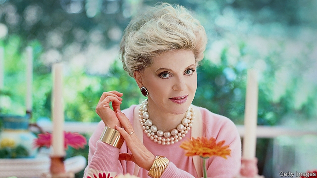

###### Women in words

# Obituary: Judith Krantz died on June 22nd 

 

> print-edition iconPrint edition | Obituary | Jul 6th 2019 

DISSECT ALMOST any novel by Judith Krantz (“Scruples” and “Princess Daisy” were the most popular) and you will find a tall leggy young woman with gorgeous hair, at least six steamy sex scenes—the raunchier the better—myriad words for colours (one sentence has “melting taupe, fawn, biscuit and greige” and that’s just for office furnishings) and a diminutive sidekick. Just as she herself measured only five-foot-two in her pantyhose, the sidekick is always a short-waisted, quick-witted, eternally loyal friend (Valentine O’Neill in “Scruples” and Kiki Kavanaugh in “Princess Daisy”) whose abiding passion is for beautiful, well-made clothes. When she is young and poor, she has to make them herself. Later, when she is rich—and she always makes a lot of money because she’s brilliant at business—she buys famous international brands or has her clothes made for her so they fit perfectly and make her look taller. 

As a writer, friends came in many forms. Adjectives and adverbs were as precious to her as cashmere and silk. So were her loyal readers, who ignored the griping reviews (Angela Carter once described reading one of her novels as like being “sealed inside a luxury shopping mall whilst being softly pelted with scented sex-technique manuals”). Her fans disagreed. They bought 85m copies of her ten novels in more than 50 languages because they loved how her heroines were survivors, not only of incest or sexual abuse, but of being fat, looked down upon, left out. Hyperbole was another close friend. Faced with a sex scene she knew she had a choice: plough in or veer to one side. Plough in won every time, whether on a velvet chaise longue or a pile of horse blankets. If it seemed voyeuristic, that was the whole point. 

It was the same with clothes. By the time she was 73, she told American Vogue, she had sported bare legs with heels, the cinched waist mid-calf skirt, the trapeze, the chemise, the chiffon blouse without a bra, the Mary Quant miniskirt, the YSL Smoking, the total Courrèges white-boot look, the bell-bottom trousers with the po’boy sweater, the power suit and tie-dyed Zandra Rhodes evening pyjamas. If she’d had to dress in something she had never worn before, she’d be limited to a pair of stilettos with fishnet stockings, a Pucci bikini and a cocktail hat. No wonder she was sometimes called “Schmatte Hari”. 

She was 49, after her two sons had left home, when her husband suggested fiction as an outlet for her energy and over-the-top imagination. In truth, she had been training for decades. She grew up on Manhattan’s Upper West Side in an apartment filled with paintings by Renoir, Degas and Soutine. Both her parents were children of immigrants; her father’s parents came from Russia, her mother from Lithuania (Billy Orsini in “Scruples” is advised that Jewish men make the best lovers). Her father dropped out of high school and later became a successful advertising executive. Her mother went to law school, but before that had become so good at book-keeping that in 1924 she was earning $40 a week. 

The Krantzes sent their daughter to a private school on the Upper East Side, but they disapproved of showing off and insisted she wore her dowdiest dresses, which did not help make her popular. She learned about beautiful clothes only when she went to Paris for a year after college, and discovered an inexpensive little dressmaker, who copied couture with great skill, she told Vogue. Having tried copywriting (about lipstick) at her father’s firm, which she did not take to, she worked as a fashion publicist, Good Housekeeping’s accessories editor and as a freelance magazine columnist, dispensing thoughts on, among other things, women’s sexual fantasies. Her husband became a Hollywood producer and the couple moved to Bel Air, the setting for “Scruples”, her first book, which came out in 1978. 

Based broadly on Giorgio’s, a boutique that opened in Beverly Hills in 1961 and changed the experience of shopping on the West Coast, it tells the story of Billy, a wealthy young widow whose own shop, Scruples, is saved from collapse by a talented young French-Irish designer, Valentine, and Spider Elliott, a charming lothario who sleeps with as many customers as he can just as soon as he has measured them up. A retailing case study with added steam, it was read by millions by the poolside. Over the next two decades she delivered a new book every second year, including a “Scruples 2”, with her husband turning them into successful television series. 

Being successful took discipline. So did keeping in shape. Three times a week, she did Pilates with a trainer, which helped her maintain her weight at a steady 104 pounds for nearly 50 years. She wore a size 6 above the waist, size 8 below. She bought her clothes in a size 8 and had them altered. Her walk-in closets held what she liked to call her many-hued bouquet of Chanel jackets, which she wore to promote her books, and trousers that, like those of her fictional characters, she had tailor-made as soon as she could afford it. Skirts were for serious lunches, board meetings and public speaking. Unlike her heroines, who stride forward on killer heels, she preferred flats—Prada or Miu Miu. 

Krantz’s novels came after the drug-filled “Valley of the Dolls” and before the servility and handcuffs of “Fifty Shades of Grey”. Unlike those two books, hers were suffused with warmth, which is the real reason they were so popular. No amount of money or sex could take the place of friendship, loyalty and a girlie heart-to-heart. “Sex [you] could, and did, get everywhere,” she once wrote. “Warmth was rare.”◼ 

