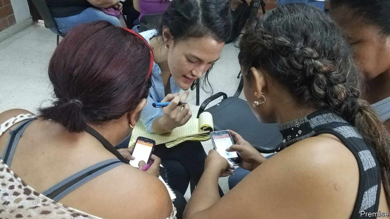

###### Combating Zika virus

# Armed with smartphones, Colombians are taking on the local mozzies 

 

> print-edition iconPrint edition | Science and technology | Jul 6th 2019 

IF YOU SEE a pothole, smell gas or step in water from a burst main, you can report the details online immediately. Smartphones mean that any concerned citizen can help keep a city’s infrastructure in proper repair—in theory. In practice, a nudge is sometimes required. And in the case of a project organised by Premise, a company in San Francisco that analyses geographical data, that nudge is financial. 

Premise, a recently formed firm, plans to make money by recruiting millions of observers. It will pay them each a fee to use their smartphones to gather whatever information is of interest to its customers about whichever country the observer happens to be in. The firm is now testing the idea with the Zika Citizen Network, a project that aims to find and stamp out mosquito-breeding sites in Colombia. 

Zika is a viral infection carried from person to person by Aedes aegypti, which also transmits dengue, chikungunya and yellow fever. Zika causes fever in adults and may trigger Guillain-Barré syndrome, an autoimmune disease of the nervous system. Infections of pregnant women can also harm the development of their unborn children—particularly by causing microcephaly, a smaller-than-normal head. The first recorded case of Zika was in Africa in the 1950s, but the illness appeared in South America in 2015 and seems to be spreading. 

Under the aegis of Premise, and paid for from America’s foreign-aid budget, the Zika Citizen Network has recruited and deployed 10,000 people in three cities: Cali, Cúcuta and Santa Marta. Observers receive mutually agreed fees to walk along specified routes while inspecting public spaces and taking photographs of bodies of standing water that might act as nurseries for mosquito larvae. So far, these peregrinations have yielded precisely located images of 15,000 such sites—especially sewer openings—a haul that might otherwise have taken years to collect. Observers are also paid to ask questions of local people. For the most enthusiastic, the fees they receive for all this work can add up to several hundred dollars a month. 

Questions asked include “Do you regularly inspect your home for breeding sites?”, “Has anyone in this home exhibited symptoms of mosquito-borne diseases?” and “What risks of dengue, Zika or chikungunya are you aware of?” Maury Blackman, Premise’s boss, says that much of the project’s effort went into refining and testing the questionnaires to make them as simple as possible to administer. Using phones instead of the clipboards and ballpoint pens which are conventionally employed for the process speeds things up enormously. The results are sent immediately by the phone for processing, and Premise’s software automatically collates and assembles the results. An artificial intelligence filters out anomalies, bad data and attempts at outright fraud—passing on anything dubious for manual inspection. 

As well as gathering data, the Zika Citizen Network’s observers put down traps in high-risk spots in order to sample the local mosquitoes. These can then be identified by an appropriate app, to check whether Aedes is among them. Once a breeding ground has been found, its existence can then be notified to the authorities—who will, with luck, do something about it. 

The current phase of the Zika Citizen Network will conclude in August. After that, the plan is to expand beyond the three pilot cities, as local authorities take over the running costs. If things have gone well, then Premise will take the lessons learned and apply them to the more commercial projects it hopes to undertake.◼ 

