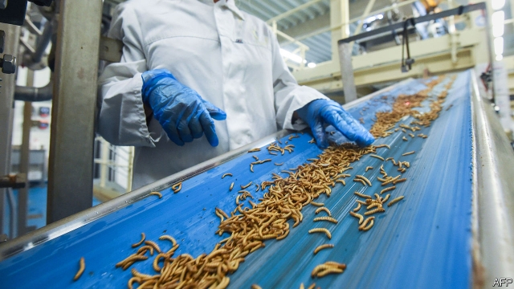

###### Grub’s up

# Beetles and flies are becoming part of the agricultural food chain 

 

> print-edition iconPrint edition | Science and technology | Jul 6th 2019 

SOME VISIONARIES hope that insects will play a big role in future human diets. Insects are nutritious, being packed with protein. Unlike hot-blooded mammals and birds, which use a lot of energy to keep themselves warm, they are efficient converters of food into body mass. And in some parts of the world they are, indeed, eaten already. 

Well, maybe. But it will take some serious marketing to persuade consumers, in the West at least, that fricasseed locusts or termiteburgers are the yummy must-haves of 21st-century cuisine. The visionaries might nevertheless prove correct that insects will contribute to human nutrition—just not in the way they imagine. 

What is actually happening is that a band of entrepreneurs are breeding insects as animal fodder—particularly fish food. Grown on cheap inputs, then crushed and formed into meal, they will thus provide all of the nutritional advantages the visionaries talk of, but at one remove from people’s dining tables instead of being served up directly for lunch. 

The two most promising species are flour beetles and black soldier flies, specifically the larval stages of these animals. Flour-beetle larvae, better known as mealworms (pictured above), have been used as fish food for a long time—they are excellent bait for anglers and are bred commercially on a small scale for this and other purposes, including as chicken food. Black-soldier-fly larvae are a more recent subject of interest. They are, in the jargon, saprophagous, meaning that they feed on decaying organic matter and will thus eat all sorts of stuff, including manure. This has led to interest in using them as composting agents, so that cultivating them, too, has already been happening on a small scale. What has changed are people’s ambitions. Instead of turning such insects out by the kilogram, the plan is to do it by the tonne, by industrialising the process. 

One of the most advanced mealworm-raising enterprises is run by Ynsect, a French firm. It uses an approach called vertical farming, which is also popular with those growing salad vegetables in cities, in the modern equivalents of market gardens. Vertical farming is an indoor operation in which the produce is held in trays that can be shuffled around robotically. 

Ynsect’s test facility, in Burgundy, is 20 metres tall and has 10,000 mealworm-laden trays. Nothing is wasted. The insects’ droppings are collected for use in fertilisers. When the larvae are about ten weeks old, those not destined to pupate, and thus provide the next generation of mealworms, are sorted, cleaned and steamed to death. They are then, as Antoine Hubert, Ynsect’s boss, puts it, treated like olives. They are crushed to extract their oil and the remaining pulp is dried and powdered. These products are sold as pet food. But the company’s eventual targets are fish farms raising salmon, trout and sea bass. 

The test facility turns out 30 tonnes of protein meal a month. On the back of its success, Ynsect is planning to start construction, later this year, of a full-scale commercial operation, 30 metres tall. This farm, in Amiens, will produce 1,500 tonnes of meal a month. And Ynsect is not alone in its ambitions for mealworms. In Washington state, in America, the home of many fish farms, a firm called Beta Hatch is building a commercial mealworm farm inside an old juice factory. This, Virginia Emery, the firm’s boss, hopes, will match the output of Ynsect’s farm in Burgundy. 

The leading contender in the breeding of black soldier flies, meanwhile, is AgriProtein. Its factory on the outskirts of Cape Town, South Africa, produces a similar tonnage to that of Ynsect’s Burgundian facility. Flies being more active than beetles, AgriProtein’s farm employs huge cages to hold them by the million. The fertilised females lay their eggs in trays fitted with cavities shaped like honeycomb and slathered in molasses. These trays are removed at regular intervals to ensure that the larvae within hatch simultaneously and are thus the same size—for large larvae often cannibalise small ones. 

Once removed from the breeding cages, the eggs are placed in hatching units and the young larvae then transferred for a short time to a nursery before being moved again, to an area where they can grow. After ten days here they are crushed and turned into oils and meal in a manner similar to that employed by Ynsect. 

One notable difference between the mealworm and soldier-fly approaches to insect farming is the fodder that the larvae are themselves fed. The companies are tight-lipped about their specific formulas. Mealworms are vegetarians. Ynsect feeds its charges on a diet including wheat bran. AgriProtein’s fly larvae were originally pampered with blood from abattoirs mixed with bran, while the adults were fed milk powder, molasses and sugar. Now the firm has formulated proprietary diets for both larvae and adults. 

Exactly what farmed insects eat depends as much on local regulations as on what the insects prefer. It was only in 2017 that the EU permitted the feeding of insect protein to farmed fish—and this on condition that the insects themselves tucked into foodstuffs approved as animal fodder. AgriProtein, which intends to expand its reach beyond South Africa, formulates its proprietary mixes to conform to the rules in destination markets. 

Regulatory fussiness, though understandable, does get in the way of another possible benefit of fly farming—waste disposal. Jason Drew, AgriProtein’s boss, reckons fly farms may one day prove ideal places to manage and recycle excrement, especially in poor countries. To this end, a subsidiary of the company has worked out how to extract birth-control and growth hormones from human and animal faeces respectively, to avoid these getting into the finished product. They hope, regulators permitting, to start adding treated faeces to fly-feed next year or the year after. 

Both beetle farmers and fly farmers also aspire to follow the paths of other husbanders of livestock by breeding better versions of their animals. Over the past four years, for example, researchers in Finland, Spain and Serbia have built up a genetic library of black-soldier-fly varieties. Gunilla Ståhls of the University of Helsinki says this library shows how much variety the flies have to offer—an essential basis for a breeding-improvement programme. 

Mr Drew thinks the scope for such improvement is enormous. As he observes by analogy, a few decades ago a laying hen would produce about three eggs a week, and even then only during the summer. Selective breeding means such a hen can now be counted on to turn out double that number, and to do so all year round. 

At the moment, the tonnages firms like Ynsect and AgriProtein aim to produce are still trivial compared with the multi-million-tonne market for fish feed. But that leaves plenty of room for growth. This is, moreover, a growth that may bring environmental benefits as well as economic ones. Today, a lot of fish food is itself fish. Insect farming could help relieve the oceans of that burden, and improve the prospect of the adage that “there are plenty more fish in the sea” actually being true.◼ 

