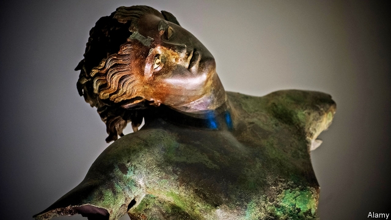

###### Archaeology

# Buried metal artefacts gather stories on their surfaces 

 

> print-edition iconPrint edition | Science and technology | Jul 6th 2019 

COINS AND other metal artefacts dug from archaeological sites bear witness to their burial in the form of the patinas of chemicals which accumulate on their surfaces—and different circumstances will result in different sorts of patina. This is particularly true of objects recovered from underwater sediments, for water can contain all sorts of dissolved substances that like to react with bare metals. But, as Gabriel Ingo of the Institute for the Study of Nanostructured Materials, in Rome, describes in ACS Omega this month, it is now possible to go beyond that general observation. He and his colleagues are using patinas to tell stories about individual finds. 

The ancients knew of seven metals: gold, silver, copper, tin, lead, iron and mercury. Of these, gold is noted for its chemical inertness, so forms no patina. And mercury, by its nature, is unsuitable for making things. But objects composed of the others often turn up in excavations—generally coated with a wide array of oxides, nitrates, carbonates and sulphides. As a chemist, Dr Ingo wondered if dissecting the patinas formed by these compounds might yield information about what the relics covered by them had been through. 

To simplify matters, he and his team concentrated on objects made of bronze, an alloy of copper and tin. Their approach was to embed a fragment of each object’s patina in a block of epoxy resin, in order to preserve its physical structure, and then to slice the block up using a diamond saw. That done, they polished the slices and studied them under a scanning electron microscope. They also applied a series of chemical tests to other samples of patina. 

One coin they took a particular interest in had a patina which was bright sky-blue. This had been found in a dredging operation in Rome, near the outlet of the Cloaca Maxima into the Tiber. The Cloaca Maxima, which still drains rainwater from central Rome’s streets, was the ancient city’s main sewer and in those days disgorged vast amounts of waste into the river. 

Analysis showed that the blue was actually turquoise deposited on the coin’s surface. Turquoise, a semi-precious mineral, forms in rocks when phosphorous, aluminium and copper sulphide react in the presence of mildly acidic water. Aluminium, an ingredient of clay, is abundant, but phosphorus is rare. Dr Ingo suggests that the coin acquired its turquoise crust when phosphorous released by animal bones discarded into the ancient sewer mingled with copper sulphides that had already accumulated on the coin’s surface. 

The source of an equally intriguing tale was discovered beneath the dark-brown patina partly covering a statue of a dancing satyr (pictured) pulled by fishermen from the waters between Sicily and Africa in 1998. Here, the team found a thin layer of vanadium oxide, but struggled to work out how this could have formed, for the statue’s bronze shows no trace of vanadium. Looking closer, though, they found markings which suggested that the satyr had once been encrusted with sea squirts. These are sessile invertebrates that make use of vanadium in some of their enzymes, thus concentrating it in their bodies. 

The dark-brown layer covering the vanadium oxide suggested to Dr Ingo that the sea-squirt colony had met a sudden end. Chemical analysis of this outer layer revealed high levels of iron oxide, indicating a rapid change in the statue’s environment. 

Given its provenance, it seems reasonable to assume that the statue was originally part of the cargo of a shipwrecked vessel. Dr Ingo guesses that, after the vessel sank, the statue remained resting for many years on the planking where it had been stowed, accumulating sea squirts as it did so. Eventually, though, the planking rotted and gave way, precipitating the satyr deep into a part of the vessel’s hold where there was a lot of corroding iron and little circulation of water—a combination of circumstances which killed the sea squirts and led to the brown patina. In support of this theory, when he examined the statue in detail Dr Ingo found the imprints of woody fibres, possibly from decking it had been resting on, in the patina of the satyr’s hair. 

Suggestive patinas form on dry land, too. One coin that the researchers studied came from a grave dug in what is now Tunisia but was then Carthaginian territory, in the 3rd century BC. Like the imprints on the satyr’s hair, the coin’s patina has preserved the shapes of some fibres. In this case, Dr Ingo and his colleagues reckon that those fibres were wool. They therefore theorise that the coin had been placed inside a woollen garment worn by the corpse when it was buried. Like the decking of the satyr’s ship, the wool then rotted away, leaving a cast of its fibres on the coin. 

Whether Dr Ingo’s new field of patinology will flourish remains to be seen. By themselves, each of his discoveries, interesting though it is, counts as little more than an anecdote. Each, however, tells a different type of story—of sewerage, of shipping and of funeral practices—that might otherwise remain untold. 

It is also possible to imagine patinology telling bigger stories—of changing environments brought about by industrial pollution, perhaps, or of climatic variation. It is a saying in forensic science that every contact leaves a trace. Dr Ingo has shown that contacts between ancient metal objects and their chemical surroundings leave some interesting traces indeed.◼ 

