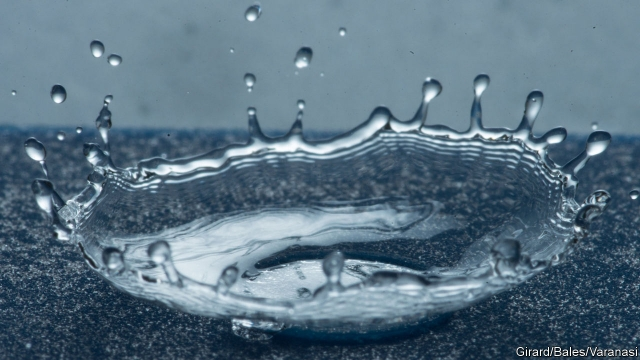

###### Materials science

# How to make a better raincoat with tiny “water bowls” 

 

> print-edition iconPrint edition | Science and technology | Jul 6th 2019 

A FEW YEARS ago Kripa Varanasi, a researcher at the Massachusetts Institute of Technology, made the news with a ketchup bottle that could be emptied without leaving any of the ketchup behind. Instead of sticking to the bottle’s interior, the sauce was repelled by it. 

Superhydrophobicity, as physicists call this effect, involves peppering a surface with microscopic structures that contain pockets of fluid. That reduces the area of contact between the surface and any water droplets which fall on it. This, in turn, diminishes the surface tension that would otherwise cause the droplet to cling on, so it instead falls off. In nature, using air as the fluid, lotus leaves and insect cuticles are both famously good at superhydrophobicity. In lotuses the air pockets are created by minute lumps of wax. In insects they are the result of tiny hairs. Dr Varanasi’s ketchup bottle improved even on these paragons, by replacing the air with an oil. 

His latest surface, though, which is even more hydrophobic than the previous ones, goes back to tinkering not with the pockets’ contents, but with the surface’s geometry. As he and his colleagues Henri-Louis Girard and Dan Soto report in  acs Nano, the trick is to carve minuscule structures they call “water bowls” on a surface. 

The trio began their research by looking at how the contact area between a surface and a droplet falling onto it influences how effectively that droplet will bounce away again. If it falls on even a standard superhydrophobic surface, a droplet will spread out. That reduces its “bounceability”. To limit this spread, the researchers used a laser to etch into an already superhydrophobic surface a series of patterns of small rings. These are the water bowls in question. Their purpose is to constrain the spread of droplets falling on them, thus encouraging the rapid ejection of those droplets back into the air (see picture). 

To test the idea’s effectiveness, the trio needed a way of measuring the strength of the contact between falling water drops and their new surface. Their solution was to use the heat transferred from surface to water while they were in contact as a proxy for contact strength. They therefore showered the surface, while it was at room temperature (20°C), with water chilled to 3ºC. While doing so they monitored the resulting drop in the surface’s temperature. This proved to be 40% less than that experienced over the same period by a standard superhydrophobic surface which they used as a control. 

The reduced transfer of heat from surface to droplets showed that the water bowls greatly reduced interaction between the two. In other words, the surface’s hydrophobicity had been increased. Moreover, further tests showed that even if a droplet landed on the edge of a water bowl, rather than dead centre, it was still repelled more effectively than by a flat surface. 

Dr Varanasi and his colleagues believe that, using lasers and other modern manufacturing techniques, it should be possible to carve water bowls into a wide variety of surfaces. Potential applications range from preventing the icing of aircraft wings by freezing rain to reducing the corrosive effects of brine from ocean spray—and even helping people stay snug and dry inside waterproof clothing. ◼ 

